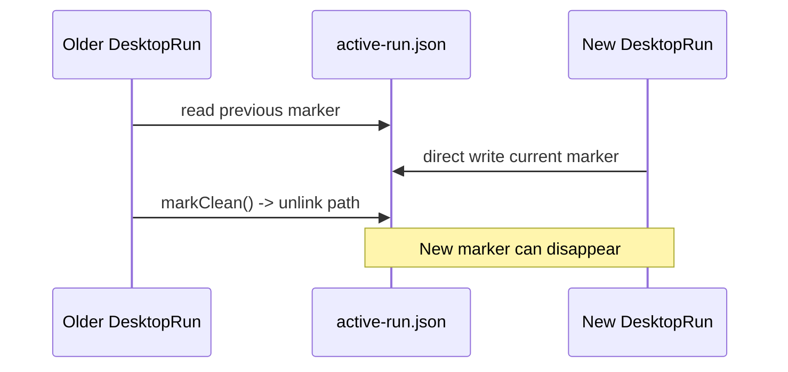
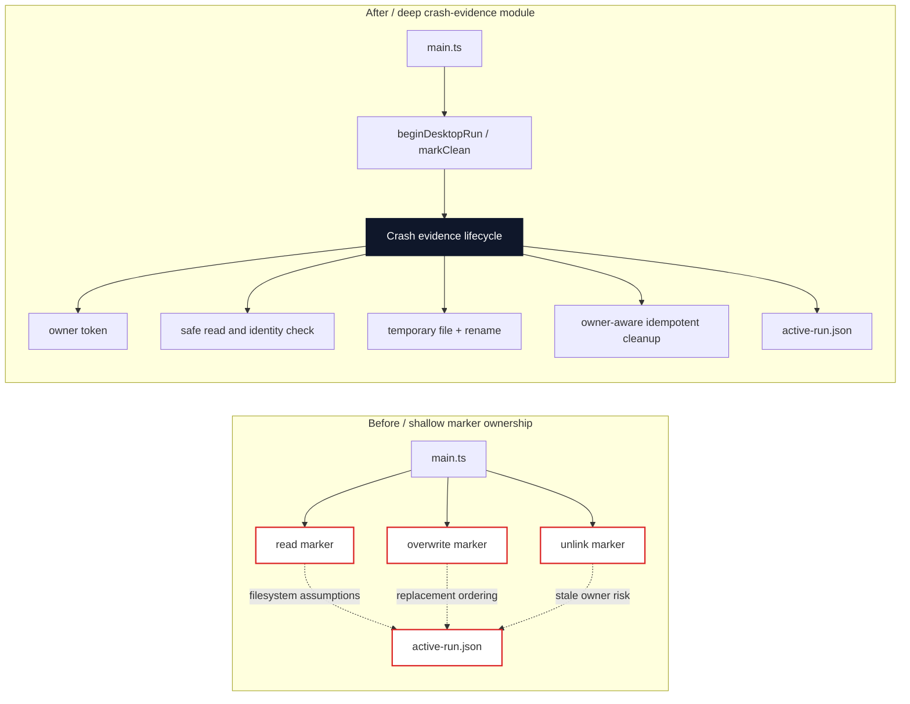

# Agent Note: Desktop crash evidence lifecycle ownership

Status: implemented

English | [中文](2026-08-19-desktop-crash-evidence-lifecycle-ownership.zh.md)

## Problem

The active-run marker is startup evidence for an unclean Desktop exit. Before this change, `beginDesktopRun()` read the previous marker and overwrote the same path directly, while `DesktopRun.markClean()` unconditionally removed that path. The public interface was small, but its implementation did not own the lifecycle invariant: a delayed older run could remove a newer run's marker, and a linked or non-regular marker could be followed or overwritten.

This was a shallow module. Callers had to rely on filesystem properties, replacement ordering, and cleanup timing that were not represented by the interface. The marker is Desktop-owned state, so those rules belong behind the `crash-evidence` seam.

## Decision

Keep the existing public interface:

```ts
beginDesktopRun(statePath, currentRun): DesktopRun
DesktopRun.markClean(): void
```

Deepen the `crash-evidence` module behind that interface. The implementation now owns:

- a private owner token for each active run;
- regular-file, link, and hard-link checks before reading or replacing the marker;
- private directory and file modes where the platform supports them;
- atomic publication through a uniquely named temporary file and rename;
- owner-aware, idempotent cleanup that never removes a marker belonging to another run.

The caller still only reports the current run and asks its returned handle to mark a controlled exit clean. It does not construct marker JSON, choose temporary names, inspect links, or decide whether cleanup is safe.

## Before / after

Before, startup and shutdown depended on a path-wide side effect:



After, one deep module owns the state and the cleanup decision:



The interface is unchanged, but the implementation now hides the ordering and failure behavior that callers should not duplicate. Deleting the module would move those rules back into startup and shutdown rather than remove them, so the module earns its seam.

## Lifecycle invariant

For one returned `DesktopRun` handle with owner token `T`:

1. Startup reads a prior regular marker, if present, only as evidence.
2. Startup publishes the current record with `T` through a private temporary file and rename.
3. `markClean()` reads the current marker and removes it only when its owner token is `T`.
4. A missing marker, unreadable marker, or marker owned by another run is not removed by this handle.
5. Repeated `markClean()` calls are no-ops after the first cleanup attempt.

This gives the caller leverage from one small interface while keeping state ownership and recovery locality inside the module.

## Failure and platform behavior

- A symlink, hard link, directory, or other non-regular marker fails closed before the module reads or replaces it.
- Temporary files are uniquely named and cleaned up after successful or failed publication.
- POSIX uses `O_NOFOLLOW` where available. Windows Node does not expose that flag, so the module still has a reparse-point time-of-check/time-of-use limitation between metadata checks and opening a file. This is a same-user threat-model limitation, not a claim of a complete Windows hostile-filesystem defense.
- Marker persistence failures remain startup evidence failures; they are reported by the existing logger and do not change the public startup result.
- The marker is evidence of the previous process lifecycle. It is not a general crash-recovery state machine and does not automatically recover a failed profile or plugin installation.

## Verification

The focused tests cover:

- previous-run evidence;
- clean shutdown and repeated cleanup;
- unreadable previous markers;
- an older run failing to remove a newer run's marker;
- linked marker rejection without changing the linked target.

The desktop package passed its type check, build, and full test suite. The root `corepack yarn check` also passed after initializing the pinned upstream checkout.

## Consequences

Future changes to active-run evidence belong in `crash-evidence.ts` and its tests. Callers must keep the `DesktopRun` handle for the current lifecycle and must not manipulate `active-run.json` directly. Stronger protection against Windows reparse-point races would require a native handle adapter; that is a separate security change, not part of this lifecycle refactor.
