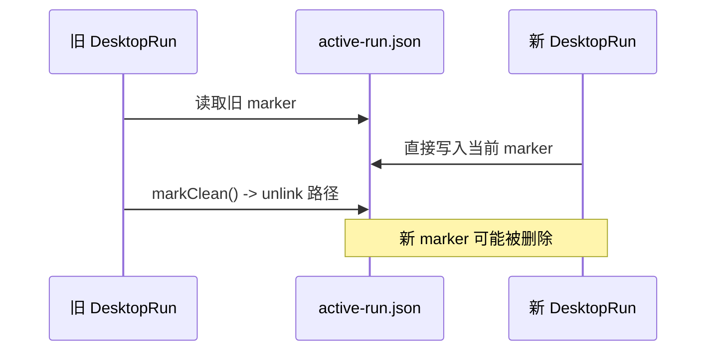
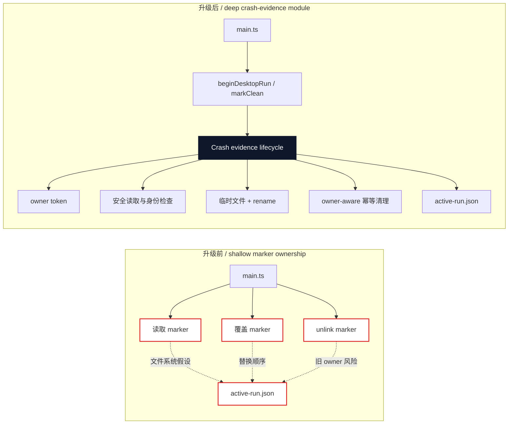

# Agent Note: Desktop 崩溃证据生命周期所有权

Status: implemented

[English](2026-08-19-desktop-crash-evidence-lifecycle-ownership.md) | 中文

## 问题

active-run marker 用来记录 Desktop 是否发生了非受控退出。此前 `beginDesktopRun()` 读取旧 marker 后直接覆盖同一路径，`DesktopRun.markClean()` 则无条件删除该路径。公开 interface 很小，但 implementation 没有真正拥有生命周期不变量：延迟退出的旧运行可能删除新运行的 marker，链接文件或非普通文件也可能被跟随或覆盖。

这是一个 shallow module。调用者必须自行依赖文件属性、替换顺序和清理时机，而这些规则没有体现在 interface 中。marker 是 Desktop 持有的状态，因此这些规则应该收回 `crash-evidence` seam 后面。

## 决策

保留现有公开 interface：

```ts
beginDesktopRun(statePath, currentRun): DesktopRun
DesktopRun.markClean(): void
```

深化 `crash-evidence` module，由 implementation 负责：

- 每次运行的私有 owner token；
- 读取或替换 marker 前的普通文件、链接和硬链接检查；
- 平台支持时使用私有目录和文件权限；
- 通过唯一临时文件和 rename 原子发布；
- 只允许 owner 清理，并保证清理幂等，不删除其他运行拥有的 marker。

调用者仍然只需要报告当前运行，并通过返回的 handle 请求受控退出。调用者不再构造 marker JSON、选择临时文件名、检查链接或判断清理是否安全。

## 升级前 / 升级后

升级前，启动和退出依赖路径级副作用：



升级后，一个 deep module 统一拥有状态和清理决策：



interface 没有扩大，但 implementation 隐藏了调用者不应该重复实现的顺序和失败行为。删除这个 module 只会把规则重新散回启动和退出流程，因此它确实为 seam 提供了深度。

## 生命周期不变量

对一个带有 owner token `T` 的 `DesktopRun` handle：

1. 启动时，如果存在旧的普通 marker，只将其作为证据读取。
2. 启动时通过私有临时文件和 rename 发布带有 `T` 的当前记录。
3. `markClean()` 读取当前 marker，只有 owner token 等于 `T` 时才删除。
4. 当前 handle 不会删除缺失、不可读或属于其他运行的 marker。
5. 重复调用 `markClean()` 在第一次清理尝试后都不会继续产生副作用。

这样调用者从一个小 interface 获得 leverage，同时把状态所有权和恢复 locality 保留在 module 内部。

## 失败和平台行为

- 符号链接、硬链接、目录或其他非普通 marker 会在读取或替换前失败关闭。
- 临时文件使用唯一名称，发布成功或失败后都会尝试清理。
- POSIX 在可用时使用 `O_NOFOLLOW`。Windows Node 不提供该 flag，因此从元数据检查到打开文件之间仍存在 reparse point 的 TOCTOU 限制。这是同一用户威胁模型下的限制，不代表完整的 Windows 对抗性文件系统防护。
- marker 持久化失败仍作为启动证据失败处理，由现有 logger 记录，不改变公开启动结果。
- marker 是进程生命周期证据，不是通用 crash recovery state machine，也不会自动恢复失败的 profile 或插件安装。

## 验证

聚焦测试覆盖：

- 上一次运行的证据；
- 正常退出和重复清理；
- 不可读的旧 marker；
- 旧运行不能删除新运行的 marker；
- 拒绝链接 marker 且不修改链接目标。

桌面 workspace 的类型检查、构建和全量测试均通过。初始化 pinned upstream checkout 后，根目录 `corepack yarn check` 也通过。

## 后果

以后 active-run evidence 的变化应集中在 `crash-evidence.ts` 及其测试中。调用者必须保留当前生命周期的 `DesktopRun` handle，不得直接操作 `active-run.json`。如果要进一步防护 Windows reparse point 竞态，需要原生 handle adapter，这是独立的安全改动，不属于本次生命周期 refactor。
