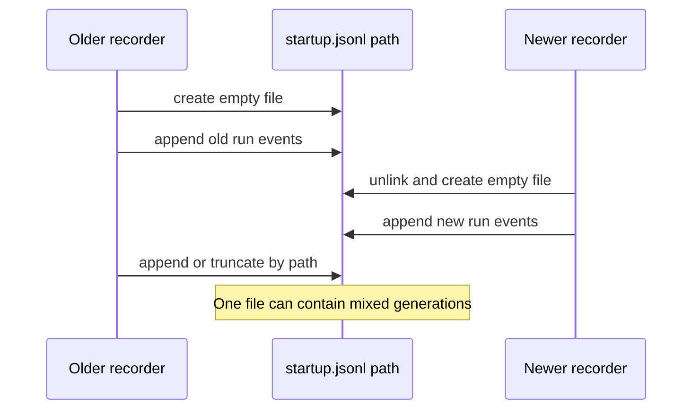
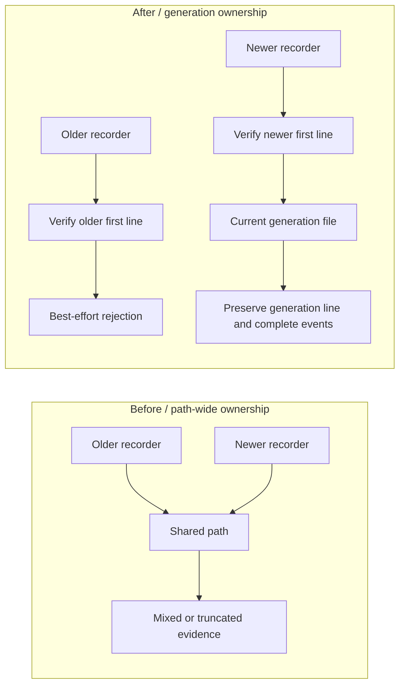

# Agent Note: Desktop lifecycle evidence generation ownership

Status: implemented

English | [中文](2026-08-19-desktop-lifecycle-evidence-generation-ownership.zh.md)

## Problem

The lifecycle recorder writes one bounded JSON Lines file for the current Desktop startup. Before this change, each recorder created the shared file, but later appends and capacity replacement trusted only the path. If a newer recorder replaced that path while an older recorder was still settling, the older recorder could append an event to the newer run or truncate its evidence during capacity retention.

The recorder interface already hid event validation and serialization, but its implementation did not own the file generation. Callers could not prevent this race because the missing invariant was inside the persistence Module.

## Decision

Keep the existing public interface. Deepen `DesktopLifecycleRecorder` so one recorder owns exactly one evidence generation:

- creation renders and writes the generation's `startup.run.started` event as the first line;
- the exact first-line bytes act as the private generation identity;
- every read, append, and replacement verifies that identity through the opened descriptor;
- capacity retention always preserves the generation line and only trims complete prior event lines;
- a delayed older recorder fails closed through the existing best-effort logger path after a newer generation takes over.

No caller learns the file format, generation identity, retention algorithm, or descriptor validation rules. The existing recorder interface remains the test surface.

## Before / after

Before, recorder lifetime and path lifetime were independent:

After, the persistence Module verifies generation ownership at every mutation:

## Lifecycle invariant

For a recorder generation whose first line is `G`:

1. The new evidence file contains `G` before the recorder is exposed to callers.
2. Every opened descriptor must still begin with the exact bytes of `G` before it is mutated.
3. Append and capacity replacement modify only a descriptor that passed that check.
4. Capacity replacement writes `G`, zero or more complete retained event lines, and the new event.
5. A missing, linked, hard-linked, malformed, or differently owned file makes evidence unavailable for that recorder and does not change the startup outcome.

The deletion test confirms the Module earns its seam: deleting the generation check would move race handling and retention ownership back into every write path rather than remove the complexity.

## Failure and platform behavior

- Evidence remains local, bounded, and best effort. Persistence failure is reported through the existing masked logger and never replaces the startup result.
- Partial synchronous writes are treated as evidence failures.
- POSIX keeps using `O_NOFOLLOW` where available. Windows Node does not expose that flag, so the existing same-user reparse-point time-of-check/time-of-use limitation remains.
- This is generation isolation, not a general multi-writer log. Desktop still publishes one current startup run at the owned path.
- Diagnostic summary and export formats are unchanged because the first line is an ordinary validated lifecycle event.

## Verification

Focused tests verify that a delayed older recorder cannot change a newer recorder's evidence, diagnostic summaries remain correlated to the new run, and capacity retention preserves the current generation line and IDs. The Desktop package build, type check, full test suite, runtime-closure check, and license check pass.

## Consequences

Future lifecycle evidence mutations belong inside `lifecycle-events.ts`. New write paths must verify the opened descriptor against the recorder generation before mutation. Callers must continue to report domain events through the recorder and must not manipulate the JSON Lines file directly.
