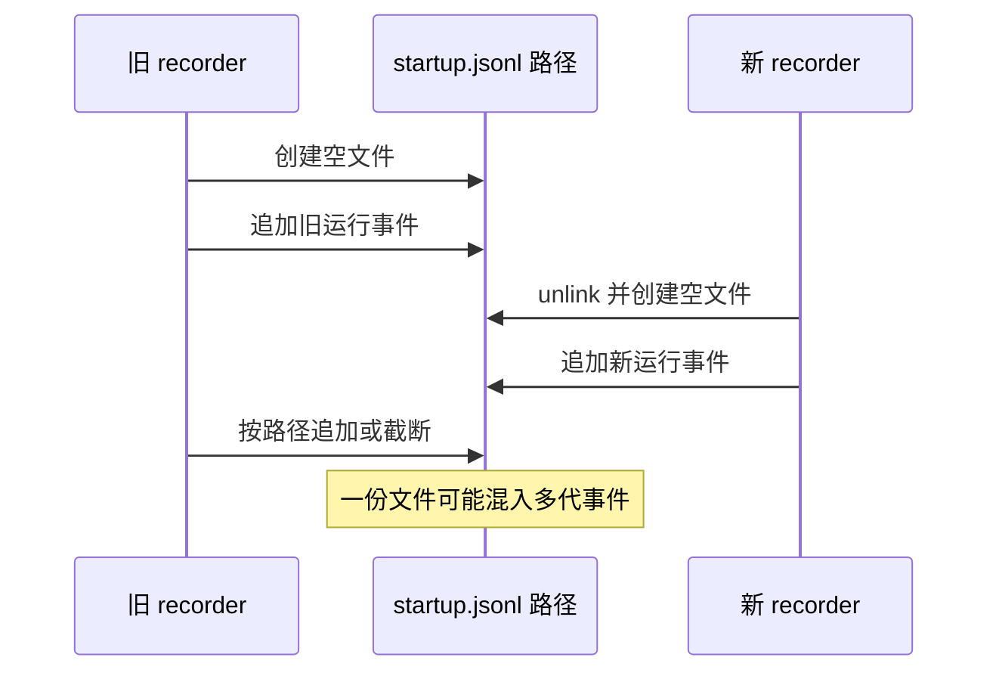
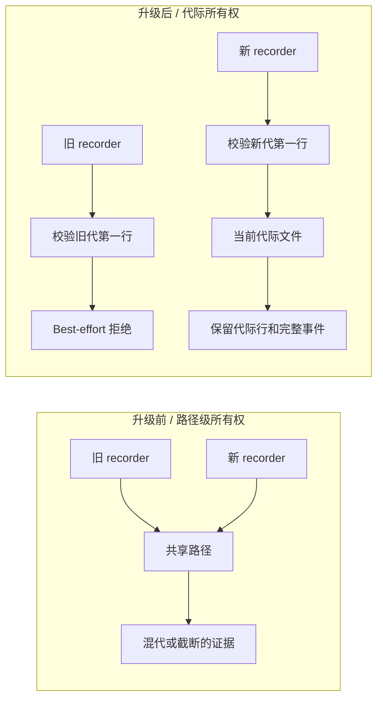

# Agent Note: Desktop 生命周期证据代际所有权

Status: implemented

[English](2026-08-19-desktop-lifecycle-evidence-generation-ownership.md) | 中文

## 问题

生命周期 recorder 会为当前 Desktop 启动过程写入一份有容量上限的 JSON Lines 文件。修改前，每个 recorder 都会创建这条共享路径，但后续追加和容量替换只信任路径本身。如果新 recorder 在旧 recorder 尚未结束时替换了该路径，旧 recorder 仍可能向新运行追加事件，或在保留容量时截断新运行的证据。

Recorder interface 已经隐藏事件校验和序列化，但其 implementation 没有拥有文件代际。调用者无法防止这个竞态，因为缺失的不变量位于持久化 module 内部。

## 决策

保留现有公开 interface，并深化 `DesktopLifecycleRecorder`，让一个 recorder 只拥有一代证据：

- 创建时渲染并写入该代的 `startup.run.started` 事件，作为第一行；
- 使用第一行的精确字节作为私有代际身份；
- 每次读取、追加和替换都通过已打开的 descriptor 校验该身份；
- 容量保留始终保留代际行，只裁剪完整的旧事件行；
- 新代接管后，延迟执行的旧 recorder 会通过现有 best-effort logger 路径失败关闭。

调用者不需要了解文件格式、代际身份、保留算法或 descriptor 校验规则。现有 recorder interface 仍然是测试 surface。

## 升级前 / 升级后

升级前，recorder 生命周期与路径生命周期相互独立：

升级后，持久化 module 会在每次修改时校验代际所有权：

## 生命周期不变量

对于第一行为 `G` 的 recorder 代际：

1. Recorder 暴露给调用者前，新证据文件已经包含 `G`。
2. 修改前，每个已打开的 descriptor 都必须仍以 `G` 的精确字节开头。
3. 追加和容量替换只能修改通过该校验的 descriptor。
4. 容量替换会写入 `G`、零条或多条完整的保留事件行，以及新事件。
5. 文件缺失、存在链接或硬链接、格式错误，或属于其他代际时，该 recorder 会将证据标记为不可用，但不会改变启动结果。

删除测试表明该 module 确实为 seam 提供了深度：删除代际校验只会把竞态处理和保留所有权重新散回每条写入路径，不会消除复杂度。

## 失败和平台行为

- 证据继续保持本地、有界且 best effort。持久化失败会通过现有脱敏 logger 报告，绝不会取代启动结果。
- 同步写入不完整时按证据失败处理。
- POSIX 在可用时继续使用 `O_NOFOLLOW`。Windows Node 不提供该 flag，因此现有同一用户 reparse point 检查与使用时序差异限制仍然存在。
- 这是代际隔离，不是通用的多 writer 日志。Desktop 仍只在自有路径发布一份当前启动运行。
- 第一行仍是普通且通过校验的生命周期事件，因此诊断摘要与导出格式保持不变。

## 验证

聚焦测试验证延迟执行的旧 recorder 无法修改新 recorder 的证据、诊断摘要仍只关联新运行，并且容量保留会保留当前代际行和 ID。Desktop package 的构建、类型检查、完整测试套件、runtime closure 检查和 license 检查均通过。

## 后果

以后生命周期证据的修改应集中在 `lifecycle-events.ts` 内。新的写入路径必须先用 recorder 代际校验已打开的 descriptor，再执行修改。调用者应继续通过 recorder 报告领域事件，不得直接操作 JSON Lines 文件。
