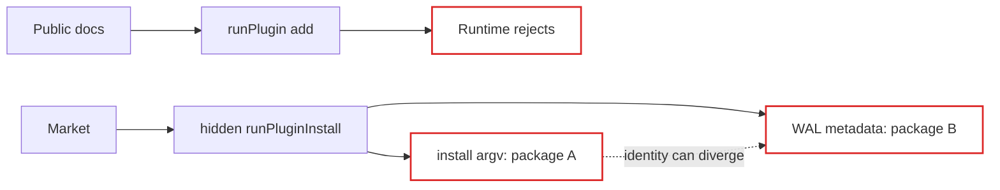
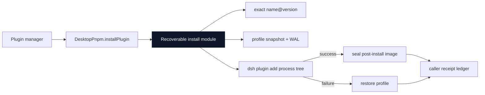

# Agent Note: Desktop plugin install lifecycle ownership

Status: implemented

English | [中文](2026-08-19-desktop-plugin-install-lifecycle-ownership.zh.md)

## Problem

The public `desktopPnpm` documentation told plugin managers to call `runPlugin(['add', ...])`, while the implementation rejected `add` and required the undocumented `runPluginInstall()` method. The Market adapter had to discover and duplicate that hidden interface to obtain profile snapshot and recovery behavior.

The hidden method also accepted installation argv separately from recovery metadata. A caller could therefore install package A while the WAL recorded package B. The process interface and recovery interface described one lifecycle but did not enforce one identity.

## Decision

Publish a narrow `DesktopPnpm` interface independently from its private Cordis `Service` implementation. Keep raw pnpm in `run()` and non-install DSH mutations in `runPlugin()`. Make `installPlugin(request)` the only supported Desktop `add` path.

`installPlugin(request)` owns:

- the enforced `add` command;
- generation of one exact `packageName@packageVersion` target;
- pre-install profile snapshots and WAL preparation;
- the generation-wide package-operation gate;
- process-tree completion;
- failed-install restoration;
- successful post-install sealing.

The caller owns trust verification, progress UI, a durable receipt ledger, post-install domain validation, and restart policy. `receiptId` is the correlation identity between that ledger and Desktop's private WAL. A recovered receipt is acknowledged only after the caller has durably removed its matching receipt.

Market retains a consumer-owned adapter interface rather than importing Desktop types. Desktop depends on Market for product composition, so a reverse type dependency would create a cycle. The structurally compatible adapter is a real seam: Desktop supplies production behavior and Market tests supply an in-memory adapter.

## Before / after

Before, the documented interface bypassed the actual recovery path:

After, one deep module owns the process and recovery lifecycle behind one request:

Deleting this module would move target generation, WAL ordering, process settlement, and restoration back into every plugin manager. The small interface therefore provides leverage and keeps recovery locality in Desktop.

## Lifecycle invariant

For one `installPlugin(request)` call:

1. `request.recovery` supplies the only package name, version, and receipt identity.
2. Desktop validates the request and snapshots the active profile before spawning.
3. Desktop generates exactly `packageName@packageVersion`; caller flags cannot replace the target.
4. `done` settles only after the complete process tree exits and the snapshot is sealed or restored.
5. A failed command restores the declarative profile image before releasing the operation gate.
6. A later startup rollback exposes the matching receipt id until the caller removes its receipt and acknowledges it.
7. Only the generation that created a live transaction may request an immediate rollback.

## Verification

Focused Desktop tests cover exact argv generation, snapshot sealing, nonzero-exit restoration, rejection of `add` through `runPlugin()`, invalid option rejection, generation-wide serialization, cancellation, and teardown. Market tests cover successful install, post-install validation failure, receipt persistence failure, recovery reconciliation, rollback, and uninstall. The Profile Loader smoke verifies every public lifecycle method through a real profile-local Host plugin without performing a package mutation.

## Consequences

Plugin authors must not use `run()` or `runPlugin()` for installation. Managers using `installPlugin()` must persist receipt intent before the operation and must reconcile `recoveredInstallReceiptIds()` on startup. Desktop's WAL format and `DesktopPnpmService` implementation remain private. File-lock crash reclamation and authoritative renderer health are separate architecture changes.
