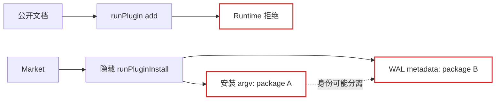
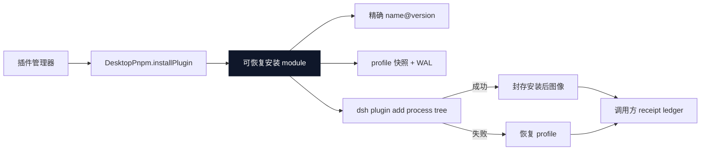

# Agent Note：Desktop 插件安装生命周期所有权

状态：已实现

[English](2026-08-19-desktop-plugin-install-lifecycle-ownership.md) | 中文

## 问题

公开 `desktopPnpm` 文档要求插件管理器调用 `runPlugin(['add', ...])`，但 implementation 会拒绝 `add`，并要求未公开的 `runPluginInstall()` 方法。Market adapter 只能自行发现并复制这个隐藏 interface，才能获得 profile 快照和恢复行为。

隐藏方法还把安装 argv 与 recovery metadata 分开接收。调用方理论上可以安装 package A，却让 WAL 记录 package B。Process interface 和 recovery interface 描述同一生命周期，却没有强制同一身份。

## 决策

将窄 `DesktopPnpm` interface 与私有 Cordis `Service` implementation 分离并公开。`run()` 保留原始 pnpm，`runPlugin()` 保留非安装 DSH mutation。`installPlugin(request)` 成为 Desktop 唯一受支持的 `add` 路径。

`installPlugin(request)` 拥有：

- 强制的 `add` 命令；
- 唯一精确 `packageName@packageVersion` 目标的生成；
- 安装前 profile 快照和 WAL 准备；
- generation-wide package-operation gate；
- process tree 完整退出；
- 安装失败恢复；
- 安装成功后图像封存。

调用方拥有信任校验、progress UI、持久 receipt ledger、安装后领域校验和重启策略。`receiptId` 是该 ledger 与 Desktop 私有 WAL 之间的关联身份。只有调用方持久删除了匹配 receipt 之后，才能确认已恢复 receipt。

Market 保留 consumer-owned adapter interface，而不反向导入 Desktop 类型。Desktop 在产品组合中依赖 Market，反向类型依赖会形成循环。结构兼容的 adapter 是真实 seam：Desktop 提供生产行为，Market 测试提供 in-memory adapter。

## 变更前 / 变更后

变更前，文档中的 interface 绕过了真正恢复路径：

变更后，一个 deep module 通过一个 request 拥有 process 和 recovery 生命周期：

删除这个 module 只会把目标生成、WAL 顺序、process settlement 和恢复重新分散到每个插件管理器中。因此这个小 interface 提供了 leverage，并把 recovery locality 保留在 Desktop。

## 生命周期不变量

对一次 `installPlugin(request)` 调用：

1. `request.recovery` 提供唯一 package name、version 和 receipt 身份。
2. Desktop 在 spawn 前校验 request 并快照激活 profile。
3. Desktop 精确生成 `packageName@packageVersion`；调用方 flag 不能替换目标。
4. 只有完整 process tree 退出且快照已封存或恢复后，`done` 才 settle。
5. 命令失败会在释放 operation gate 前恢复声明式 profile 图像。
6. 以后启动回滚会持续暴露匹配 receipt id，直到调用方删除 receipt 并确认。
7. 只有创建活跃 transaction 的 generation 才能请求立即回滚。

## 验证

Desktop 定点测试覆盖精确 argv 生成、快照封存、非零退出恢复、`runPlugin()` 拒绝 `add`、无效 option 拒绝、generation-wide 串行、cancellation 和 teardown。Market 测试覆盖成功安装、安装后校验失败、receipt 持久化失败、recovery reconcile、rollback 和 uninstall。Profile Loader smoke 通过真实 profile-local Host plugin 验证每个公开生命周期方法，但不执行 package mutation。

## 后果

插件作者不得使用 `run()` 或 `runPlugin()` 安装插件。使用 `installPlugin()` 的管理器必须在 operation 前持久 receipt intent，并在启动时 reconcile `recoveredInstallReceiptIds()`。Desktop WAL 格式与 `DesktopPnpmService` implementation 保持私有。文件锁崩溃回收和权威 renderer health 属于独立架构变更。
