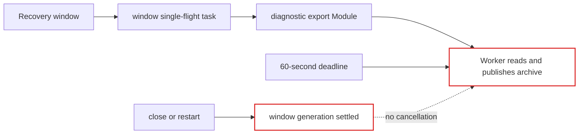
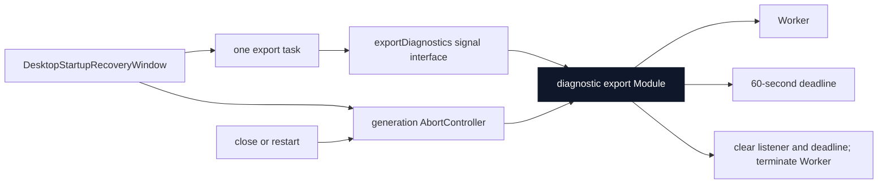

# Agent Note: Desktop recovery diagnostics lifecycle ownership

Status: implemented

English | [中文](2026-08-19-desktop-recovery-diagnostics-lifecycle-ownership.zh.md)

## Problem

The startup recovery window starts a diagnostic export automatically so evidence survives a failed launch. The export runs in a short-lived Worker with a 60-second deadline, but the window did not own that Worker's lifetime. Closing the window or choosing an immediate restart settled the recovery generation while its export could continue reading, compressing, and publishing files until completion or timeout.

The export Module owned worker termination on timeout, while the recovery window separately owned single-flight and saved-result state. No interface connected UI lifetime to worker lifetime. Correct cleanup therefore depended on eventual timeout rather than an explicit owner.

## Decision

Keep diagnostic archive construction, evidence limits, timeout, and Worker termination in the existing `diagnostic-export.ts` Module. Extend its interface with an optional `AbortSignal`. Cancellation rejects with `AbortError`, removes the abort listener, clears the deadline, and terminates the Worker through the same settlement path used by success, failure, and timeout.

Make each `DesktopStartupRecoveryWindow` own one `AbortController`. Every automatic or user-requested export in that window shares its signal and its existing single-flight task. The window aborts the controller exactly when its generation settles. `main.ts` only connects the signal to `exportDesktopDiagnostics`; it does not know how a Worker is stopped.

## Before / after

Before, the UI and Worker had independent lifetimes:

After, the recovery generation explicitly owns cancellation while the export Module owns its implementation:

Deleting the cancellation interface would move Worker knowledge into the recovery window or restore timeout-only cleanup. The interface therefore provides leverage while keeping termination locality in the export Module.

## Lifecycle invariant

For one startup recovery window generation:

1. Automatic and explicit export requests share one in-flight task.
2. A successful archive is reused for later recovery actions.
3. An export failure clears the task so the user can retry while the window remains active.
4. Closing or restarting the window aborts an in-flight export and terminates its Worker.
5. Explicit quit still waits for the required diagnostic export before settling, preserving the existing evidence-first behavior.
6. Worker success, failure, timeout, and cancellation use one first-settlement-wins path.
7. Cancellation does not change archive contents, evidence limits, retention, or atomic publication.

## Preserved behavior and limits

- Tray exports and headless CLI exports keep their existing 60-second timeout and are not tied to the recovery window controller.
- A completed archive remains available through the recovery window's existing reveal action.
- Recovery actions that require diagnostics still wait for a successful archive.
- This change does not add partial archives, resume, remote upload, or application-wide diagnostic task ownership.
- Worker termination is best-effort after Promise settlement, matching the existing timeout behavior.

## Verification

Focused tests prove that cancellation rejects with `AbortError`, terminates a non-responsive Worker, and is triggered when a recovery window generation ends. Existing tests continue to cover timeout, archive contents, evidence limits, linked-path rejection, retry, and single-flight behavior. The Desktop package check passed build, type checking, 66 Vitest files (636 passed and 11 platform-specific skips), runtime closure, and license verification on Windows.

## Consequences

Future recovery-window background operations must expose cancellation only when the underlying Module can safely stop them. Diagnostic archive semantics continue to belong to `diagnostic-export.ts`; recovery UI code must not manipulate Workers, timers, or partially published files directly.
