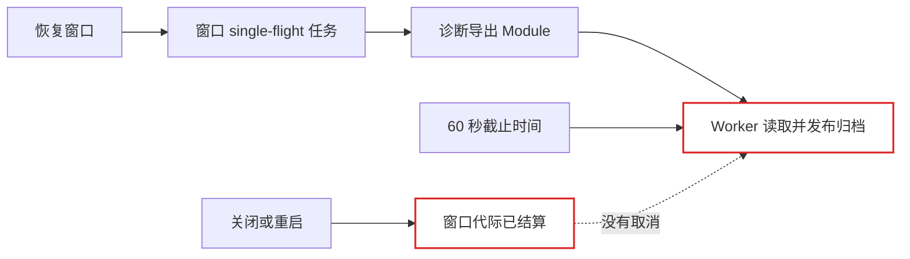
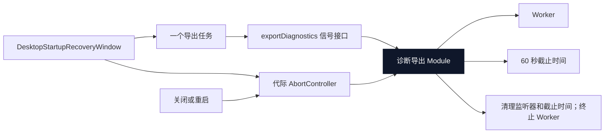

# Agent Note：Desktop 恢复诊断生命周期所有权

状态：已实现

[English](2026-08-19-desktop-recovery-diagnostics-lifecycle-ownership.md) | 中文

## 问题

启动恢复窗口会自动开始诊断导出，使启动失败的证据能够保留下来。导出运行在短生命周期 Worker 中，并有 60 秒截止时间，但窗口并不拥有该 Worker 的生命周期。关闭窗口或选择立即重启会结束恢复代际，而导出仍可能继续读取、压缩和发布文件，直到完成或超时。

导出 Module 拥有超时后的 Worker 终止，恢复窗口则单独拥有 single-flight 与已保存结果状态。两个生命周期之间没有接口。正确释放因此依赖最终超时，而不是显式 owner。

## 决策

诊断归档构建、证据上限、超时和 Worker 终止继续由现有 `diagnostic-export.ts` Module 拥有。其接口增加可选 `AbortSignal`。取消会以 `AbortError` 拒绝，移除取消监听器、清理截止计时器，并通过成功、失败和超时共用的结算路径终止 Worker。

每个 `DesktopStartupRecoveryWindow` 拥有一个 `AbortController`。该窗口内自动或由用户请求的所有导出共用其信号和现有 single-flight 任务。窗口恰好在其代际结算时中止 controller。`main.ts` 只把信号接到 `exportDesktopDiagnostics`，并不知道 Worker 如何停止。

## 升级前后

升级前，UI 与 Worker 的生命周期相互独立：

升级后，恢复代际显式拥有取消，导出 Module 拥有其实现：

删除取消接口会把 Worker 知识移动到恢复窗口，或退回只依靠超时清理。因此该接口提供 leverage，同时把终止逻辑的 locality 保留在导出 Module 中。

## 生命周期不变量

对一个启动恢复窗口代际：

1. 自动导出和显式导出请求共用一个进行中的任务。
2. 成功归档会被后续恢复操作复用。
3. 导出失败会清理任务，使用户可在窗口仍活动时重试。
4. 关闭或重启窗口会取消进行中的导出并终止其 Worker。
5. 显式退出仍会在代际结算前等待所需诊断导出，保持原有的证据优先行为。
6. Worker 成功、失败、超时和取消共用一条首次结算生效路径。
7. 取消不会改变归档内容、证据上限、保留策略或原子发布。

## 保持不变的行为与限制

- 托盘导出和无头 CLI 导出继续使用现有 60 秒超时，不绑定恢复窗口 controller。
- 已完成归档仍可通过恢复窗口现有的定位操作打开。
- 要求诊断证据的恢复操作仍会等待成功归档。
- 本次变更不增加部分归档、续传、远程上传或应用级诊断任务所有权。
- Promise 结算后对 Worker 的终止仍是 best-effort，与现有超时行为一致。

## 验证

定点测试证明取消会以 `AbortError` 拒绝、终止无响应 Worker，并在恢复窗口代际结束时触发。现有测试继续覆盖超时、归档内容、证据上限、链接路径拒绝、重试和 single-flight 行为。Desktop 包检查在 Windows 上通过 build、类型检查、66 个 Vitest 文件（636 个通过、11 个平台相关跳过）、runtime closure 和 license 验证。

## 后果

未来恢复窗口的后台操作只有在底层 Module 能够安全停止时才应暴露取消。诊断归档语义继续属于 `diagnostic-export.ts`；恢复 UI 代码不得直接操纵 Worker、计时器或部分发布文件。
