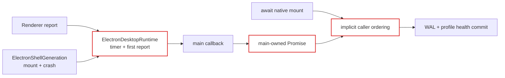
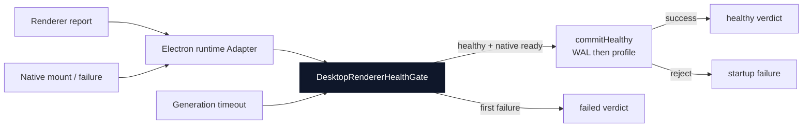

# Agent Note: Desktop renderer health ownership

Status: implemented

English | [中文](2026-08-19-desktop-renderer-health-ownership.zh.md)

## Problem

Renderer startup health was one lifecycle with three owners. `main.ts` owned an externally resolved Promise and the durable install/profile commits, `ElectronDesktopRuntime` owned timeout and first-report flags, and `ElectronShellGeneration` owned native mount and crash evidence. Correctness depended on `main.ts` awaiting native mount before consuming an already-settled Renderer report.

That implicit ordering admitted a harmful race. A Renderer could report healthy while `BrowserWindow.loadURL()` was still pending. The Runtime then treated the report as terminal and ignored a subsequent renderer crash, even though the native generation had not finished mounting. Startup could therefore commit the plugin install WAL and last-known-good profile after the generation had already failed.

## Decision

Introduce the private `DesktopRendererHealthGate` Module as the only owner of one generation's health lifecycle. Its Interface accepts Renderer reports, native mount readiness, native failures, timeout configuration, stop, and one required asynchronous `commitHealthy` operation. It returns one terminal verdict.

`ElectronDesktopRuntime` is now an Adapter at that seam. It forwards Host reports and native evidence but no longer owns timer, first-report, or failure-reason state. `main.ts` supplies the durable commit implementation and awaits native mount and the Gate verdict together.

The Gate owns these invariants:

1. Evidence received before `begin()` has no effect.
2. Renderer healthy evidence is pending, not terminal, until native mount is also ready.
3. Native readiness alone cannot commit health.
4. Renderer failure, native failure, and timeout use first-terminal-wins ordering while health is pending.
5. The healthy verdict resolves only after `commitHealthy` succeeds.
6. A commit rejection rejects startup and never produces a healthy verdict.
7. `stop()` rejects a pending waiter and prevents later evidence from starting a commit.
8. Once a durable commit starts, late evidence and stop cannot reinterpret it; the operation must settle because its writes cannot be cancelled safely.

## Before / after

Before, lifecycle knowledge and state were distributed across three Modules:

After, one deep Module reconciles all evidence before the durable commit:

Deleting the Gate would move timeout, evidence ordering, cancellation, commit eligibility, and duplicate suppression back into Runtime and `main.ts`. Its small Interface therefore provides leverage and restores locality for both implementation and tests.

## Failure and recovery behavior

Native mount becomes ready only after URL loading, Tray creation, and interactive wiring succeed. A mount rejection stops the Gate with the original cause so `Promise.all()` cannot hang or replace the useful error. A renderer crash after healthy evidence but before native readiness now fails startup and blocks the durable commit. A crash after the commit has started remains a runtime crash rather than being reinterpreted as a plugin-install startup failure.

The supplied commit keeps the existing durable order: mark the verifying install healthy, promote the active profile to last-known-good, then clear the verified WAL. WAL cleanup remains best-effort after both health markers are durable.

## Security scope

This is lifecycle ownership, not sender authentication or a plugin sandbox. Client plugins still execute in the same Renderer and share its origin. The Gate prevents accidental ordering races and duplicate lifecycle transitions, but it cannot prove which same-origin plugin sent a healthy report. Trust isolation would require a separate origin or execution realm and is a distinct architecture change.

## Verification

Focused tests cover both evidence orders, pre-begin evidence, Renderer and native failure ordering, timeout, duplicate reports, stop, asynchronous and synchronous commit failure, mount rejection, and the healthy-before-mount crash race. The Desktop package check passed build, type checking, 64 Vitest files (619 passed and 11 platform-specific skips), runtime closure, Loader/profile smokes, and license verification on Windows.
