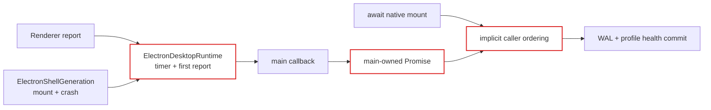
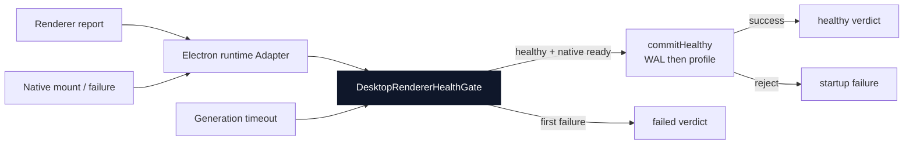

# 代理说明：桌面端 Renderer 健康状态所有权

状态：已实现

[English](2026-08-19-desktop-renderer-health-ownership.md) | 中文

## 问题

Renderer 启动健康状态原本是一套生命周期，却由三个所有者共同维护。`main.ts` 持有一个由外部 resolve 的 Promise 和安装/profile 的持久化提交，`ElectronDesktopRuntime` 持有超时及首份报告标志，`ElectronShellGeneration` 持有原生挂载与崩溃证据。正确性依赖 `main.ts` 先等待原生挂载，再消费一个可能早已结算的 Renderer 报告。

这种隐式顺序存在有害竞态。Renderer 可以在 `BrowserWindow.loadURL()` 仍未完成时报告 healthy。Runtime 随即把报告视为终态，并忽略之后发生的 Renderer 崩溃，即使原生 generation 尚未完成挂载。结果是 generation 已失败后，启动流程仍可能提交插件安装 WAL 和 last-known-good profile。

## 决策

新增私有 `DesktopRendererHealthGate` Module，作为一个 generation 健康生命周期的唯一所有者。它的 Interface 接受 Renderer 报告、原生挂载就绪、原生失败、超时配置、停止操作，以及一个必需的异步 `commitHealthy` operation，并返回一个终态 verdict。

`ElectronDesktopRuntime` 现在是该 seam 上的 Adapter。它转发 Host 报告和原生证据，不再持有 timer、首份报告或失败原因状态。`main.ts` 提供持久化提交 implementation，并同时等待原生挂载和 Gate verdict。

Gate 拥有以下不变量：

1. `begin()` 前收到的证据不产生作用。
2. Renderer healthy 证据只是 pending 条件，只有原生挂载也就绪后才能成为终态。
3. 只有原生就绪不能提交健康状态。
4. 健康仍 pending 时，Renderer 失败、原生失败和超时遵循首个终态胜出。
5. healthy verdict 只在 `commitHealthy` 成功后 resolve。
6. 提交 reject 会使启动 reject，绝不产生 healthy verdict。
7. `stop()` 会 reject 尚在 pending 的等待者，并阻止后续证据启动提交。
8. 持久化提交一旦开始，晚到证据和 stop 不再重新解释它；写操作无法安全取消，因此必须自行结算。

## 改造前后

改造前，生命周期知识和状态分散在三个 Module 中：

改造后，一个深 Module 在持久化提交前统一归并所有证据：

如果删除 Gate，超时、证据顺序、取消、提交资格和重复抑制会重新散落到 Runtime 与 `main.ts`。因此这个小 Interface 为调用者提供了 leverage，也让 implementation 和测试重新获得 locality。

## 失败与恢复行为

只有 URL 加载、Tray 创建和交互接线全部成功后，原生挂载才会标记为 ready。挂载 reject 会用原始 cause 停止 Gate，确保 `Promise.all()` 不会悬挂，也不会用无意义的停止错误覆盖原错误。Renderer 在 healthy 证据之后、原生 ready 之前崩溃时，现在会使启动失败并阻止持久化提交。提交开始后的崩溃仍属于运行期崩溃，不会被重新解释成插件安装启动失败。

注入的提交保持现有持久化顺序：先把 verifying install 标为 healthy，再把 active profile 提升为 last-known-good，最后清理 verified WAL。两项健康标记都已持久化后，WAL 清理仍保持 best-effort。

## 安全范围

这是生命周期所有权优化，不是发送者身份认证或插件 sandbox。Client 插件仍在同一个 Renderer 中执行并共享 origin。Gate 可以避免意外的顺序竞态和重复生命周期转换，但无法证明是哪一个同源插件发送了 healthy 报告。可信隔离需要独立 origin 或执行 realm，属于另一项架构变更。

## 验证

聚焦测试覆盖两种证据到达顺序、begin 前证据、Renderer 与原生失败顺序、超时、重复报告、停止、异步和同步提交失败、挂载 reject，以及 healthy 先到但挂载前崩溃的竞态。Windows 上 Desktop package check 已通过构建、类型检查、64 个 Vitest 文件（619 项通过，11 项平台相关跳过）、runtime closure、Loader/profile smoke 和许可证验证。
