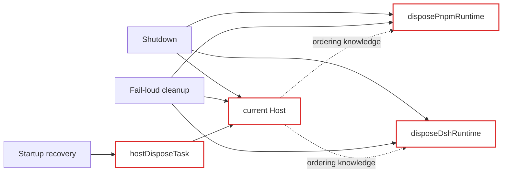
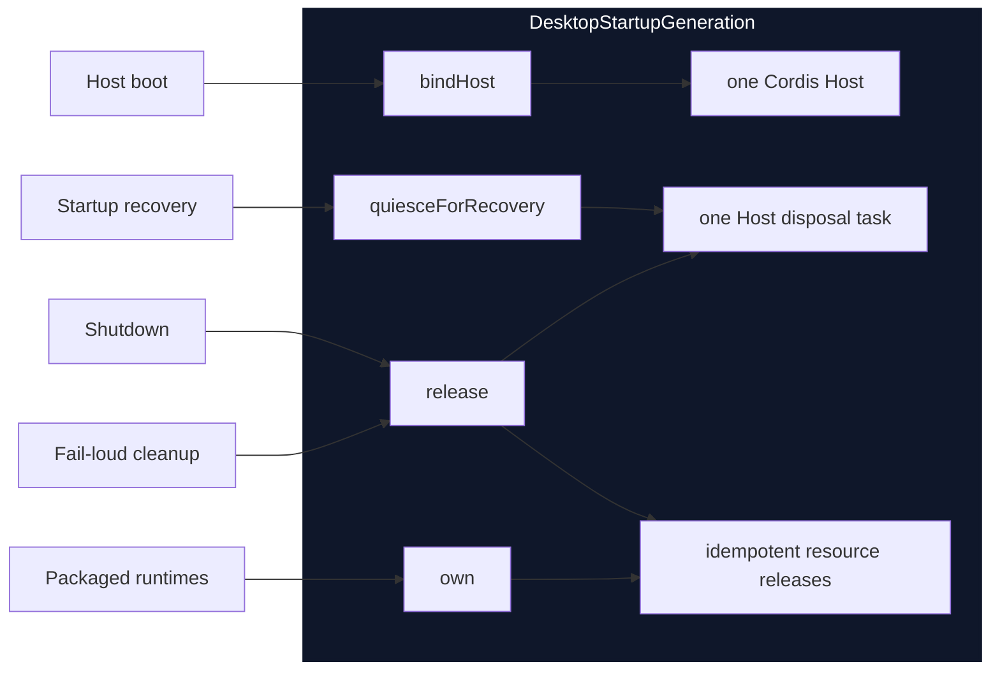

# Agent Note: Desktop startup resource ownership

Status: implemented

English | [中文](2026-08-19-desktop-startup-resource-ownership.zh.md)

## Problem

One Desktop process creates a Cordis Host, a packaged pnpm PATH installation, and on Windows a packaged DSH PATH installation. These resources belong to the same startup generation, but `main.ts` previously represented their lifetime with independent mutable variables and repeated cleanup blocks.

Ordinary shutdown, fail-loud cleanup, and startup recovery each implemented part of the same release protocol. Recovery also kept a separate Host disposal task so a later shutdown could decide whether to dispose the Host again. Callers therefore had to know disposal ordering, timeout behavior, retry behavior, and which local variable still represented the live generation.

## Decision

Introduce the private `DesktopStartupGeneration` module as the sole owner of startup resources. Its small interface is:

- `id`, the identity passed to install recovery, the recovery controller, and the pnpm bootstrap;
- `bindHost(host)`, which binds the one Cordis Host for the generation;
- `own(release)`, which registers a process-local resource and returns the same idempotent release callback for a Host effect;
- `quiesceForRecovery()`, which coalesces Host disposal and reports whether state mutation is safe;
- `release()`, which coalesces final release, waits for an in-flight recovery quiesce, retries a failed Host disposal, and releases every registered resource in reverse order.

Profile selection, install WAL transitions, Renderer health, recovery-window decisions, and native process exit keep their existing owners. This change deepens resource ownership only; it does not claim that all startup state now lives in one module.

## Before / after

Before, three entry paths depended on the same mutable locals and duplicated parts of the release protocol:

After, callers cross one interface and the implementation owns the ordering:

Deleting this module would move Host identity, concurrent release coalescing, recovery timeout handling, failed-disposal retry, and reverse resource release back into every caller. The module therefore provides leverage and keeps lifecycle knowledge local.

## Lifecycle invariant

For one `DesktopStartupGeneration`:

1. At most one distinct Cordis Host may be bound.
2. Each owned process resource has one idempotent release callback shared with Host effects.
3. Concurrent recovery requests share one Host disposal task.
4. A recovery timeout withholds the mutable recovery controller but does not cancel the underlying Host disposal.
5. Final release waits for an in-flight Host disposal; if that disposal failed, final release retries the bound Host once through the same Cordis interface.
6. Final release then invokes every owned resource callback in reverse registration order, even when another callback fails.
7. Concurrent and repeated final-release requests share one result.

The existing shutdown deadline remains the outer process-level guarantee. The generation module does not force native exit and does not weaken the rule that recovery mutation requires a successfully quiesced Host.

## Verification

Focused tests cover one-Host ownership, concurrent final release, shared Host-effect callbacks, concurrent recovery quiescence, timeout behavior, failed-disposal retry, reverse resource release, and failure preservation. Package structure tests verify that `main.ts` delegates pnpm and DSH runtime ownership, shutdown, fail-loud cleanup, and recovery quiescence to the generation module.

The Desktop type check passed. Its full test suite completed 626 tests with 11 platform skips. The root `corepack yarn check` passed with Market 255/255, the Desktop build and tests, runtime closure, CLI, Loader and profile smoke checks, and license verification. An earlier root run hit a Fetch forbidden-port allocation in an unchanged Market HTTP test; that test and the complete root gate both passed on rerun.

## Consequences

`main.ts` remains the composition root and still owns startup business ordering. It no longer owns separate Host and PATH-disposer state. New process-local resources that live for the startup generation should register through `own()`; callers must not add another shutdown-only disposer.

The next possible deepening is the selected Profile and install-WAL commit lifecycle. That work must preserve the existing order of WAL verification, Profile last-known-good promotion, best-effort WAL cleanup, and failure routing. It is intentionally outside this resource-ownership change.
