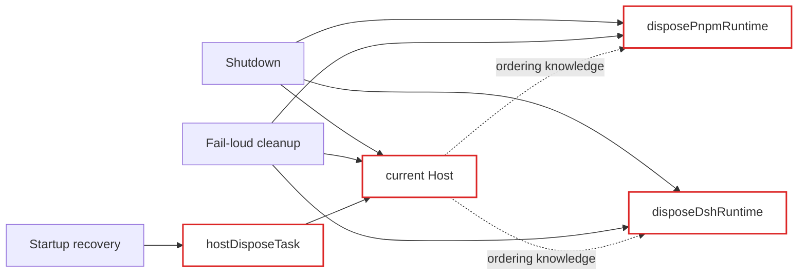
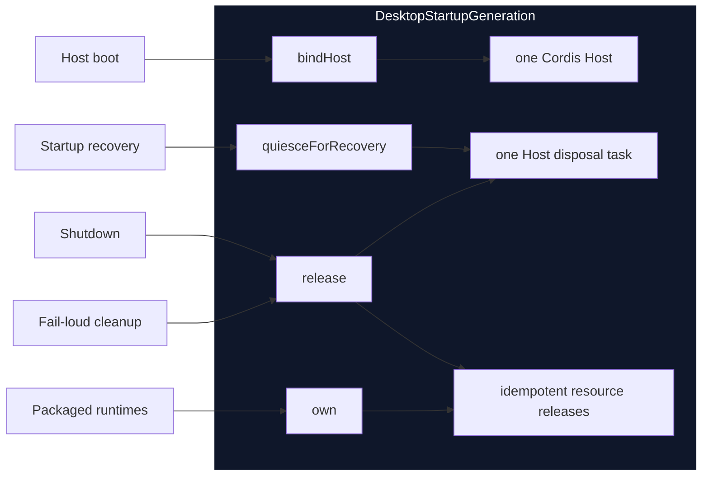

# Agent Note：Desktop 启动资源 ownership

Status: implemented

[English](2026-08-19-desktop-startup-resource-ownership.md) | 中文

## 问题

一个 Desktop 进程会创建 Cordis Host、打包 pnpm PATH 安装，以及 Windows 上的打包 DSH PATH 安装。这些资源属于同一个启动 generation，但 `main.ts` 以前用互相独立的可变变量和重复清理代码表达它们的生命周期。

普通 shutdown、fail-loud 清理和启动恢复分别实现了同一套释放协议的一部分。恢复流程还单独保存 Host disposal task，让之后的 shutdown 判断是否需要再次释放 Host。调用方因此必须知道释放顺序、超时行为、重试行为，以及哪个局部变量仍代表存活的 generation。

## 决策

引入私有 `DesktopStartupGeneration` module，作为启动资源的唯一 owner。它的小型 interface 是：

- `id`：传给安装恢复、恢复 controller 和 pnpm bootstrap 的身份；
- `bindHost(host)`：绑定该 generation 唯一的 Cordis Host；
- `own(release)`：注册进程本地资源，并返回供 Host effect 使用的同一个幂等释放回调；
- `quiesceForRecovery()`：合并 Host disposal，并报告状态修改是否安全；
- `release()`：合并最终释放、等待进行中的恢复静默化、重试失败的 Host disposal，并按逆序释放所有已注册资源。

Profile 选择、安装 WAL 转换、Renderer 健康、恢复窗口决策和原生进程退出继续由现有 owner 管理。本次修改只深化资源 ownership；它并不声称所有启动状态都已进入一个 module。

## 前后对比

此前，三个入口路径依赖同一批可变局部变量，并重复实现释放协议的一部分：

现在，调用方只跨越一个 interface，由 implementation 拥有释放顺序：

删除这个 module 会让 Host 身份、并发释放合并、恢复超时处理、失败 disposal 重试和资源逆序释放重新散落到各调用方。因此该 module 提供了 leverage，并让生命周期知识保持 locality。

## 生命周期不变量

对于一个 `DesktopStartupGeneration`：

1. 最多只能绑定一个不同的 Cordis Host。
2. 每个受管进程资源只有一个幂等释放回调，并与 Host effect 共享。
3. 并发恢复请求共享一个 Host disposal task。
4. 恢复超时时不向窗口提供可修改状态的 recovery controller，但不会取消底层 Host disposal。
5. 最终释放会等待进行中的 Host disposal；如果该 disposal 失败，最终释放会通过同一个 Cordis interface 对仍绑定的 Host 重试一次。
6. 随后最终释放按注册逆序调用每个受管资源回调，即使其他回调失败也继续执行。
7. 并发和重复的最终释放请求共享同一个结果。

现有 shutdown deadline 仍是外层进程级保证。generation module 不会强制原生退出，也不会削弱“恢复修改必须先成功静默 Host”的规则。

## 验证

聚焦测试覆盖唯一 Host ownership、并发最终释放、共享 Host-effect 回调、并发恢复静默化、超时行为、失败 disposal 重试、资源逆序释放和失败保留。包结构测试验证 `main.ts` 把 pnpm 与 DSH runtime ownership、shutdown、fail-loud 清理和恢复静默化委托给 generation module。

Desktop 类型检查通过。完整测试完成 626 项，另有 11 项平台跳过。根仓库 `corepack yarn check` 通过，包括 Market 255/255、Desktop 构建和测试、runtime closure、CLI、Loader 与 profile smoke，以及许可证验证。更早一次根检查在未修改的 Market HTTP 测试里随机分配到 Fetch 禁止端口；该测试和完整根 gate 重跑均通过。

## 后果

`main.ts` 仍是 composition root，并继续拥有启动业务顺序。它不再拥有相互分离的 Host 与 PATH disposer 状态。新的、与启动 generation 同寿命的进程本地资源应通过 `own()` 注册；调用方不得再增加只供 shutdown 使用的独立 disposer。

下一项可能的深化是已选 Profile 与安装 WAL 的提交生命周期。该工作必须保持 WAL 验证、Profile last-known-good 提升、best-effort WAL 清理和失败路由的现有顺序。它被明确排除在本次资源 ownership 修改之外。
