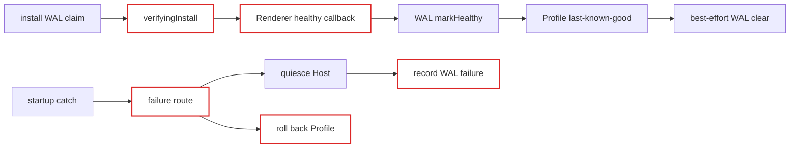
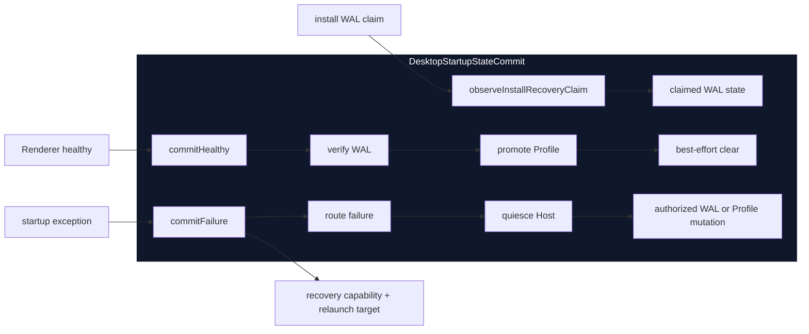

# Agent Note: Desktop startup state commit ownership

Status: implemented

English | [中文](2026-08-19-desktop-startup-state-commit-ownership.zh.md)

## Problem

One healthy Desktop generation may need to verify a protected plugin-install WAL, promote the selected Profile to last-known-good, and remove terminal WAL metadata. One failed generation may instead need to quiesce the Cordis Host, route the failure, persist install recovery, or restore Profile selection.

`main.ts` previously owned these transitions through separate mutable variables and direct calls into the Profile and WAL modules. Correctness depended on call-site ordering: WAL verification had to precede Profile promotion, cleanup had to remain best-effort, and no failure path could downgrade an already verified install. Failure handling also computed its route separately from the state mutation it authorized.

## Decision

Introduce the private `DesktopStartupStateCommit` module. Its interface is:

- `observeInstallRecoveryClaim(claim)`, which retains only the WAL state relevant to this startup;
- `commitHealthy()`, which verifies a claimed install, promotes the selected Profile, and then best-effort clears a verified WAL;
- `commitFailure(input)`, which routes the failure, quiesces the Host, applies only the mutation authorized by that route, and returns the recovery capability and optional last-known-good relaunch target.

`main.ts` remains the composition root. It still owns Renderer health evidence, the native recovery window, notifications, and process exit. The new module owns only durable startup state commits and their ordering.

## Before / after

Before, the composition root carried WAL and Profile state and had to reproduce their ordering constraints:

After, callers cross one interface and the implementation owns each durable transition:

Deleting this module would move claim interpretation, partial-commit handling, Host-before-state ordering, and failure-route authorization back into the composition root. The module therefore provides leverage and keeps durable startup knowledge local.

## Commit invariant

For one `DesktopStartupStateCommit`:

1. A verifying WAL becomes `verified` before the selected Profile is promoted to last-known-good.
2. Once WAL verification succeeds, later Profile promotion failure cannot downgrade the install to recovery-pending.
3. Terminal WAL cleanup happens only after Profile promotion and is best-effort. Cleanup failure is logged and leaves both healthy decisions intact.
4. A startup failure must quiesce the Host before any WAL or Profile mutation.
5. If Host quiescence fails or times out, no recovery state is mutated and no mutable recovery controller is exposed.
6. A protected-install failure records only its WAL failure; it does not roll back Profile selection.
7. A candidate Profile failure rolls selection back to last-known-good and returns that explicit relaunch target; it does not open the ordinary recovery window.

The WAL store remains the owner of WAL format and transaction validity. The Profile manager remains the owner of selection-file validation and atomic writes. This module owns only the cross-module commit protocol.

## Verification

Focused behavior tests use real temporary Profile state and real install WAL files. They cover healthy verification and cleanup, Host-before-WAL failure ordering, candidate Profile fallback, failed-quiesce mutation denial, verified-install preservation after Profile promotion failure, and best-effort cleanup failure. Package structure tests verify that `main.ts` delegates claim observation and healthy/failure commits without retaining its former WAL variables or direct Profile mutations.

Desktop type checking and build passed. The focused startup suite completed 50 tests. The full Desktop suite completed 632 tests with 11 platform skips.

## Consequences

`main.ts` no longer needs to understand the WAL phases that participate in startup commits or the ordering between WAL and Profile writes. Recovery UI receives a controller only when the state-commit module confirms the Host is quiescent. New startup-persistent state must not add another direct write path in `main.ts`; it should either stay within its existing owner or join this commit protocol when ordering spans multiple modules.
