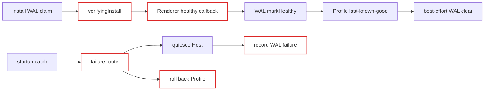
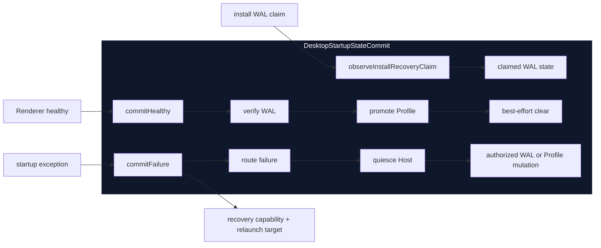

# Agent Note：Desktop 启动状态提交 ownership

Status: implemented

[English](2026-08-19-desktop-startup-state-commit-ownership.md) | 中文

## 问题

一个健康的 Desktop generation 可能需要验证受保护插件安装 WAL、把已选 Profile 提升为 last-known-good，并删除终态 WAL 元数据。一个失败的 generation 则可能需要先静默 Cordis Host，再进行失败路由、持久化安装恢复状态，或恢复 Profile 选择。

`main.ts` 以前通过多个独立可变变量以及对 Profile、WAL module 的直接调用拥有这些转换。正确性依赖调用点顺序：WAL 验证必须早于 Profile 提升，清理必须保持 best-effort，任何失败路径都不能降级已经 verified 的安装。失败处理还把路由计算与该路由授权的状态修改分开执行。

## 决策

引入私有 `DesktopStartupStateCommit` module。它的 interface 是：

- `observeInstallRecoveryClaim(claim)`：只保留与本次启动有关的 WAL 状态；
- `commitHealthy()`：验证已 claim 的安装、提升已选 Profile，然后 best-effort 清理 verified WAL；
- `commitFailure(input)`：进行失败路由、静默 Host、只执行该路由授权的修改，并返回恢复能力以及可选的 last-known-good 重启目标。

`main.ts` 继续作为 composition root。Renderer 健康证据、原生恢复窗口、通知和进程退出仍由它拥有。新 module 只拥有持久启动状态提交及其顺序。

## 前后对比

此前，composition root 同时携带 WAL 与 Profile 状态，并且必须自行维持它们的顺序约束：

现在，调用方只跨越一个 interface，由 implementation 拥有每个持久化转换：

删除这个 module 会让 claim 解释、部分提交处理、Host-before-state 顺序和失败路由授权重新散落到 composition root。因此该 module 提供了 leverage，并让持久启动知识保持 locality。

## 提交不变量

对于一个 `DesktopStartupStateCommit`：

1. verifying WAL 必须先变成 `verified`，随后才能把已选 Profile 提升为 last-known-good。
2. WAL 验证一旦成功，后续 Profile 提升失败不能再把该安装降级为 recovery-pending。
3. 终态 WAL 清理只在 Profile 提升后发生，并且是 best-effort。清理失败只记录日志，两个健康结论都保持不变。
4. 启动失败必须先静默 Host，之后才能修改 WAL 或 Profile。
5. 如果 Host 静默失败或超时，不得修改任何恢复状态，也不得暴露可修改状态的 recovery controller。
6. 受保护安装失败只记录对应 WAL 失败，不回滚 Profile 选择。
7. 候选 Profile 失败会把选择恢复到 last-known-good，并返回明确的重启目标；它不会打开普通恢复窗口。

WAL store 继续拥有 WAL 格式和事务有效性。Profile manager 继续拥有选择文件验证和原子写入。本 module 只拥有跨 module 的提交协议。

## 验证

聚焦行为测试使用真实临时 Profile 状态和真实安装 WAL 文件，覆盖健康验证与清理、Host-before-WAL 失败顺序、候选 Profile fallback、静默失败时禁止修改、Profile 提升失败后保留 verified 安装，以及 best-effort 清理失败。包结构测试验证 `main.ts` 委托 claim 观察和健康/失败提交，不再保留原有 WAL 变量或直接修改 Profile。

Desktop 类型检查和构建通过。聚焦启动测试完成 50 项。完整 Desktop 测试完成 632 项，另有 11 项平台跳过。

## 后果

`main.ts` 不再需要理解参与启动提交的 WAL phase，也不再需要维护 WAL 写入与 Profile 写入之间的顺序。只有状态提交 module 确认 Host 已静默时，恢复 UI 才会拿到 controller。新的启动持久状态不应在 `main.ts` 增加另一条直接写路径；如果它的顺序跨越多个 module，应加入本提交协议，否则继续留在原 owner 内。
