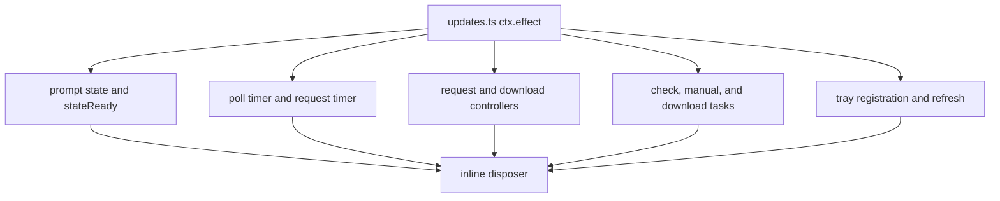
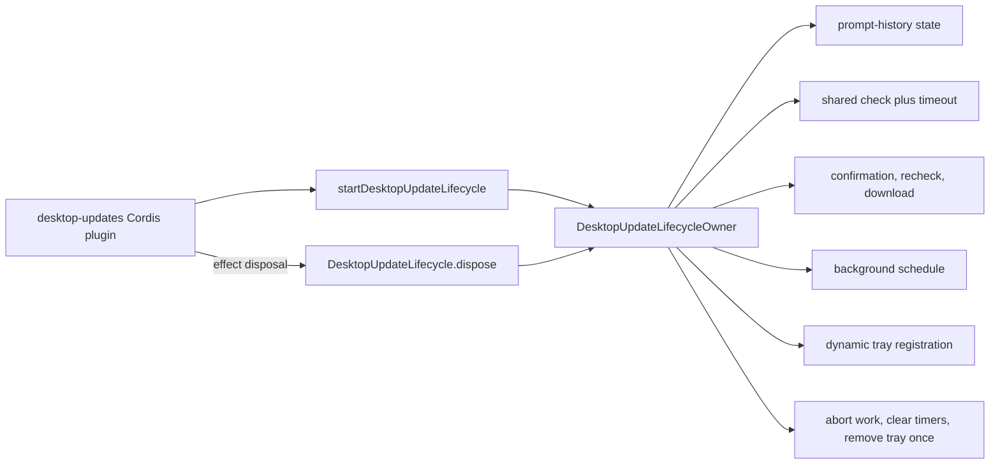

# Agent Note: Desktop update lifecycle ownership

Status: implemented

English | [中文](2026-08-19-desktop-update-lifecycle-ownership.zh.md)

## Problem

The `desktop-updates` Cordis plugin coordinates scheduled checks, manual checks, confirmation, download handoff, prompt-history persistence, dynamic tray state, timeouts, cancellation, and disposal. Before this change, all mutable state lived in one `ctx.effect()` closure in `updates.ts`: two timers, two `AbortController` instances, three single-flight tasks, persisted state readiness, availability state, and the tray registration.

The plugin interface was small, but the implementation made lifecycle correctness difficult to inspect. Understanding whether one Host generation released all update work required reading every nested function and matching each state variable with its cleanup path. The update operation already had one natural lifetime, so its state belonged behind one generation-scoped seam.

## Decision

Keep the public `desktop-updates` Cordis plugin and its exported `Config` unchanged. Add a private `DesktopUpdateLifecycle` Module whose interface is:

```ts
startDesktopUpdateLifecycle(options): DesktopUpdateLifecycle
DesktopUpdateLifecycle.dispose(): Promise<void>
```

The Module owns:

- prompt-history loading, validation, replacement, and optional persistence;
- background scheduling and request timeout timers;
- shared manual/background version checks;
- confirmation followed by a fresh version check;
- one active download and its cancellation controller;
- available/downloading tray presentation and its registration;
- generation disposal, including idempotent cancellation and tray removal.

`updates.ts` now validates Cordis configuration, starts one lifecycle in one effect, and delegates effect disposal to the returned handle. It does not inspect or mutate lifecycle state.

## Before / after

Before, one plugin closure exposed many parallel ownership paths:



After, the Cordis plugin has one generation-scoped lifecycle handle:



The interface is smaller than the implementation and gives the caller leverage: one start operation establishes all update behavior, and one disposal operation releases the generation. Deleting the Module would move its state and cleanup rules back into `updates.ts`, so it earns its seam.

## Lifecycle invariant

For one update lifecycle generation:

1. At most one version-check request is active; manual and background callers share it.
2. At most one confirmation/download task is active.
3. A confirmed version is checked again before download handoff.
4. Background prompting records the version before opening confirmation and does not repeat it for the same persisted version.
5. Disposal marks the generation inactive before clearing timers, aborting requests/downloads, and removing the tray item.
6. Disposal waits only for state readiness and the abortable version request; native dialogs remain non-cancellable and do not block Host release.
7. Repeated disposal returns the same task, removes the tray item once, and cannot restart polling.

## Preserved behavior and limits

- The update state remains version 2 with the same 4 KiB read limit and atomic best-effort persistence.
- Manual failures remain visible only through the existing native result dialog. Scheduled, filesystem, download, and installer-opening failures retain their existing silent behavior.
- Download endpoints, artifact validation, installer handoff, and update discovery are unchanged.
- This refactor does not add cryptographic artifact identity, resumable downloads, automatic retries, or remote telemetry.
- Native confirmation and result dialogs still cannot be cancelled. The owner prevents their late result from starting new work after disposal.

## Verification

Existing update tests continue to cover scheduling, prompt persistence, manual/background check sharing, confirmation and recheck, download single-flight, cancellation, timeout, platform capability, and non-blocking native dialogs. A lifecycle test also verifies idempotent disposal and that polling does not restart afterward. The Desktop package build, type check, full test suite, runtime-closure check, and license check pass.

## Consequences

Future changes to update timers, operation tasks, prompt history, tray state, or release behavior belong in `update-lifecycle.ts`. `updates.ts` remains the Cordis adapter and configuration surface. New update capabilities should extend the lifecycle Module only when they share this generation lifetime; artifact verification and platform installer adapters remain separate Modules.
