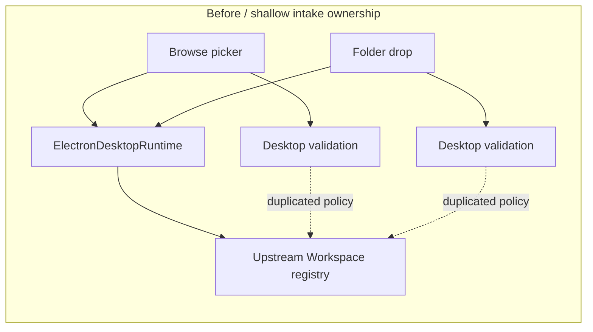
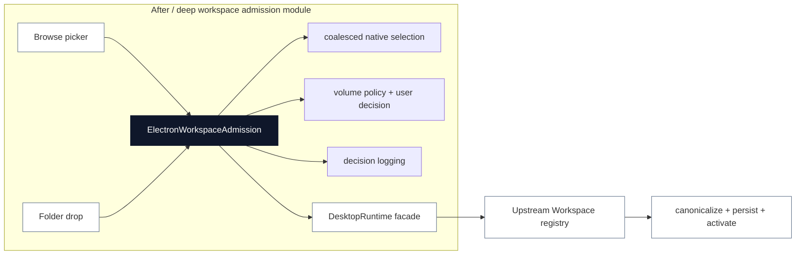

# Agent Note: Desktop workspace admission ownership

Status: implemented

English | [中文](2026-08-19-desktop-workspace-admission-ownership.zh.md)

## Problem

Workspace intake had two Desktop entry paths: the patched browse picker and native folder drop. Both eventually called the upstream Workspace interface, but the Windows volume policy lived in the picker/drop callers and the native selection task lived in `ElectronDesktopRuntime`. A new intake path could therefore persist a path without the Desktop-owned storage decision, and callers had to know which path was safe to use.

The upstream Workspace module correctly owns canonicalization, persistence, and session activation. Desktop owns the admission decision before persistence: native selection, Windows volume inspection, confirmation, blocking, and audit logging. Those responsibilities were spread across a shallow facade instead of one seam.

## Decision

Keep the existing runtime interface:

```ts
DesktopRuntime.pickDirectory(): Promise<string | null>
DesktopRuntime.validateDirectory(path: string): Promise<boolean>
```

Deepen a Desktop-owned `ElectronWorkspaceAdmission` module behind that interface. It now owns:

- one coalesced native picker task per runtime;
- platform capability rejection before opening a dialog;
- Windows NTFS/ReFS, removable-drive, network-drive, and inspection-failure decisions;
- localized confirmation and blocking dialogs;
- decision logging.

The upstream Workspace module remains the adapter that canonicalizes and persists an admitted path, then activates the resulting workspace. Desktop does not copy or own Workspace registry state.

## Before / after

Before, policy was attached to individual callers and the runtime facade carried unrelated lifecycle details:



After, every Desktop-owned intake decision crosses one deep seam before the unchanged upstream persistence module:



The interface is unchanged. Deleting the admission module would move selection coalescing, platform decisions, dialogs, and logging back into each caller; it would not remove that complexity. The module earns the seam and improves locality.

## Ownership invariant

For every Desktop-selected or dropped path:

1. The path crosses Desktop admission before any Workspace create call.
2. A fixed ACL-capable local Windows volume is allowed without a prompt.
3. A removable NTFS/ReFS volume requires explicit confirmation.
4. Unsupported or uninspectable storage is blocked and never persisted.
5. Canonicalization, durable registry order, and session activation remain upstream Workspace responsibilities.

This gives callers leverage from two small methods while keeping the policy implementation and its tests in one place.

## Verification

The admission module tests cover concurrent picker coalescing, platform rejection, fixed-volume allow, removable-volume confirmation/cancellation, unsupported storage blocking, and a disconnected volume failing closed. The Desktop package passed typecheck, build, and the full test suite (`591 passed`, `11 skipped`). After building the community-market prerequisite, Loader, profile, runtime-closure, and license checks passed.

## Consequences

Future Desktop workspace intake paths must use `ElectronWorkspaceAdmission` through the runtime facade and must not call the upstream Workspace create interface before admission. The upstream submodule remains pinned and unmodified. Stronger Windows reparse-point protection is a separate filesystem-security change; this refactor centralizes the policy seam but does not claim to remove the native TOCTOU limitation.
