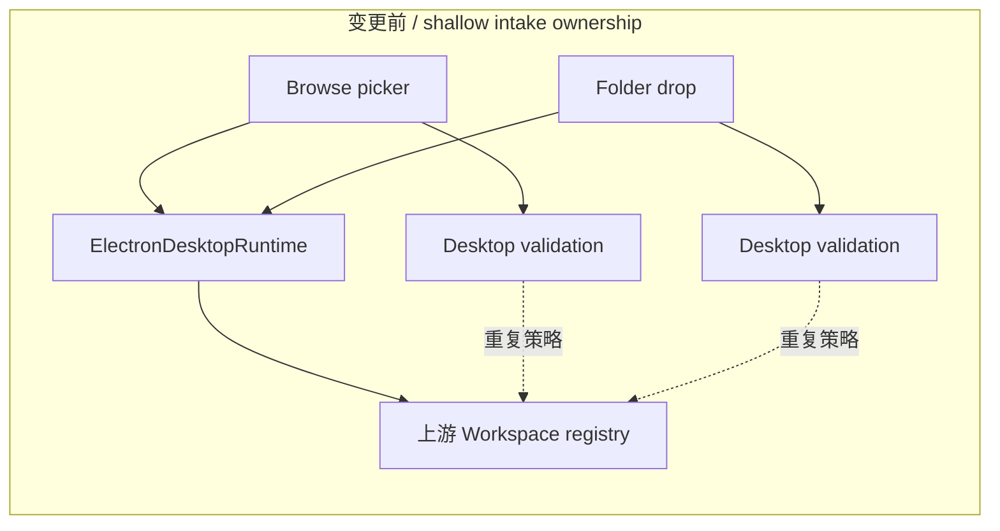
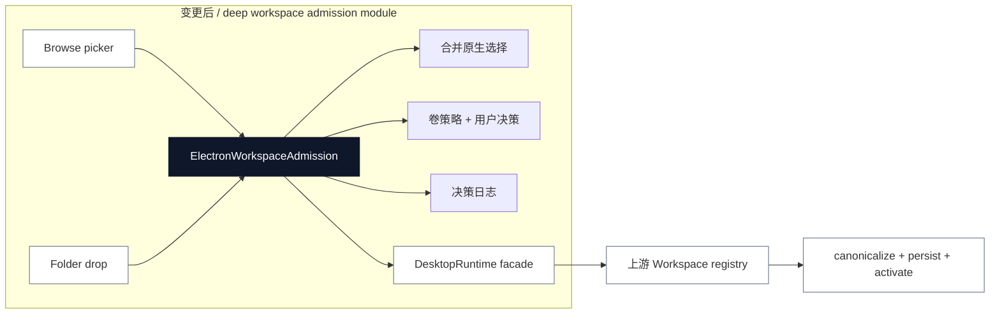

# Agent Note：Desktop 工作区准入所有权

状态：已实现

[English](2026-08-19-desktop-workspace-admission-ownership.md) | 中文

## 问题

工作区接入有两个 Desktop 入口：补丁后的 browse picker 和原生文件夹拖入。两者最终都会调用上游 Workspace interface，但 Windows 卷策略分散在 picker/drop caller 中，原生选择任务又放在 `ElectronDesktopRuntime` 里。以后新增入口时，可能在没有 Desktop 存储决策的情况下持久化路径，调用者也必须知道哪个路径可以安全使用。

上游 Workspace module 正确拥有 canonicalization、持久化和 session activation。Desktop 拥有的是持久化前的准入决策：原生选择、Windows 卷检查、确认、阻止和审计日志。这些职责之前散落在 shallow facade 中，而不是集中在一个 seam 后面。

## 决策

保留现有 runtime interface：

```ts
DesktopRuntime.pickDirectory(): Promise<string | null>
DesktopRuntime.validateDirectory(path: string): Promise<boolean>
```

在该 interface 后加深 Desktop-owned 的 `ElectronWorkspaceAdmission` module。它现在拥有：

- 每个 runtime 一个合并后的原生 picker task；
- 打开 dialog 前的平台能力拒绝；
- Windows NTFS/ReFS、可移动盘、网络盘和检查失败的决策；
- 本地化的确认与阻止 dialog；
- 决策日志。

上游 Workspace module 仍是 adapter，负责 canonicalize 和持久化已准入的路径，然后激活生成的 workspace。Desktop 不复制也不拥有 Workspace registry state。

## 变更前 / 变更后

变更前，策略附着在不同 caller 上，runtime facade 还携带了不相关的生命周期细节：



变更后，所有 Desktop-owned 的 intake decision 都先穿过同一个 deep seam，再进入不变的上游持久化 module：



interface 没有变化。删除 admission module 只会把选择合并、平台决策、dialog 和日志重新分散到每个 caller 中，而不会消除复杂度。因此该 module 赚到了这个 seam，并改善了 locality。

## 所有权不变量

对每个由 Desktop 选择或拖入的路径：

1. 路径必须在任何 Workspace create call 之前穿过 Desktop admission。
2. 固定且具备 ACL 能力的本地 Windows 卷无需提示即可允许。
3. 可移动 NTFS/ReFS 卷必须得到明确确认。
4. 不支持或无法检查的存储会被阻止，永不持久化。
5. canonicalization、持久 registry 顺序和 session activation 仍由上游 Workspace 负责。

这让 caller 通过两个小方法获得 leverage，同时把策略 implementation 和测试集中在一个位置。

## 验证

准入 module 测试覆盖并发 picker 合并、平台拒绝、固定卷允许、可移动卷确认/取消、不支持存储阻止，以及断盘时 fail closed。Desktop package 通过了 typecheck、build 和全量测试（`591 passed`、`11 skipped`）。补建 community-market 前置产物后，Loader、profile、runtime-closure 和 license 检查均通过。

## 后果

以后 Desktop 工作区 intake path 必须通过 runtime facade 使用 `ElectronWorkspaceAdmission`，不能在 admission 之前调用上游 Workspace create interface。上游 submodule 仍保持 pinned 且未修改。更强的 Windows reparse-point 防护属于独立的 filesystem-security change；本次重构集中的是 policy seam，并不声称消除了原生 TOCTOU 限制。
