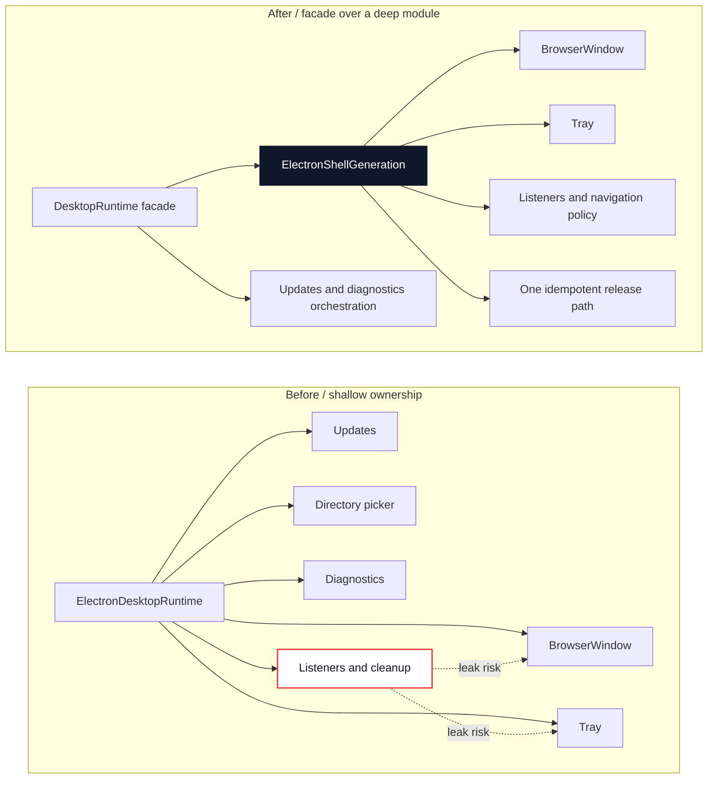
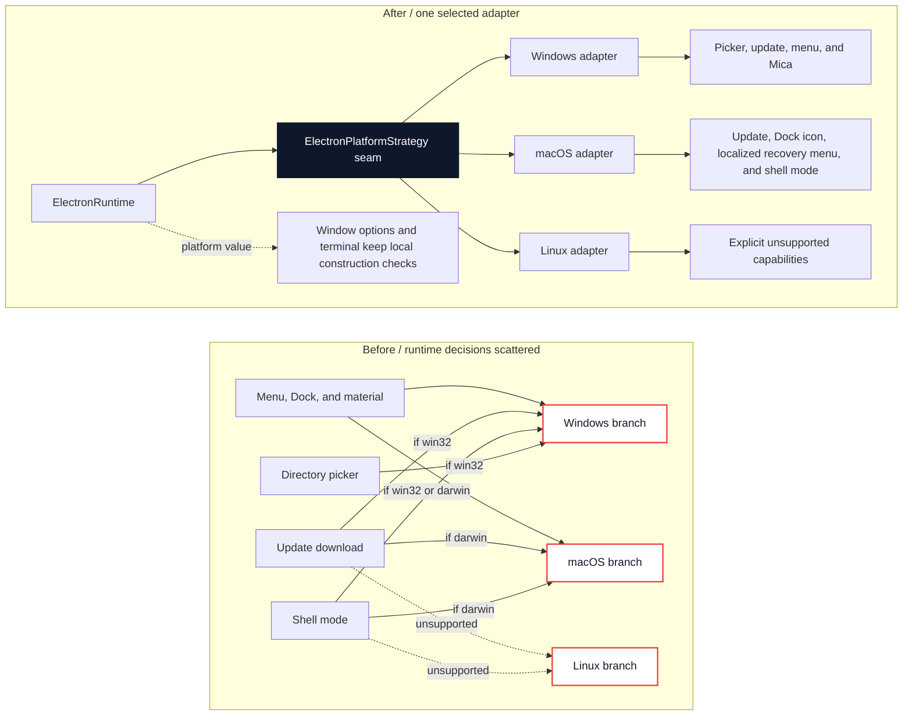
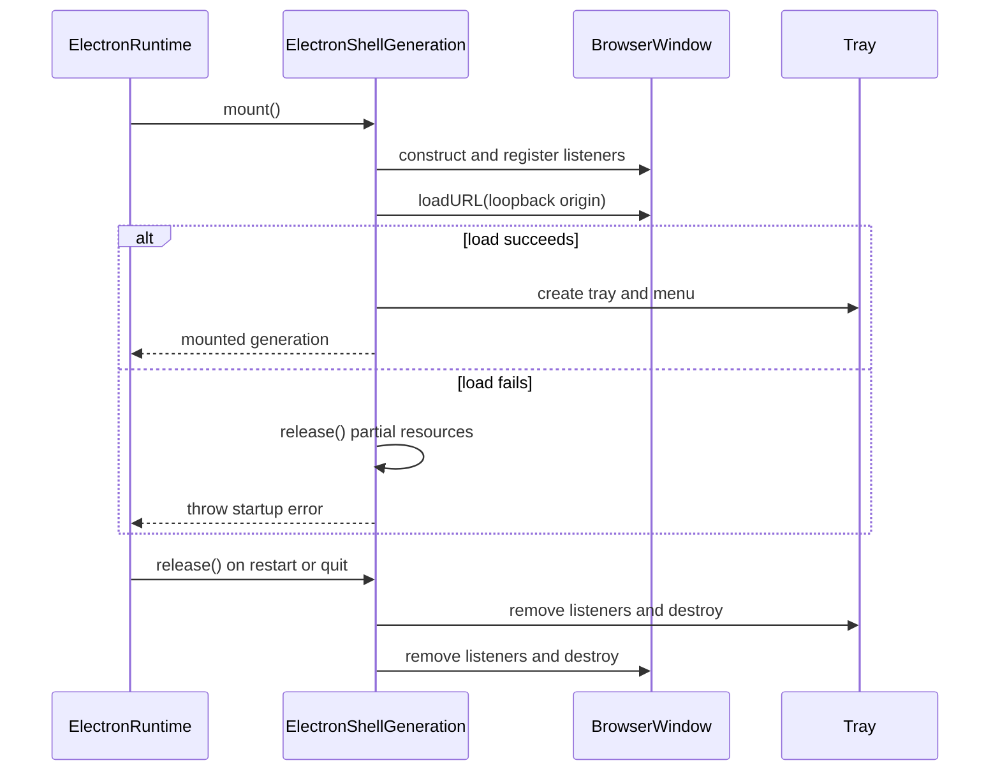

# Agent Note: Native shell generation and platform adapters

Status: implemented

English | [中文](2026-08-19-native-shell-generation-and-platform-adapters.zh.md)

## Problem

The Electron runtime used to coordinate the Host while also constructing the `BrowserWindow` and `Tray`, registering their listeners, enforcing navigation rules, handling zoom shortcuts, and branching on the operating system. A profile or mode restart replaces all native resources together, but their ownership and cleanup were spread across the larger runtime implementation. Adding platform behavior required more conditionals in that same lifecycle.

This reduced locality: a maintainer had to inspect construction, event registration, failure cleanup, ordinary shutdown, and platform checks together to verify one generation. It also made the public `DesktopRuntime` interface a poor test surface for native resources that are intentionally private to Electron.

## Decision

Keep `DesktopRuntime` as the existing Host-facing interface and deepen two private Electron modules behind it:

- `ElectronShellGeneration` owns one complete native shell generation.
- `ElectronPlatformStrategy` is the seam where startup selects one Windows, macOS, or Linux adapter.

The runtime coordinates these modules but does not expose either one as a third-party interface. The renderer carrier, public profile and pnpm interfaces, and the pinned upstream checkout remain unchanged.

### Architecture shift

The first change moves native resource ownership out of the runtime facade and behind one deep generation module:

The `ElectronRuntime` interface remains the orchestration point. `ElectronShellGeneration` earns locality because window, tray, listeners, navigation policy, and release now change and fail together behind one interface.

### Platform strategy shift

The second change consolidates the platform decisions that already vary together, while leaving unrelated one-off construction checks local:

With three concrete adapters, the strategy is a real seam. It gives capability checks and native presentation one selection point without forcing terminal or window-construction details into a fake universal interface.

### Generation lifecycle

The same `release()` path handles both partial startup and ordinary shutdown, so a restart cannot leave a listener, tray, or window from the previous generation alive.

### One owner for native shell resources

`ElectronShellGeneration.mount()` creates the application icon, configures the application through the selected platform adapter, creates the window, registers every window/application/webContents listener, loads the loopback URL, and creates the tray only after loading succeeds. It also owns same-origin navigation enforcement, external-link delegation, renderer failure reporting, tray menu refresh, and bounded zoom shortcuts.

`release()` is the only disposal path for resources owned by the generation. It is idempotent, stops renderer boot monitoring, removes the registered listeners, destroys the tray, and destroys the window. A failed `mount()` uses that same path, so partial startup and ordinary shutdown have the same cleanup semantics. The runtime may replace its generation reference, but callers must not cache `BrowserWindow`, `Tray`, or their listeners across a profile or mode restart.

This module is deep because a small `mount` / `show` / `refresh` / `release` interface hides the ordering and failure behavior of the complete native shell. Deleting it would move that complexity back into the runtime rather than remove it, and its interface is therefore the test surface for generation ownership.

### One platform adapter per runtime

`electronPlatformStrategy()` selects exactly one adapter at runtime construction. Each adapter provides a platform identity, declares directory-picking, shell-mode, and update-download capabilities, and owns native presentation operations:

- Windows removes the application menu and restores Mica after theme changes.
- macOS configures the Dock icon and a generation-owned localized recovery menu.
- Linux declares unsupported advanced-shell and update-download capabilities without pretending to provide them.

The shell generation consumes this interface without branching on `process.platform`. The runtime uses the same selected adapter for capability checks and update behavior, so platform policy and native implementation remain at one seam. With three concrete adapters, this is a real seam rather than a hypothetical abstraction.

New platform-specific behavior belongs in the relevant adapter when it satisfies this interface. Shared generation ordering, resource ownership, navigation policy, and failure handling remain in `ElectronShellGeneration`. Product features and public Host interfaces do not depend directly on an adapter.

## Verification

The implementation and its focused tests were committed together. Electron runtime tests cover repeated release, listener cleanup after failed startup, Windows directory selection, Windows menu removal, Windows Mica refresh, macOS Dock configuration, Linux capability rejection, and unsupported platform rejection.

Before merge, the desktop package completed 541 tests with 11 skips, the Windows package gate completed 155 tests, and the Electron runtime focus completed 38 tests. Build, type checking, and packaged-runtime closure also passed locally. Pull request #291 then passed the repository `check`, `desktop-windows`, `desktop-macos`, and `upstream-command-windows` jobs.

Graphical native appearance and operating-system integration still require verification on real target machines; headless tests verify the selected calls and lifecycle, not their visual result.

## Alternatives considered

**Keep all behavior in `ElectronRuntime`.** This avoids two files but restores mixed Host coordination, native resource ownership, and platform branching. The interface would stay small only because the implementation remains concentrated in one oversized module, without the locality needed to reason about restart cleanup.

**Create separate Windows, macOS, and Linux runtime classes.** Most startup, navigation, failure, and disposal behavior is identical. Duplicating it would weaken locality and allow platform implementations to drift. Small adapters at one seam isolate only what actually varies.

**Expose window and tray handles through `DesktopRuntime`.** That would enlarge a Host-facing interface with Electron implementation details and encourage resources to outlive their generation. Keeping them private preserves the existing public contract and cleanup invariant.

## Consequences

Native resource ownership is now local to one generation module, and platform variation is local to three adapters. Callers gain leverage from small interfaces while restart cleanup and platform policy can be tested without widening the public desktop contract.

Future changes must preserve the split: shared lifecycle behavior belongs to `ElectronShellGeneration`, platform-specific capability or native presentation behavior belongs to an adapter, and orchestration belongs to `ElectronRuntime`. This structure does not make Electron platform behavior portable by itself; every new adapter operation still needs Windows and macOS verification proportional to its impact.
