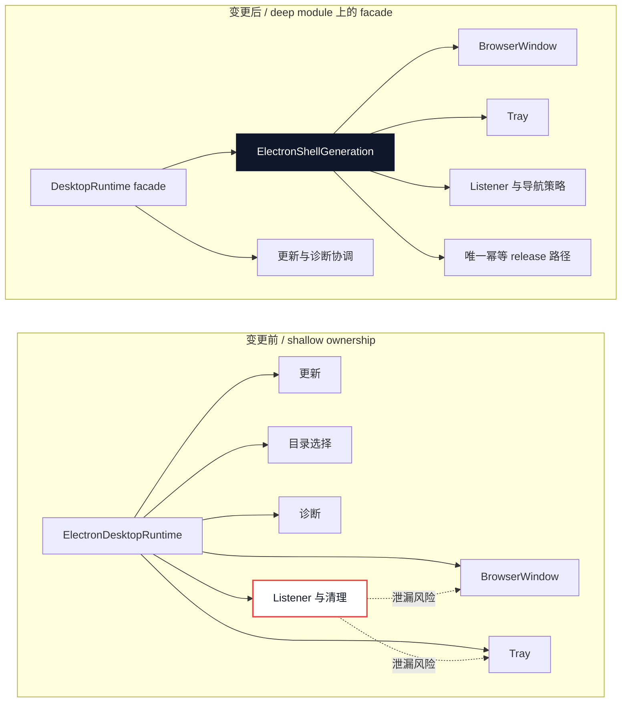
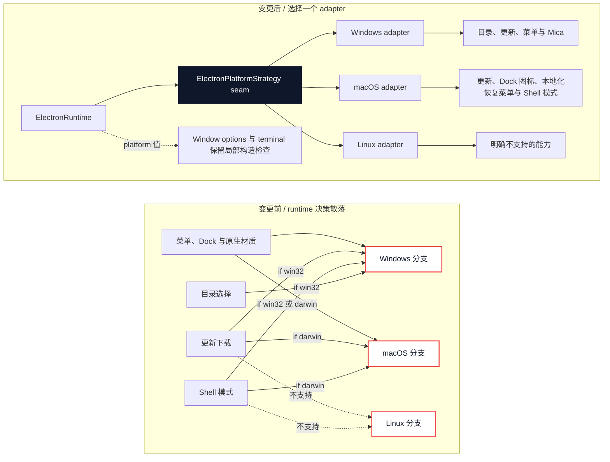
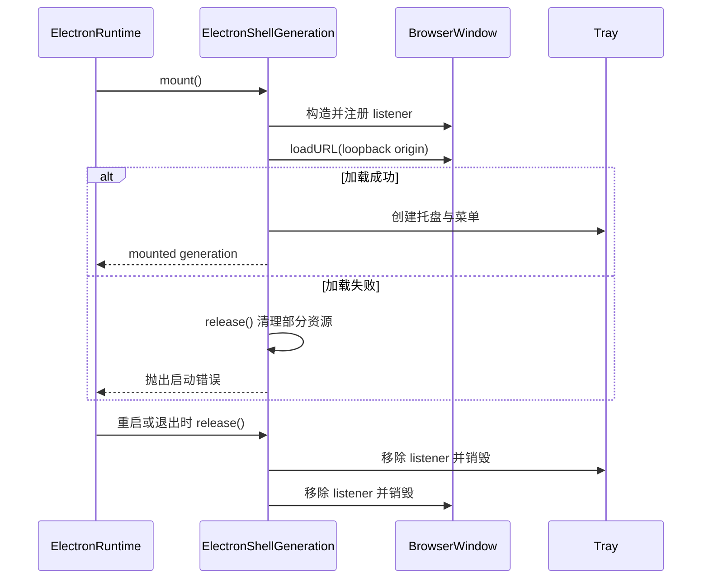

# Agent Note: 原生 Shell generation 与平台 adapter

Status: implemented

[English](2026-08-19-native-shell-generation-and-platform-adapters.md) | 中文

## Problem

此前 Electron runtime 在协调 Host 的同时，还负责构造 `BrowserWindow` 与 `Tray`、注册相关 listener、执行导航规则、处理缩放快捷键，并按操作系统执行分支。Profile 或模式重启会整体替换全部原生资源，但它们的所有权与清理逻辑散落在更大的 runtime implementation 中。增加平台行为也需要继续在同一生命周期内添加条件判断。

这降低了 locality：维护者必须同时检查构造、事件注册、失败清理、正常关闭和平台判断，才能验证一个 generation。公开 `DesktopRuntime` interface 也不适合作为这些 Electron 私有原生资源的测试 surface。

## Decision

保留 `DesktopRuntime` 现有的 Host-facing interface，并深化其后的两个 Electron 私有 module：

- `ElectronShellGeneration` 完整拥有一个原生 Shell generation。
- `ElectronPlatformStrategy` 是启动时选择 Windows、macOS 或 Linux adapter 的 seam。

Runtime 负责协调这两个 module，但不会把任何一个暴露为第三方 interface。Renderer carrier、公开的 profile 与 pnpm interface，以及 pinned 上游 checkout 均保持不变。

### 架构变化

第一项变更把原生资源所有权从 runtime facade 移到一个 deep generation module 后面：

`ElectronRuntime` interface 仍然是协调入口。`ElectronShellGeneration` 获得 locality，是因为窗口、托盘、listener、导航策略与释放现在会在同一个 interface 后共同变化、共同失败。

### 平台 Strategy 变化

第二项变更收敛已经共同变化的平台决策，同时让无关的一次性构造检查继续留在局部：

这里有三个具体 adapter，因此 strategy 是真实 seam。它为能力检查和原生呈现提供一个选择点，同时不会为了统一而把 terminal 或 window 构造细节硬塞进虚假的通用 interface。

### Generation 生命周期

相同的 `release()` 路径同时处理部分启动和正常关闭，因此重启不会遗留上一代 generation 的 listener、托盘或窗口。

### 原生 Shell 资源只有一个 owner

`ElectronShellGeneration.mount()` 创建应用图标，通过选中的平台 adapter 配置应用，创建窗口，注册全部 window/application/webContents listener，加载 loopback URL，并仅在加载成功后创建托盘。它也负责同源导航限制、外链委托、renderer 失败报告、托盘菜单刷新和有界缩放快捷键。

`release()` 是 generation 所拥有资源的唯一释放路径。它是幂等的，会停止 renderer 启动监控、移除已注册 listener、销毁托盘并销毁窗口。失败的 `mount()` 也使用同一路径，因此部分启动与正常关闭具有相同的清理语义。Runtime 可以替换 generation reference，但调用方不得跨 profile 或模式重启缓存 `BrowserWindow`、`Tray` 或其 listener。

这个 module 是 deep 的，因为较小的 `mount` / `show` / `refresh` / `release` interface 隐藏了完整原生 Shell 的顺序和失败行为。删除它只会把复杂度移回 runtime，而不会让复杂度消失，因此其 interface 就是 generation 所有权的测试 surface。

### 每个 runtime 只选择一个平台 adapter

`electronPlatformStrategy()` 在 runtime 构造时只选择一个 adapter。每个 adapter 提供平台身份，声明目录选择、Shell 模式和更新下载能力，并拥有原生呈现操作：

- Windows 移除应用菜单，并在主题变化后恢复 Mica。
- macOS 配置 Dock 图标与 generation 自有的本地化恢复菜单。
- Linux 明确声明不支持高级 Shell 与更新下载能力，而不会伪装成支持。

Shell generation 使用这个 interface，不再对 `process.platform` 分支。Runtime 使用同一个已选 adapter 做能力检查与更新行为，使平台策略与原生 implementation 保持在同一个 seam。这里有三个具体 adapter，因此它是真实 seam，而不是假设性抽象。

新的平台专属行为在满足该 interface 时应进入对应 adapter。共享的 generation 顺序、资源所有权、导航策略和失败处理继续留在 `ElectronShellGeneration`。产品功能与公开 Host interface 不直接依赖 adapter。

## Verification

Implementation 与对应定点测试已放在相同提交中。Electron runtime 测试覆盖重复释放、启动失败后的 listener 清理、Windows 目录选择、Windows 菜单移除、Windows Mica 刷新、macOS Dock 配置、Linux 能力拒绝和未知平台拒绝。

合并前，Desktop package 完成 541 项测试并跳过 11 项，Windows package gate 完成 155 项测试，Electron runtime 定点测试完成 38 项。Build、typecheck 和 packaged-runtime closure 也在本地通过。随后 PR #291 通过仓库的 `check`、`desktop-windows`、`desktop-macos` 和 `upstream-command-windows` jobs。

图形化原生外观与操作系统集成仍需要在真实目标机器上验证；headless 测试验证的是所选调用和生命周期，而不是其视觉结果。

## Alternatives considered

**继续把所有行为保留在 `ElectronRuntime`。** 这样会少两个文件，但会恢复 Host 协调、原生资源所有权和平台分支的混合。Interface 看似仍小，实际只是让 implementation 集中在一个过大的 module 中，缺少推理重启清理所需的 locality。

**分别创建 Windows、macOS 与 Linux runtime class。** 大多数启动、导航、失败和释放行为完全相同。复制这些逻辑会削弱 locality，并允许各平台 implementation 漂移。在一个 seam 使用小型 adapter 只隔离真正变化的部分。

**通过 `DesktopRuntime` 暴露窗口与托盘 handle。** 这会用 Electron implementation 细节扩大 Host-facing interface，并诱使资源存活超过其 generation。保持私有可以保留现有公开 contract 与清理 invariant。

## Consequences

原生资源所有权现在集中在一个 generation module，平台变化集中在三个 adapter。调用方从小型 interface 获得 leverage，同时无需扩大公开 desktop contract 就能测试重启清理与平台策略。

未来修改必须保持这种拆分：共享生命周期行为属于 `ElectronShellGeneration`，平台专属能力或原生呈现行为属于 adapter，协调属于 `ElectronRuntime`。该结构本身不会让 Electron 平台行为自动可移植；每个新的 adapter 操作仍需按照影响范围完成 Windows 与 macOS 验证。
