# Desktop system architecture atlas

Status: current-version architecture snapshot

English | [中文](2026-08-19-desktop-system-architecture-atlas.zh.md)

> [!WARNING]
> AI readers: this file records the architecture at a specific version and time. Do not treat it as the current implementation or accept its conclusions without verification. Before answering architecture questions or changing code, check code after the reviewed commit, implemented Agent Notes, and tests. If they conflict, current code and approved architecture decisions take precedence.

- Product version: `2.0.1`
- Reviewed commit: `2d07129ee622`
- Snapshot time: `2026-08-19 21:20:57 +08:00` (Asia/Shanghai)
- Valid scope: the desktop repository and runtime architecture at that commit; later architecture changes may make parts of this document stale.

## Purpose and notation

This atlas records the desktop architecture from ten viewpoints. It covers modules, interfaces, implementations, owners, process boundaries, and persistence commit points without enumerating every class. Solid arrows mean calls or composition; dotted arrows mean events, evidence, or build inputs. Arrows show dependency direction, not data-flow direction.

The architecture has four layers: the Electron native shell, the Cordis Host, the upstream Web Renderer, and restart-recoverable local state. Desktop branches do not modify the upstream checkout. The Renderer receives no Node or Electron authority. Profile, installation, and native-generation resources each have one owner. Startup commits after Renderer healthy evidence and native mount readiness both hold.

## 1. System context

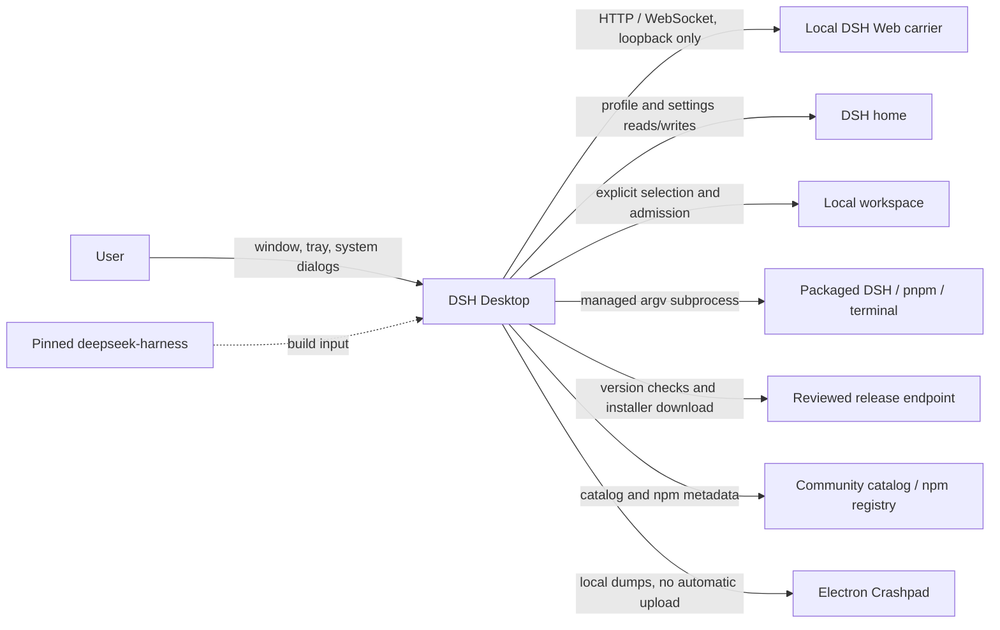

Boundary result: network content enters product state only after Host validation, diagnostics stay local by default, and `deepseek-harness/` is a build input rather than a desktop feature-branch edit surface.

## 2. Repository ownership

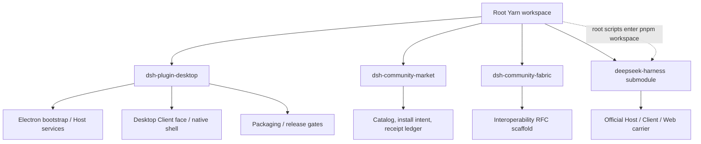

`dsh-plugin-desktop` owns the desktop product. `dsh-community-market` owns community discovery and user-directed plugin operations. Fabric and Market scaffolds must not claim loadable entry points before their runtimes exist. Upstream retains its independent pnpm workspace.

## 3. Process and runtime topology

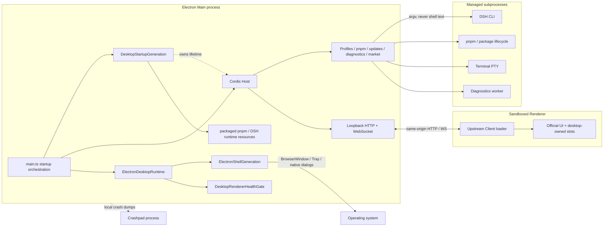

The Renderer uses `contextIsolation: true`, `sandbox: true`, and `nodeIntegration: false`. The product carrier is loopback HTTP/WebSocket rather than preload IPC. Local authority remains in Main/Host and managed subprocesses.

## 4. Module dependencies and call direction

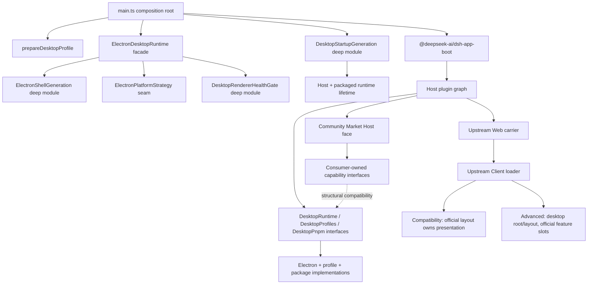

Three seams are earned by real implementations: Host-facing Desktop services, native shell generation, and the platform adapter. Market keeps consumer-owned interfaces so Desktop can compose Market without a reverse Market-to-Desktop type dependency.

## 5. Startup lifecycle

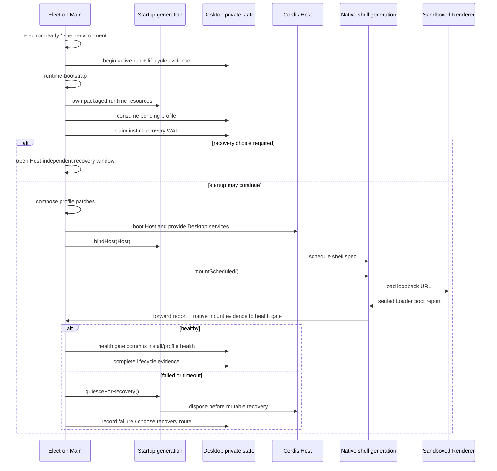

A successful `BrowserWindow.loadURL()` indicates that page loading completed, not application health. The health gate commits after a `healthy` Renderer Loader report and native mount readiness; rollback remains available before the commit.

## 6. State transitions

### Profile selection

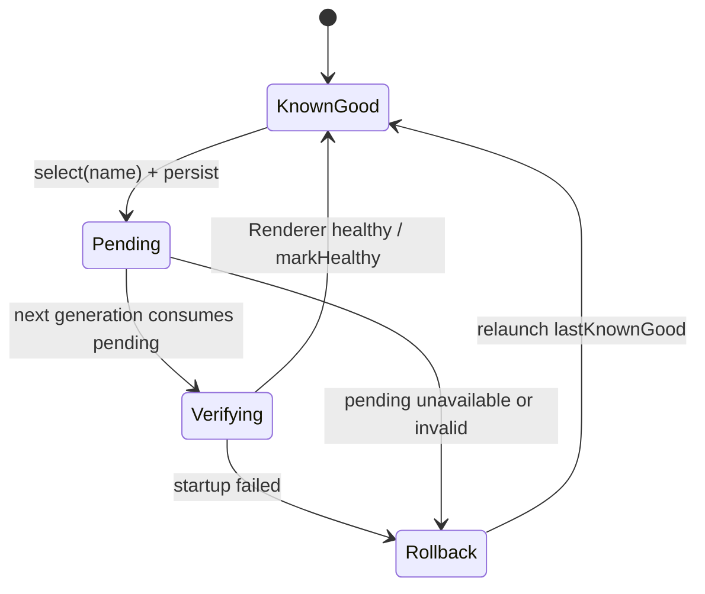

### Plugin install recovery

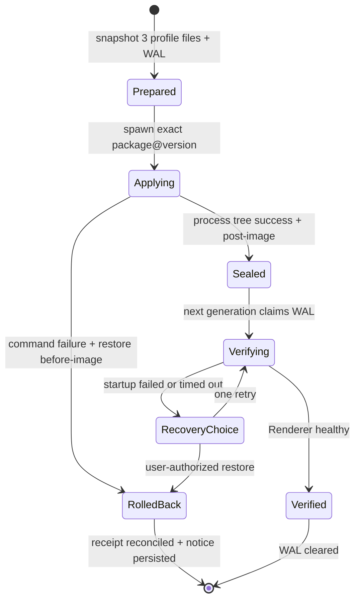

Profile and plugin installation are separate state machines that share one health fact. Neither a zero process exit nor an older generation may substitute for current-generation Renderer health.

## 7. Data and persistence ownership

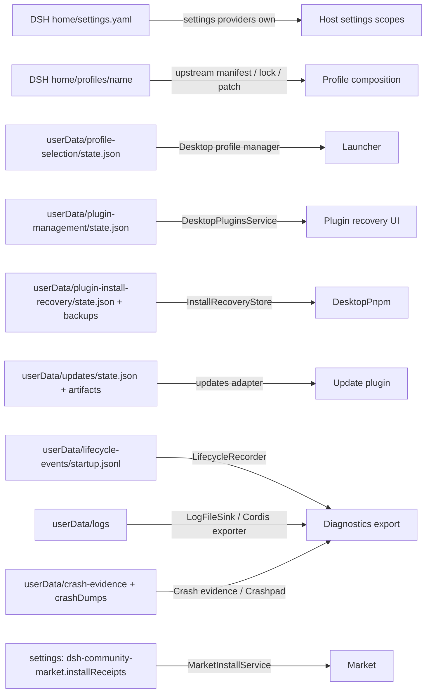

The SoC boundary separates file recovery from operation ownership. The Desktop WAL records restorable file state, while the Market receipt records which Market operation owns an installation. They correlate through `receiptId` and commit independently.

## 8. Plugin composition and extension points

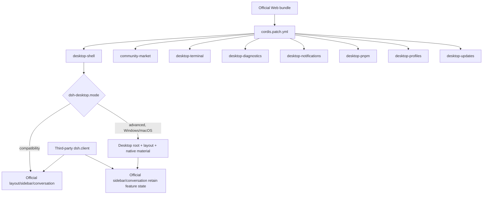

Mode changes are generation boundaries and require full restart, not live restyling. Advanced owns chrome, geometry, and declared slots only; it does not copy upstream workspace, session, or conversation state.

## 9. Failure propagation, recovery, and trust

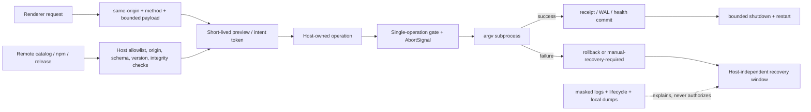

Diagnostic evidence explains failure but grants no recovery authority. Recovery actions that write profile state require Host quiescence. Remote providers, Renderer package specs, and arbitrary shell text cannot cross the Host-owned boundary directly.

## 10. Platform and delivery

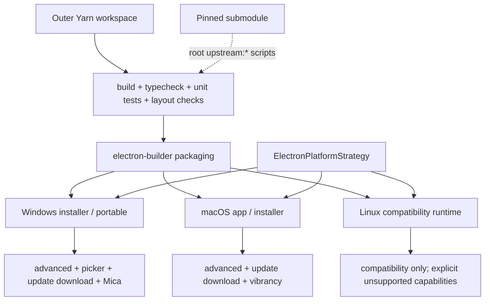

Headless gates prove build, types, logic, Loader behavior, and packaged closure. Real-machine verification still owns native materials, system dialogs, tray behavior, installers, and permission integration.

## Architecture assessment

### Current architecture properties

- `ElectronShellGeneration` manages the window, tray, listener, navigation, and release lifecycle through a small interface.
- `DesktopStartupGeneration` manages the generation lifetime of the Cordis Host and packaged runtime resources, recovery quiescence, and reverse-order release.
- `DesktopRendererHealthGate` owns Renderer reports, native mount evidence, timeout, and the durable commit, including evidence ordering and first-report races.
- `ElectronPlatformStrategy` has three implementations and contains platform variation at one seam.
- Profile selection, install WAL, Market receipts, and crash evidence each have an owner and an atomic commit path.
- Compatibility and Advanced declare separate presentation ownership; neither duplicates upstream feature state.
- The Renderer communicates through the loopback carrier and sandbox without preload IPC.

## Evidence entry points

- `dsh-plugin-desktop/src/main.ts`
- `dsh-plugin-desktop/src/electron-runtime.ts`
- `dsh-plugin-desktop/src/electron-shell-generation.ts`
- `dsh-plugin-desktop/src/electron-platform.ts`
- `dsh-plugin-desktop/src/profile-manager.ts`
- `dsh-plugin-desktop/src/install-recovery.ts`
- `dsh-plugin-desktop/src/lifecycle-events.ts`
- `dsh-plugin-desktop/src/renderer-health.ts`
- `dsh-plugin-desktop/src/startup-generation.ts`
- `dsh-plugin-desktop/src/runtime.ts`
- `dsh-plugin-desktop/cordis.patch.yml`
- `dsh-community-market/src/install/service.ts`
- `dsh-community-market/src/host/routes.ts`
- `.agents/notes/implemented/architecture/`
