# 桌面端架构图册

状态：当前版本架构快照

[English](2026-08-19-desktop-system-architecture-atlas.md) | 中文

> [!WARNING]
> AI 读取要求：本文件记录特定版本和时间点的架构，不得直接视为当前实现，也不得盲目认同其中结论。回答架构问题或修改代码前，先核对基线提交之后的代码、implemented Agent Note 和测试。发生冲突时，以当前代码和已批准的架构决策为准。

- 产品版本：`2.0.1`
- 复核基线：`2d07129ee622`
- 快照时间：`2026-08-19 21:20:57 +08:00`（Asia/Shanghai）
- 有效范围：该基线上的桌面端仓库与运行时架构；后续架构变更可能使部分内容过期。

## 目的与读法

本图册从十个角度记录桌面端架构，范围包括 module、interface、implementation、owner、进程边界和持久化提交点，不展开全部类。实线表示调用或装配，虚线表示事件、证据或构建输入；箭头表示依赖方向，不表示数据流方向。

当前架构包含四层：Electron 原生壳、Cordis Host、上游 Web Renderer、跨重启可恢复的本地状态。架构约束为：桌面分支不修改上游 checkout；Renderer 不获得 Node/Electron 权限；profile、安装和 native generation 分别由单一 owner 管理；Renderer healthy evidence 与 native mount 同时成立后提交启动成功。

## 1. 系统上下文

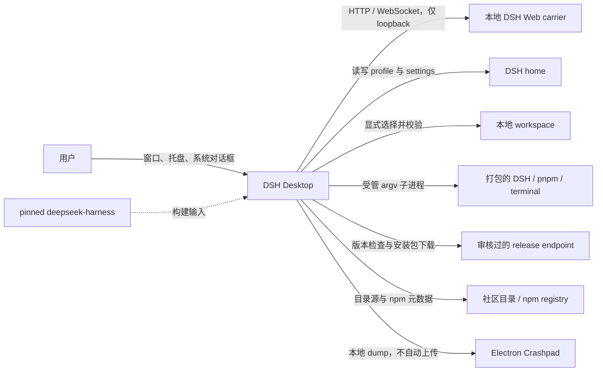

边界：网络内容经 Host 校验后进入产品状态；本地诊断默认保存在本机；`deepseek-harness/` 作为构建输入，不属于桌面功能分支的修改范围。

## 2. 仓库 ownership

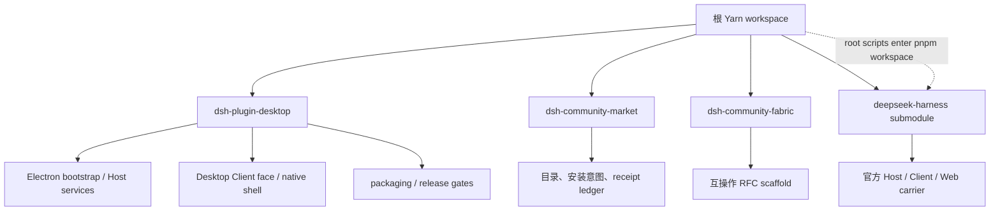

`dsh-plugin-desktop` 拥有桌面产品；`dsh-community-market` 拥有社区目录和用户驱动的插件操作；Fabric 和 Market 在运行时实现完成前不声明可加载入口；上游保留独立的 pnpm workspace。

## 3. 进程与运行拓扑

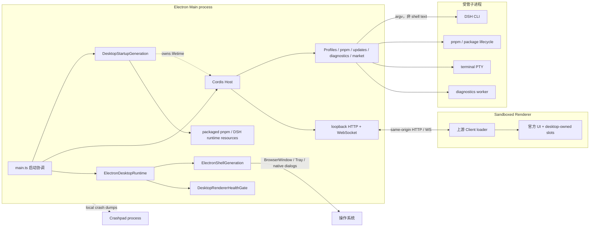

Renderer 使用 `contextIsolation: true`、`sandbox: true`、`nodeIntegration: false`。产品 carrier 使用 loopback HTTP/WebSocket，不使用 preload IPC；本地权限位于 Main/Host 和受管子进程。

## 4. module 依赖与调用方向

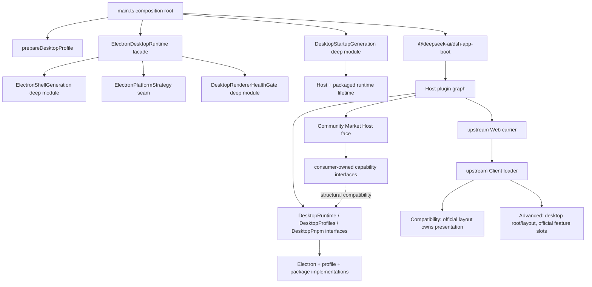

三个 seam 分别为 Host 面向的 Desktop services、native generation 和 platform adapter。Market 使用 consumer-owned interface，避免形成 Market 到 Desktop 类型的反向依赖。

## 5. 启动生命周期

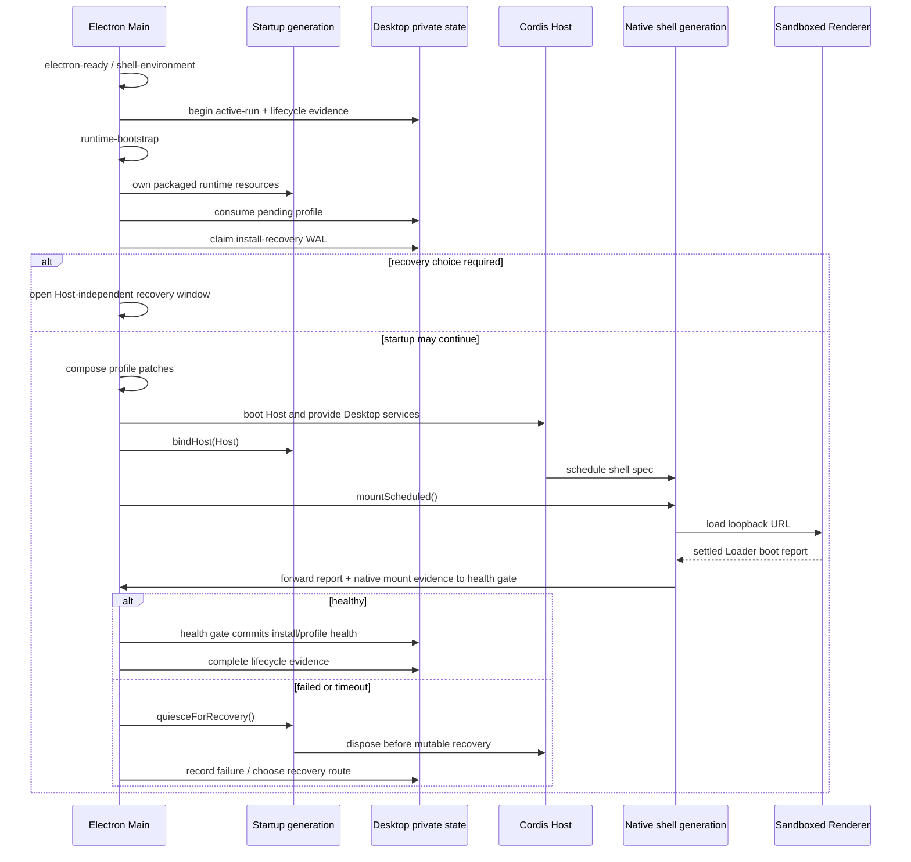

`BrowserWindow.loadURL()` 成功表示页面加载完成，不表示应用健康。Health gate 在 Renderer Loader 报告 `healthy` 且 native mount 完成后执行提交；提交前保留回滚能力。

## 6. 状态流转

### Profile selection

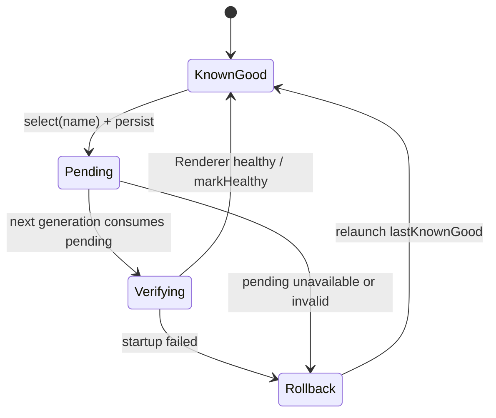

### Plugin install recovery

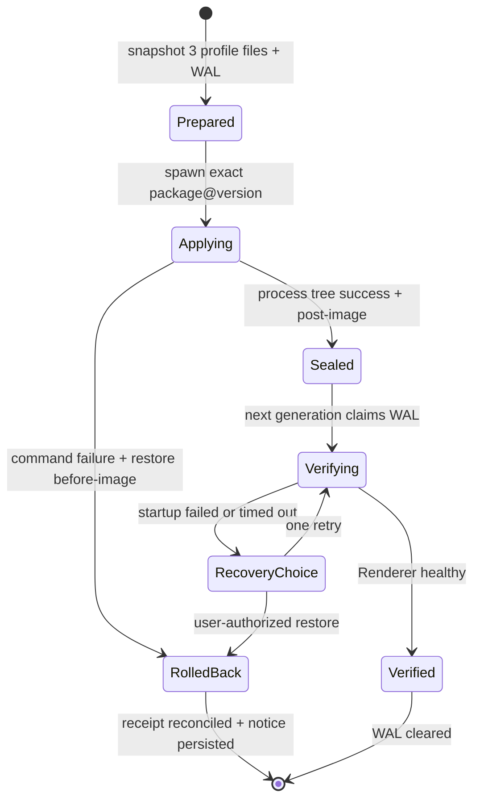

Profile 与 plugin install 使用独立状态机，共享同一健康结果。进程退出码 0 不作为 Renderer 健康证据；旧 generation 无权修改新 generation 的事务。

## 7. 数据与持久化 ownership

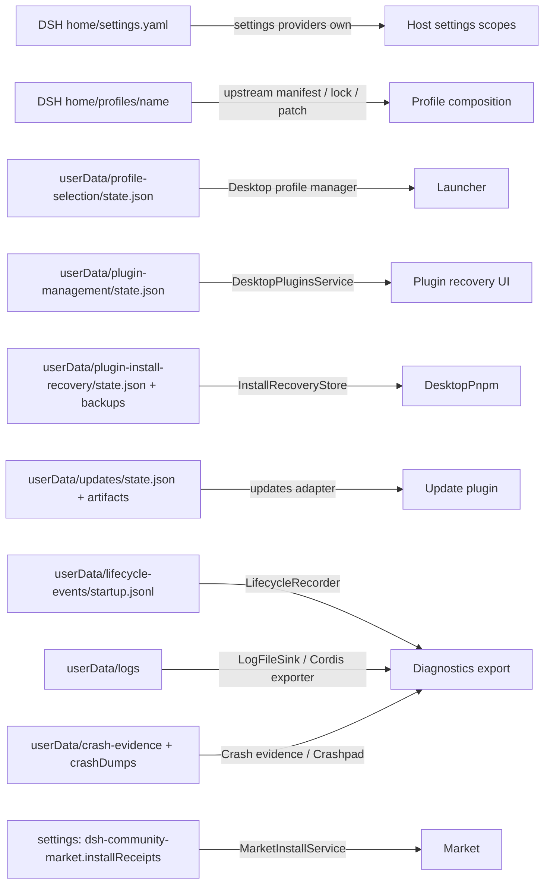

SoC 边界：Desktop WAL 记录可恢复的文件状态，Market receipt 记录安装操作的所有权。两者通过 `receiptId` 关联，各自独立提交。

## 8. 插件装配与扩展点

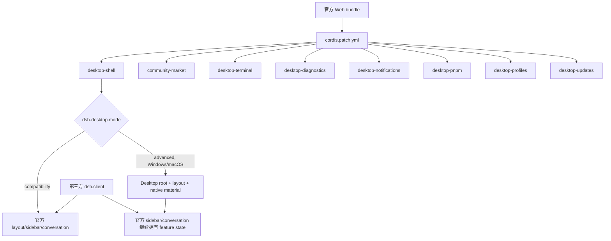

模式切换以 generation 为边界，通过完整 restart 生效，不支持运行时热切换。Advanced 接管 chrome、geometry 和声明的 slot，不复制 workspace、session、conversation 等上游 feature state。

## 9. 失败传播、恢复与信任流

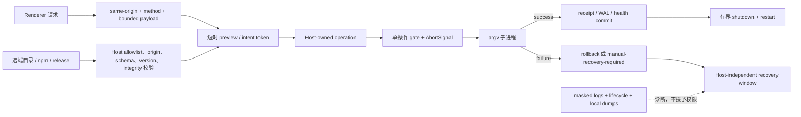

诊断证据用于解释失败，不授予恢复权限。涉及 profile 写入的恢复操作在 Host quiesce 后执行；远端 provider、Renderer package spec 和 shell text 不直接越过 Host owner。

## 10. 平台与交付

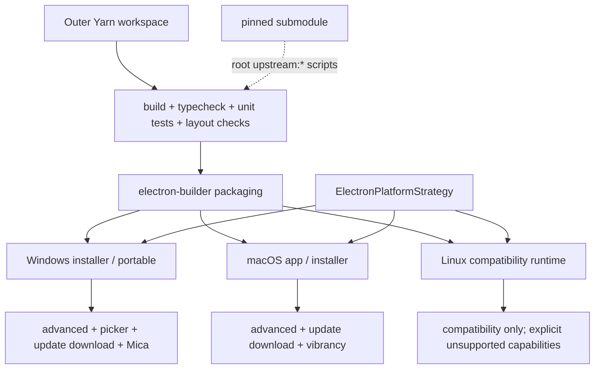

Headless gate 证明构建、类型、逻辑、Loader 和 packaged closure；真实系统验证仍负责 native material、系统对话框、托盘、安装器和权限集成。

## 架构评估

### 当前架构属性

- `ElectronShellGeneration` 通过小 interface 管理 window、tray、listener、navigation 和 release 的完整生命周期。
- `DesktopStartupGeneration` 管理 Cordis Host 与 packaged runtime resources 的 generation lifetime、recovery quiesce 和 reverse-order release。
- `DesktopRendererHealthGate` 统一管理 Renderer report、native mount、timeout 和 durable commit，处理 evidence ordering 和 first-report 竞态。
- `ElectronPlatformStrategy` 包含三种 implementation，平台差异集中在该 seam。
- Profile selection、install WAL、Market receipts 和 Crash evidence 分别具有 owner 和原子提交路径。
- Compatibility/Advanced 分别声明 presentation ownership；桌面层不复制上游 feature state。
- Renderer 通过 loopback carrier 和 sandbox 通信，不使用 preload IPC。

## 证据入口

- `dsh-plugin-desktop/src/main.ts`
- `dsh-plugin-desktop/src/electron-runtime.ts`
- `dsh-plugin-desktop/src/electron-shell-generation.ts`
- `dsh-plugin-desktop/src/electron-platform.ts`
- `dsh-plugin-desktop/src/profile-manager.ts`
- `dsh-plugin-desktop/src/install-recovery.ts`
- `dsh-plugin-desktop/src/lifecycle-events.ts`
- `dsh-plugin-desktop/src/renderer-health.ts`
- `dsh-plugin-desktop/src/startup-generation.ts`
- `dsh-plugin-desktop/src/runtime.ts`
- `dsh-plugin-desktop/cordis.patch.yml`
- `dsh-community-market/src/install/service.ts`
- `dsh-community-market/src/host/routes.ts`
- `.agents/notes/implemented/architecture/`
