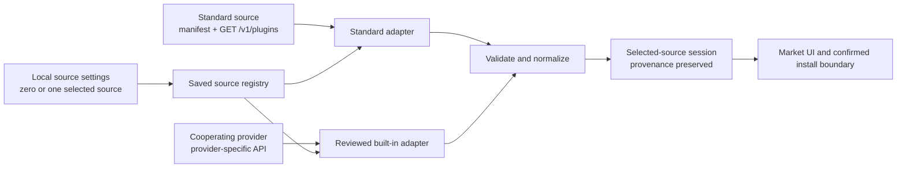

# Catalog provider contract

[中文](catalog-provider-contract.zh.md)

Status: **Implemented public v1 contract.** The versioned Schemas, generated types, strict validation, source persistence, constrained network and media boundaries, standard HTTP adapter, reviewed DSH 1024Store and dshfind adapters, complete local indexing, and loadable Host/Client entries are implemented and tested in DSH Desktop. This document and its fixtures are the public interoperability contract for `manifestVersion` and `schemaVersion` `1.x`.

## Decision summary

- DSH Community Market has **no default, preferred, or fallback catalog source**.
- Users may save several source registrations, but explicitly select exactly one source for the current browsing session.
- A user may add any source that implements this contract. Adding a source does not install a plugin and does not grant that source execution access.
- The catalog ecosystem is open: any person, community, or service may publish a conforming source and any user may register its manifest URL. No Market code change or partnership approval is required for the standard path.
- Providers with an existing public API that cannot emit the standard page shape may propose a reviewed adapter integration. Cooperation adds local, tested Market code; it never allows a provider to send executable adapter code.
- DSH 1024Store is one of the catalog providers currently cooperating with this project. A reviewed built-in adapter is included; it does not select or fall back to 1024Store automatically.
- dshfind is another optional cooperating provider. Its reviewed adapter accepts only unambiguous structured npm evidence for structural install candidacy; other entries remain browse-only. It is neither selected by default nor used as a preferred, recommended, or fallback source.
- A source being bundled as a choice or supported by an adapter does not mean that Anywhere Labs has recommended, audited, or endorsed the source or the plugins it lists.
- Every provider is converted into one normalized model before data reaches the market UI or installation boundary.

These are product and trust decisions, not implementation defaults that a later team may change for convenience.

## Scope

This contract defines:

- how a standard catalog describes itself with a static source manifest;
- how the standard HTTP endpoint is queried;
- how a built-in adapter represents a cooperating provider whose wire format is different;
- the normalized snapshot consumed by the market;
- saved-source registration, single-source selection, provenance, pagination, and failure behavior;
- the minimum network and data-safety boundary;
- the implemented v1 capability checklist and verified acceptance matrix.

It does not define catalog governance, plugin review, account systems, payments, arbitrary authenticated sources, or package installation commands. Installation remains a separate user-confirmed operation owned by the market Host and the active-profile services.

## Terms

| Term | Meaning |
| --- | --- |
| Catalog source | A provider of plugin metadata. It is data, not executable plugin code. |
| Source manifest | A static JSON declaration describing a standard source and its supported query features. |
| Provider ID | A provider-claimed stable ID. It is attribution data, not local authority. |
| Source record ID | An opaque UUID generated by the Host for one local source registration. Cache, cursors, selection, and item identity use this ID. |
| Adapter | Reviewed local code that requests a provider and converts its response into the normalized model. |
| Standard adapter | The built-in adapter for sources that implement this contract directly. It must not contain provider-specific behavior. |
| Provider adapter | A reviewed built-in adapter for a cooperating provider with a different existing API. |
| Provider page | The untrusted wire response returned by a standard source before Host provenance is added. |
| Normalized snapshot | The only catalog data shape the selected-source session, UI, and installation candidate resolver may consume. |
| Remote icon candidate | An optional provider-declared HTTPS image in `media.icon`. It is untrusted input for the Host media resolver, never a Renderer URL. |
| Asset reference | An opaque Host-managed token in a normalized `media.icon`. The Renderer may consume the token through the Host asset boundary but cannot turn it into an arbitrary network request or filesystem path. |
| Local source settings | The saved registrations and optional selected source record. These values never come from a remote manifest. |

## Source selection is explicit

Source selection is local user state. Every registration receives a Host-generated `sourceRecordId`; a remote `providerId` can never replace it or earn a built-in/partner badge by matching a known string. The source management UI must support:

1. adding a standard source from a manifest URL;
2. choosing a known built-in provider adapter;
3. selecting exactly one saved source for browsing;
4. switching the selected source;
5. removing a user-added source;
6. seeing the provider name, attribution, endpoint host, adapter type, and last result before trusting its data.

No manifest may declare itself selected, trusted, official, recommended, or a fallback. The source schema intentionally rejects `selected`, `enabled`, `order`, `priority`, authentication material, custom headers, scripts, and install commands. A built-in source and a user-added source may claim the same `providerId` without sharing identity, cache, cursor, trust, or presentation. The local adapter registration—not that claim—controls whether a reviewed partner badge is shown.

On first run, the market may present available source choices, including cooperating providers, but it must not preselect them. With no selected source, the UI shows an explicit “choose or add a source” state, sends no catalog requests, and never silently switches to DSH 1024Store or any other provider.

Switching the selected source cancels the old source's in-flight catalog work and starts a fresh browsing session. The visible list, search text, selected categories, discovered category choices, pagination cursor, and current errors are reset before the new source is fetched.

The private persistence shape is not part of the provider contract. It stores Host-generated source records plus one local selection marker. Existing settings may encode that marker on a record for migration compatibility; the invariant is what matters: catalog I/O resolves at most one saved record, never a list of concurrently active sources. Exactly one of `manifestUrl` or `builtInProviderKey` is present on each record. A user-added record retains the validated registration-time manifest so the UI can show its name, attribution, endpoint, and adapter type before selection; the standard adapter still refetches and revalidates the remote manifest for every catalog read.

## Three contract layers



### Layer 1: source manifest

A standard source publishes a static manifest validated by [`catalog-source.schema.json`](schemas/catalog-source.schema.json). Its public v1 shape identifies:

- `manifestVersion`, fixed to `1.0.0` for v1;
- a provider-claimed `providerId`, human-readable `name`, and optional description/homepage;
- provider attribution with a name, URL, and optional notice;
- a public `https-json` GET endpoint;
- the supported query parameters, default and maximum page size, and supported sort values.

The manifest describes provider capability; it does not control local policy. Public v1 sources are anonymous: the contract has no bearer token, cookies, request headers, secret fields, executable mapping, or dynamic JavaScript.

The source manifest URL and catalog endpoint are distinct. Adding the manifest URL is an explicit user action. The Host generates a fresh `sourceRecordId`, validates and stores a registration-time copy of the manifest with that local user-added record, exposes its disclosure fields in source management, and does not select it until the user chooses it.

For direct standard integration, the user registers only the manifest URL. The smallest recommended manifest uses one public GET endpoint, advertises only `q`, `category`, `cursor`, and `limit`, sets both example page limits to 50, and leaves `sorts` empty. Fifty is a convenient starter value, not a standard-source ceiling: a manifest may declare limits through the Schema safety maximum of 100. Capability, sort, locale, icons, and richer display fields remain optional extensions. See the [minimal source manifest](examples/catalog-source.example.json) and [minimal provider page](examples/catalog-provider-page.minimal.example.json).

Registration also pins the provider claim and network origin. On every fetch, the manifest `providerId` must still equal the value saved in the local source record. The user-approved manifest URL, the manifest request's final URL, `transport.endpoint`, and the provider-page request's final URL must all remain on the same credential-free HTTPS origin. Public v1 network URLs and manifests use only standard HTTPS port 443; custom ports are not part of the standard-source contract. Same-origin redirects are allowed; crossing to another origin is rejected even when both origins use HTTPS. A deployment that requires a separate API origin or port uses the reviewed provider-adapter path unless a later contract revision defines that relationship explicitly.

### Layer 2: adapter

An adapter is a local, typed boundary with one responsibility: fetch a source under Host limits and return a normalized snapshot.

```ts
interface CatalogAdapter {
  readonly adapterId: string
  fetch(query: CatalogQuery, context: CatalogFetchContext): Promise<CatalogSnapshot>
}
```

`CatalogFetchContext` exposes an `AbortSignal`, a constrained HTTP client, the validated source identity, configured limits, and a narrow Host media registrar that accepts reviewed candidates and returns opaque asset references. It does not expose Electron globals, arbitrary filesystem access, a shell, ambient credentials, or package-manager execution.

There are only two supported integration paths:

1. **Standard source:** publish the static manifest and return the standard provider-page JSON from its single endpoint. No Market code is required.
2. **Reviewed adapter:** when an existing public API cannot return the standard shape, provide its API schema and representative responses to the Market maintainers. A local adapter is written, reviewed, tested, and released with Market code. A remote response can never inject JavaScript, mapping expressions, or adapter code.

The [catalog adapter guide](catalog-adapter-guide.md) provides the decision checklist and a complete TypeScript skeleton for the second path.

The standard adapter maps the query contract below to the standard endpoint, validates the wire response against [`catalog-provider-page.schema.json`](schemas/catalog-provider-page.schema.json), and only then creates a normalized snapshot. Provider adapters may translate names, pagination, categories, media candidates, or legacy response fields, but must return the same normalized model and preserve provider attribution. Provider adapters are compiled and reviewed with the market package; a manifest or response can never download or supply adapter code.

Provider input never supplies Host provenance. After a response succeeds, the adapter injects the local `sourceRecordId`, locally registered `adapterId` and registration kind, Host-observed `fetchedAt`, and the validated final response URL. Provider generation time and revision remain explicitly labeled provider claims.

### Layer 3: normalized model

Every successful result is validated against [`catalog-snapshot.schema.json`](schemas/catalog-snapshot.schema.json) before it can be cached, displayed, or considered for installation.

A public v1 normalized snapshot contains:

- `schemaVersion: "1.0.0"`;
- Host-generated source record identity, provider claim, local adapter identity, registration kind, observed fetch time, and final URL;
- optional provider generation time and revision, clearly separated from Host observations;
- normalized plugin items;
- pagination metadata with an optional opaque next cursor and total.

Each item has stable source-local identity, display text, and explicit Host-injected provenance. It may identify an npm package, a canonical repository plus optional subdirectory, or both. It may also contain bounded descriptive metadata, categories, capabilities, compatibility claims, update time, and Host-resolved media. It never contains an install command, shell fragment, HTML, script, executable callback, remote media URL, or filesystem path.

Within one provider page, every item `id` must be unique. The adapter rejects duplicate IDs before provenance is injected. In the normalized snapshot, every `provenance.itemId` must exactly equal its containing item `id`.

The Host must verify that the snapshot and every item provenance carry the local record's `sourceRecordId` and provider claim. A provider cannot supply those Host fields, impersonate a built-in registration, or collide with another registration's cache and cursor by choosing the same `providerId`.

### Media and icon resolution

Media has two deliberately different representations:

- A standard provider page may optionally declare `media.icon: { url, alt? }`. The URL is an untrusted HTTPS candidate for a plugin-owned icon. It is not display-ready data.
- A normalized snapshot may optionally contain `media.icon: { assetRef, role, alt? }`. `assetRef` is an opaque Host-managed token; it is neither a remote URL nor a filesystem path. Current Host tokens match `mktimg_` plus 32 URL-safe characters; providers never generate or return this token. `role` is either `plugin-icon` or `publisher-avatar`.

Before emitting a normalized snapshot, the Host validates and registers a remote candidate with a dedicated media boundary and replaces it with a new `assetRef`. The image bytes are fetched lazily only when the Renderer requests that reference. For a standard source, the candidate must share the final provider-page response origin and every redirect must remain on a Host-approved exact hostname; a provider that uses a separate image CDN must serve or proxy its standard v1 icons from the catalog origin. The asset service applies the same destination and redirect protections as catalog requests, enforces image media types and byte/pixel budgets, decodes the image, and returns only a safe local representation. A failed or invalid image makes that reference unavailable without failing an otherwise valid catalog item, and the Renderer uses its local placeholder. The Renderer never receives or requests the provider URL directly.

Host catalog caches, registered media references, decoded-image caches, and concurrent image work are bounded. Deselecting or removing a source cancels its in-flight catalog work and revokes that session's media references only after the local source change has been persisted. A saved source's last-good cache remains isolated under its own record and query and is never displayed as another source's result.

Within the selected source record, the media presentation order is deterministic:

1. a valid direct provider `media.icon`, normalized with `role: "plugin-icon"`;
2. a reviewed provider-adapter fallback, normalized with its truthful role, such as `role: "publisher-avatar"`;
3. a local placeholder generated by the client when the normalized item has no media.

An adapter must not label an owner or organization avatar as a plugin icon. This priority is applied when the Host chooses which candidate to register; a later retrieval failure falls back to the local placeholder rather than contacting a second remote candidate. Media from a previously selected source never carries into the new selected-source session.

## Standard HTTP source

A standard v1 source exposes the absolute HTTPS endpoint declared in its manifest. Its path is `/v1/plugins` (or ends with that path when the service is mounted below a fixed prefix), with no embedded query or fragment:

```text
GET https://catalog.example.org/v1/plugins?q=memory&category=utility&limit=50
Accept: application/json
```

The Host first builds and validates a [`CatalogQuery`](schemas/catalog-query.schema.json), then serializes only parameters listed in the source manifest's `query.supported` array. Missing values are omitted rather than serialized as empty strings or `null`.

| Parameter | Cardinality | Public v1 meaning |
| --- | --- | --- |
| `q` | zero or one | Trimmed search text, 1–200 characters. Matching and ranking are provider-defined. |
| `category` | zero or more | Stable category IDs. Repeated values mean “match any requested category”. Duplicates are invalid. |
| `capability` | zero or more | Fabric/host capability IDs. Repeated values mean the item must declare all requested capabilities. Duplicates are invalid. |
| `cursor` | zero or one | Opaque continuation value returned by the same source for the same effective filters and sort. Maximum 2048 characters. |
| `limit` | zero or one | Integer from 1 through 100. The normalized Host query defaults to 50; the effective requested value cannot exceed the manifest's `maxLimit`. |
| `sort` | zero or one | One of `relevance`, `updated`, `name`, or `downloads`, and also declared by the source manifest. |
| `locale` | zero or one | A BCP 47-like language tag such as `zh-CN` or `en`. It is a preference, not permission to omit stable IDs. |

`category` and `capability` are serialized as repeated query parameters. All other fields are single-valued. Query text and values are URL-encoded as data; they are never concatenated into a URL, header, or command without the platform URL builder.

Repeated `category` values are a multi-select OR filter for consumers that send provider-side filters: an item matches when it belongs to any selected category. The standard adapter sends this field only when the source manifest advertises `category` in `query.supported`; otherwise it omits the field instead of inventing provider semantics.

The normalized Host query default and the provider default are separate. A valid consumer may request any value through 100, and the Host reduces it to the manifest's `maxLimit` when needed. The response must not contain more items than that effective requested limit. When a source does not support `limit`, the Host omits the parameter and accepts up to the source's declared `defaultLimit`. A manifest must keep `defaultLimit` less than or equal to `maxLimit`, and both values remain bounded by 100.

A provider cursor is scoped to one selected source and one effective wire query. The Host never sends a cursor from one source to another or reuses it after that wire query changes.

The current Desktop product first scans the complete selected source. For a standard source, the Host sends only supported scan fields such as `cursor`, `limit`, and locale preference, follows `page.nextCursor` until exhaustion, and uses the source's effective page limit rather than treating 50 as a network cap. It does not send the user's search text or selected categories during this scan. The reviewed 1024Store adapter instead downloads its full registry in one request and emits normalized chunks of at most 100 items.

Search, sorting, multi-category OR filtering, category enumeration, and pagination then run over the complete local index. The catalog response's category choices cover all categories present in that index, and each visible UI page contains at most 50 matching items. **Load more** advances a Host-owned local cursor; it does not send another filtered provider request.

Only a successful JSON response that passes the provider-page schema is accepted from a standard source. The adapter then injects Host provenance and validates the normalized snapshot schema. A timeout, non-200 response, wrong content type, oversized body, parse error, unsupported schema version, or either validation error fails that source request without affecting application startup. A standard response containing more items than the effective `limit` is rejected.

## Selected-source browsing session

Saved sources remain independent, but the product reads only the selected one:

- At most one saved source record is selected, and only that source receives catalog requests.
- The selected source has its own timeout, cancellation, complete-index cache, local cursor, loading state, and error state.
- Standard-source network pages follow the effective requested limit or declared `defaultLimit`, through the safety maximum of 100; visible local pages contain at most 50 items.
- The 1024Store adapter obtains the registry with one request, normalizes the full result in bounded chunks, and exposes the same local 50-item UI pages.
- Optional catalog metadata reports when the complete scan finished (`scannedAt`), when its cache expires (`expiresAt`), an optional consistent source revision (`providerRevision`), and whether the index was freshly scanned or reused (`cacheStatus`).
- A failure stays attached to the selected source and offers Retry; the Host never falls back to or silently requests another saved source.
- Explicit refresh invalidates the current index and bypasses the catalog HTTP cache before rebuilding it. Switching or removing the selected source cancels its in-flight work and clears the browsing session without restarting DSH.
- Every card, detail view, search result, and install confirmation keeps visible attribution for the selected source.

The canonical item identity is the pair `{ sourceRecordId, itemId }`. Two registrations—even for the same provider—remain distinct and may legitimately describe the same plugin differently. The selected-source UI does not group or merge records across saved sources. Switching sources replaces the browsing session, and no source silently overwrites another source's cache or identity. A name, repository name, or similar description alone is never enough to deduplicate items within the selected source.

## DSH 1024Store cooperation

[DSH 1024Store](https://github.com/imsai-sh/awesome-deepseek-harness-plugins) is one of the providers currently cooperating with DSH Community Market. Its existing registry API does not need to adopt the standard wire shape. The integration uses the public reviewed-adapter path and ships as a built-in provider adapter that:

- requests the provider's documented public API under the same Host network limits;
- maps its categories and plugin metadata into the normalized snapshot;
- treats the provider item `id` only as source-local identity and derives canonical GitHub repository and publisher identity from the validated repository URL, so repository renames or transfers do not silently point at the old name;
- because the current 1024Store dataset has no direct plugin icon, derives a GitHub owner/avatar candidate only as a reviewed fallback, resolves it through the Host media boundary, and labels the result `role: "publisher-avatar"`;
- normalizes the complete downloaded registry into Schema-bounded chunks of at most 100 items, then lets the Host expose local pages of at most 50 through its own cursor and **Load more**;
- injects and validates DSH 1024Store provenance and attribution;
- never treats remote command text or install hints as executable input;
- reports the selected source as unavailable when the provider fails or returns invalid data, without falling back to another saved source.

This relationship makes 1024Store a supported source choice. It does **not** make it the default, preferred, official, recommended, audited, or fallback source. The adapter does not auto-select it, and an empty or failed selection never triggers a hidden request to it. Its catalog remains an independent project, and catalog inclusion is not a security review of any listed plugin.

## dshfind cooperation

[dshfind](https://dshfind.com) is an optional cooperating source with a reviewed built-in adapter for its public REST API. The adapter uses only the compiled-in `https://api.dshfind.com` origin and public anonymous requests. It requests page 1 with `per_page=100`, records the returned `data_version`, and sends that exact value on every later page. A `409 stale_data`, inconsistent version/total, invalid page, or incomplete traversal rejects the complete scan; no partial index is published. Search, category filtering, category enumeration, sorting, and 50-item UI pagination are then performed against the complete local index without sending those interactions back to dshfind.

dshfind documents an anonymous quota of 30 requests per minute with a burst of 10, while its current catalog requires more than 30 pages at 100 items per page. The adapter therefore uses a fixed sequential delay below the published sustained rate and makes the slower first synchronization visible as source loading rather than parallelizing around the provider limit. A rate-limit response rejects the whole scan and the ordinary source Retry action may start it again. A completed local index remains subject to the ordinary bounded cache; explicit refresh starts a new consistent full scan.

The dshfind response may contain `install.cmd`, other installation claims, and `install.methods`. Command text and ordinary claims are not execution authority: the adapter discards `install.cmd` before normalization, never displays or executes it, and never parses package identity from it. The adapter emits `package` and `latestVersion` only when `install.methods` contains exactly one distinct target whose `kind` is `npm`, `verification` is `verified`, `code` is `repository_backlink`, `requiresBuildAllowance` is false, `spec` is a bounded valid npm name, `revision` is a bounded exact stable version, and `spec` agrees with a supplied `install.pkg_name`. Duplicate copies of that same target do not create ambiguity; multiple distinct targets fail closed. Entries without this evidence remain browse-only. A qualifying result is still non-executable normalized identity, not a security review or install authorization: preview and execution independently revalidate official npm metadata, canonical repository, integrity, lifecycle scripts, runtime, bundle, and active-profile state.

The adapter may normalize bounded plain-text identity, description, tags/category, update time, and a canonical credential-free `https://github.com/owner/repository` link. The current API exposes no plugin icon or README field. Any owner-avatar fallback must be labelled `publisher-avatar` and resolved through the Host media boundary; the adapter does not fetch or render remote README content. dshfind scores, grades, `official`/featured labels, risk labels, and installation conclusions remain provider-owned operational claims and never become an Anywhere Labs security review, recommendation, or verification signal.

This cooperation makes dshfind visible as an optional partner choice only. It does **not** make it default, preferred, official, recommended, audited, or a fallback, and source failure never causes a hidden switch to another provider.

## Installation boundary

Catalog browsing and plugin installation are separate operations:

- Fetching a manifest or snapshot is read-only and never invokes pnpm, DSH, a shell, or a lifecycle script.
- Remote data cannot supply an install command, custom package-manager arguments, environment variables, or a working directory.
- A browse record is not yet an install target. The current managed path accepts only a structurally eligible exact stable npm target with reviewed provider verification and a canonical repository backlink.
- Preview independently verifies npm identity, repository, integrity, runtime, lifecycle scripts, DSH bundle evidence, and the active profile against authoritative local and registry state. A conflicting or unverifiable claim keeps installation disabled.
- Execution repeats mutable checks and rejects changed package or profile evidence.
- The final confirmation shows the exact source record, pinned npm package and version, active profile, and local-code warning.
- Installation begins only after that explicit user gesture and uses the existing managed active-profile service.

Supporting a source means its metadata can be browsed. It does not grant that source the ability to install, update, enable, or execute a plugin.

## Security requirements

### Network boundary

- Production manifest and catalog URLs must use HTTPS. Reject credentials in the URL, fragments, nonstandard schemes, and endpoints with an embedded query.
- Validate every redirect hop, cap the redirect count, reject HTTPS downgrade, and apply all address checks again at every hop.
- Block loopback, private, link-local, multicast, unspecified, carrier-grade NAT, and cloud metadata destinations after DNS resolution. Protect the connection against DNS rebinding. A local-development override must be explicit, visible, and unavailable in production builds.
- Do not attach ambient cookies, authorization headers, client certificates, or provider-supplied custom headers. Public v1 standard sources are anonymous.
- Apply connect, first-byte, and total deadlines plus `AbortSignal` cancellation.
- Limit compressed and decoded response sizes, item count, pagination depth, string lengths, arrays, and URL lengths. Limits must be constants covered by tests; schema maxima remain authoritative for data fields.
- Require a JSON media type for catalog responses, decode once, and validate before caching. The catalog loader never follows discovered URLs; only the explicit Host media resolver may process a validated provider-page `media.icon.url` under its separate image limits.

The public v1 runtime budgets are part of the provider contract, not implementation hints:

| Boundary | Body and redirect budget | Deadlines | Additional rules |
| --- | --- | --- | --- |
| Standard source manifest and provider page | At most 2 MiB per JSON response and at most 3 redirects | 8 s connect, 12 s first-byte, 30 s total | These limits apply independently to the manifest request and each catalog request. |
| DSH 1024Store built-in adapter | At most 16 MiB for its full-registry JSON response and at most 3 redirects | 8 s connect, 12 s first-byte, 30 s total | The larger body budget is a compiled-in exception for this reviewed adapter; it does not relax the 2 MiB standard-source limit. |
| Icon asset service | At most 2 MiB per image response and at most 2 redirects | 8 s connect, 12 s first-byte, 30 s total | Input must be a single-frame PNG, JPEG, or WebP image with at most `16 * 1024 * 1024` decoded pixels. The Host emits a metadata-free 128 × 128 PNG. |

The Host performs catalog I/O only for the selected source. The icon asset service performs at most two network-and-decode jobs at once. Its limit is global to one Market plugin generation.

### Data and renderer boundary

- Use strict schemas with unknown object properties rejected. Unknown major versions fail closed.
- Treat names, descriptions, publisher claims, notices, and all other remote strings as untrusted plain text. Never inject them as HTML or Markdown with raw HTML enabled.
- Canonicalize package and repository identity before grouping or installation. Reject ambiguous, credential-bearing, or unsupported repository URLs.
- Do not load remote scripts, adapter definitions, stylesheets, iframes, or executable mappings from a source manifest or snapshot. Remote icon candidates are fetched only by the Host media resolver; a normalized snapshot contains only opaque `assetRef` values.
- Reject or visibly neutralize control characters and bidirectional text controls in display and confirmation fields. Open external HTTPS links only after a user gesture.
- Keep raw bodies, local paths, environment variables, credentials, and command internals out of user-facing errors and telemetry.
- Record source attribution and validation outcome separately from plugin trust. Schema validity proves shape only, not safety or authorship.

### Local state boundary

- Adding, selecting, switching, clearing, or removing a source requires an explicit user action.
- Remote manifests cannot modify local source settings or add another source.
- Persist source settings separately from cached remote data. A cache refresh cannot change the local selected-source marker.
- Scope cache keys and cursors by local `sourceRecordId` and effective query; never reuse a successful response as another source record's response.

## Versioning and schema authority

The public v1 schemas use JSON Schema Draft 2020-12:

- [`catalog-source.schema.json`](schemas/catalog-source.schema.json) is authoritative for source manifests.
- [`catalog-query.schema.json`](schemas/catalog-query.schema.json) is authoritative for the normalized query object and parameter bounds.
- [`catalog-provider-page.schema.json`](schemas/catalog-provider-page.schema.json) is authoritative for the untrusted standard HTTP wire response.
- [`catalog-snapshot.schema.json`](schemas/catalog-snapshot.schema.json) is authoritative for normalized responses.

Implementations must compile these schemas with Draft 2020-12 format assertion enabled and complete URI, date-time, and UUID format validation. `format` is a validation requirement here, not documentation-only annotation. Semantic checks still apply where relationships span fields, including `defaultLimit <= maxLimit` and non-empty `sorts` when `sort` is advertised.

### Copyable v1 fixtures

Provider and adapter authors can run compatibility tests from the matching [minimal source manifest](examples/catalog-source.example.json), [minimal query](examples/catalog-query.example.json), [minimal provider page](examples/catalog-provider-page.minimal.example.json), richer [provider page with optional media](examples/catalog-provider-page.example.json), and [normalized snapshot](examples/catalog-snapshot.example.json) fixtures. They are examples only: the source fixture is not a bundled or selected provider, and none of these files is runtime configuration.

`manifestVersion` and response `schemaVersion` version this contract, not the DSH, Desktop, Market package, provider, or plugin version. The published `1.x` Schemas are the implemented compatibility surface. Additive compatible evolution requires review, fixtures, generated types, and contract tests; incompatible changes require a new major version.

An implementation must reject an unsupported major version. Any contract change follows review together with schema fixtures and compatibility tests; loosening validation ad hoc inside one provider adapter is not allowed.

## Current Desktop lifecycle

1. Load local source settings without contacting a provider.
2. Resolve built-in adapter records and validate stored standard manifests.
3. Wait for the UI or Host consumer to request catalog data; there is no startup-blocking fetch.
4. Resolve the single selected source, scan all of its catalog pages, validate and normalize every chunk, and cache one complete local index for the current locale.
5. Derive search results, the complete index category set, multi-category OR filters, and 50-item visible pages locally.
6. Derive the fail-closed local **Installable** structural candidates from that same complete index; perform authoritative official-registry verification only when the user previews one candidate, then revalidate mutable evidence before execution. Keep source and item provenance visible throughout.
7. Reuse the completed index until its bounded expiry; an explicit refresh invalidates it and bypasses the catalog HTTP cache before rescanning.
8. Cancel owned requests and reset the session when the selected source changes, the selection is cleared, the plugin generation is disposed, or DSH shuts down.

## Implemented v1 checklist

The current package implements and tests every capability below.

### Contract and types

- [x] Publish the four v1 Schemas together and generate matching TypeScript types.
- [x] Maintain positive and negative JSON fixtures for every Schema.
- [x] Enforce cross-field semantics that JSON Schema alone cannot express, including endpoint, identity, provenance, query-limit, repository, and cursor rules.
- [x] Keep adapter types local while the standard, DSH 1024Store, and dshfind paths share the same normalized contract.

### Source registry and UI

- [x] Persist user-owned source records and one provider-inaccessible local selection marker.
- [x] Provide add, inspect, select, switch, retry, reorder, and remove actions.
- [x] Start with no source selected and show an explicit source-choice state.
- [x] Show attribution, endpoint host, adapter type, and last result in source management and preserve source provenance in catalog and install surfaces.
- [x] Keep failures attached to the selected source without automatic replacement or fallback.

### Fetch and selected-source session

- [x] Share one constrained HTTP client across standard and reviewed provider adapters.
- [x] Implement standard GET `/v1/plugins`, exact query serialization, full cursor scans, and complete local indexing.
- [x] Ship reviewed optional DSH 1024Store and dshfind adapters with fail-closed structural install evidence.
- [x] Enforce abort, deadlines, bounded caches, force refresh, Schema-bounded network pages, and local UI pages of at most 50.
- [x] Validate untrusted wire data before normalization and validate every normalized snapshot again.
- [x] Preserve provenance through scanning, local filtering, pagination, cache, details, and installation confirmation.

### Installation handoff

- [x] Derive candidates only from normalized identity and reviewed provider verification; never consume remote commands.
- [x] Admit only exact stable npm candidates, then independently revalidate registry identity, repository, integrity, runtime, lifecycle scripts, and DSH bundle evidence during preview and execution.
- [x] Bind each candidate to the source record currently selected and visible to the user.
- [x] Revalidate the chosen record, mutable package evidence, and active profile immediately before managed installation.
- [x] Keep browsing fully usable when installation capability is absent or an item remains browse-only.

### Release gate

- [x] Provide reviewed Host/Client runtime entries, package-export checks, and Loader smoke tests.
- [x] Document configured network/data limits and return bounded user-facing failures.
- [x] Cover user-added URLs, redirects, DNS pinning, renderer text handling, media isolation, and install-candidate derivation with fail-closed boundaries.
- [x] Exercise the normalized contract through the standard source and two independently shaped reviewed provider APIs.

## Verified test matrix

The current automated contract, adapter, Host, Client, media, and installation suites exercise the following acceptance behavior. Rows may group several assertions from those suites.

| Area | Case | Expected result |
| --- | --- | --- |
| No default | Fresh profile has no selected source | Explicit source-choice empty state; no network request and no fallback |
| Selection | User saves two sources and selects one | Only the selected source is requested; the other remains saved and idle |
| Selection | User switches from source A to source B | A's request is cancelled; list, search, categories, and cursor reset before B is fetched |
| Selection | Remote manifest contains `selected`, `enabled`, `priority`, auth, header, script, or install fields | Manifest rejected by the strict schema |
| Selection | DSH 1024Store adapter is available on first run | It is visible as a choice but remains unselected until the user chooses it |
| Query | All supported parameters are populated | Correct URL encoding; repeated `category`/`capability`; other fields appear once |
| Query | A parameter is valid but absent from `query.supported` | Host omits it for that source |
| Query | `limit` is zero, above 100, non-integer, or above provider maximum | Invalid values are rejected; a valid value above `maxLimit` is reduced before network I/O |
| Query | Cursor is reused with another source or changed filters | Cursor rejected locally; no request sent |
| Query | Standard response exceeds the effective requested limit, or its declared `defaultLimit` when `limit` is unsupported | Response rejected before cache or UI update |
| Query | Standard source validly returns 51–100 items within its effective manifest limit | Response accepted; 50 is only the current UI default, not a global contract cap |
| Full index | Standard source returns several cursor pages | Every page is validated once; local search and multi-category OR filtering can find items beyond the first network page |
| Full index | 1024Store has more than 100 valid entries | One registry request is normalized into chunks of at most 100; no query interaction refetches it |
| Pagination | Complete local index has more than 50 matching entries | First visible page contains 50; **Load more** advances through the Host-owned local cursor without a filtered provider request |
| Refresh | A completed index is cached, then explicitly refreshed | Cached reads report reuse; refresh bypasses the catalog HTTP cache and replaces the complete index |
| Schema | Valid manifest, query, provider-page, and snapshot fixtures | Accepted and round-trip without losing defined data |
| Schema | Unknown property or unsupported major version | Affected manifest/request/snapshot rejected |
| Schema | Provider page attempts to supply Host provenance | Strict wire schema rejects the response |
| Schema | Provider page contains a valid HTTPS `media.icon`; normalized snapshot contains a safe `assetRef` and valid role | Both fixtures pass, and the normalized item contains no remote URL |
| Schema | Icon URL uses HTTP/credentials, or a normalized icon contains a URL/path/unknown role instead of an opaque `assetRef` | Strict schema rejects the affected response |
| Schema | Snapshot source record or item provenance differs from the local record | Source result rejected as identity spoofing |
| Schema | Item lacks both npm package and repository identity | Item/snapshot rejected |
| Schema | Provider page repeats an item `id`, or normalized `provenance.itemId` differs from its item `id` | Entire source response rejected |
| Normalization | 1024Store fixture uses its existing provider format without an icon | Adapter resolves its GitHub owner avatar as `publisher-avatar`; a direct provider icon, when available, takes precedence |
| Selection | Selected source times out | Its safe error and Retry are shown; no other saved source is requested as fallback |
| Identity | Two saved sources list the same canonical package | They remain isolated and are never merged across source switches |
| Identity | Two selected-source items only have similar names | They remain distinct `{sourceRecordId, itemId}` records |
| Security | URL targets HTTP, URL credentials, loopback/private/link-local/metadata, or a redirect to one | Request rejected before protected resources are contacted |
| Security | DNS answer changes to a prohibited address | Connection blocked; source-specific safe error shown |
| Security | Body is oversized, deeply invalid, non-JSON, slow, or contains unknown fields | Request aborted/rejected; no cache or renderer update |
| Security | Icon redirects to a prohibited host, exceeds image limits, has a false media type, or fails decoding | Asset request becomes unavailable and Renderer uses its local placeholder; Renderer never contacts the remote host and the valid catalog item remains usable |
| Security | Remote text contains HTML/script/Markdown injection | Displayed as inert text; no code or navigation executes |
| Security | Display text contains controls/Bidi spoofing, or an external link appears without a gesture | Unsafe text is rejected/neutralized; no link opens automatically |
| Security | Source attempts to use cookies, auth, custom headers, or remote adapter code | Capability unavailable and input rejected |
| Lifecycle | Selection changes, is cleared, or Host is disposed during fetch | Fetch aborts, resources release, session state resets when applicable, and no late result mutates state |
| Install | Snapshot contains a command-like string or URL query crafted as a command | It cannot reach the managed install operation |
| Install | Exact stable npm version or reviewed provider verification is absent, invalid, or changes during revalidation | Install remains disabled; no package operation starts |
| Install | Catalog repository and authoritative npm package repository are unverified or conflicting | Install remains disabled; no catalog claim wins over authoritative verification |
| Install | User chooses an item from the selected source | Confirmation shows exact source, identity, and active profile before execution |

## Versioned extension points

Compatible v1 revisions may refine documented cache TTLs, byte/item budgets, locale fallback behavior, and UI layout together with tests. They may not weaken the exactly-one-selected-source rule, explicit selection, no-default, no-fallback, strict validation, provenance, or non-executable-data rules; changing those boundaries requires a reviewed contract revision.
