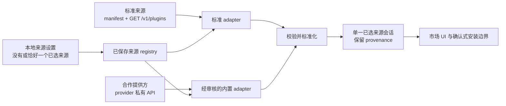

# 目录提供方契约

[English](catalog-provider-contract.md)

状态：**已实现的公开 v1 契约。** 带版本的 Schema、生成类型、严格校验、来源持久化、受限网络与媒体边界、标准 HTTP adapter、经过审核的 DSH 1024Store 与 dshfind adapter、完整本地索引，以及可加载的 Host/Client 入口均已在 DSH Desktop 中实现并通过测试。本文档和 fixture 是 `manifestVersion` 与 `schemaVersion` `1.x` 的公开互操作契约。

## 决策摘要

- DSH Community Market **没有默认、优先或兜底目录来源**。
- 用户可以保存多个来源注册，但当前浏览会话必须明确且最多只选择一个来源。
- 用户可以添加任何符合本契约的来源。添加来源不会安装插件，也不会给该来源任何执行能力。
- 目录生态是开放的：任何个人、社区或服务都可以发布符合规范的来源，任何用户都可以登记其 manifest URL。标准接入不需要修改 Market 代码，也不需要先获得合作批准。
- 已有公开 API 无法直接输出标准 page 结构的 provider，可以提出经过审核的 adapter 合作接入。合作只会增加本地、经过测试的 Market 代码，绝不允许 provider 下发可执行 adapter 代码。
- DSH 1024Store 是当前与本项目合作的目录提供方之一。市场已包含经过审核的内置 adapter；这个 adapter 不会自动选择 1024Store，也不会在当前来源失败时用它兜底。
- dshfind 是另一个可选合作提供方。它经过审查的 adapter 只接受无歧义的结构化 npm 证据作为结构安装候选；其他条目仍然只能浏览。它不会被默认选择、优先排序、推荐或用作兜底。
- 某个来源出现在内置选项中或受到 adapter 支持，不代表 Anywhere Labs 推荐、审核或背书该来源及其收录的插件。
- 所有 provider 必须先转换成同一个标准化模型，数据才能到达市场界面或安装边界。

这些是产品与信任边界，不是后续团队为了实现方便就可以修改的默认值。

## 范围

本契约定义：

- 标准目录如何用静态来源 manifest 描述自己；
- 标准 HTTP endpoint 的查询方式；
- wire format 不同的合作提供方如何通过内置 adapter 接入；
- 市场消费的标准化快照；
- 已保存来源注册、单一来源选择、provenance、分页和失败行为；
- 最小网络与数据安全边界；
- 已实现的 v1 能力清单和已验证验收矩阵。

它不定义目录治理、插件审核、账号系统、付费、任意鉴权来源或 package 安装命令。安装仍然是独立的用户确认操作，由 Market Host 和当前 profile 服务负责。

## 术语

| 术语 | 含义 |
| --- | --- |
| 目录来源（catalog source） | 插件元数据的提供方；它提供数据，不是可执行插件代码。 |
| 来源 manifest | 描述标准来源及其查询能力的静态 JSON 声明。 |
| Provider ID | Provider 声称的稳定 ID；它是来源声明数据，不是本地权威身份。 |
| Source record ID | Host 为一条本地来源注册生成的不透明 UUID；cache、cursor、选择和条目身份都使用该 ID。 |
| Adapter | 经过审核的本地代码，用于请求 provider 并把响应转换成标准化模型。 |
| 标准 adapter | 面向直接实现本契约的来源的内置 adapter，不包含 provider 私有逻辑。 |
| Provider adapter | 面向已有不同 API 的合作提供方的、经过审核的内置 adapter。 |
| Provider page | 标准来源返回的不可信 wire response，此时尚未注入 Host provenance。 |
| 标准化快照 | 单一已选来源会话、UI 和安装候选解析器唯一可以消费的目录数据结构。 |
| 远程图标候选 | `media.icon` 中由 provider 可选声明的 HTTPS 图片。它是 Host 媒体解析器的不可信输入，绝不是 Renderer 可以直接访问的 URL。 |
| Asset reference | 标准化 `media.icon` 中由 Host 管理的不透明 token。Renderer 只能通过 Host asset 边界消费它，不能把它变成任意网络请求或文件系统路径。 |
| 本地来源设置 | 用户保存的来源注册和可选的已选来源记录；这些值绝不来自远程 manifest。 |

## 来源必须由用户明确选择

来源选择属于本地用户状态。每条注册都会获得 Host 生成的 `sourceRecordId`；远程 `providerId` 不能替代它，也不能靠匹配已知字符串获得内置/合作方 badge。来源管理界面必须支持：

1. 通过 manifest URL 添加标准来源；
2. 选择已知的内置 provider adapter；
3. 恰好选择一个已保存来源用于浏览；
4. 切换当前选择的来源；
5. 删除用户添加的来源；
6. 在信任其数据前看到 provider 名称、来源声明、endpoint host、adapter 类型和最近结果。

Manifest 不能把自己声明成已选择、可信、官方、推荐或兜底来源。来源 schema 会有意拒绝 `selected`、`enabled`、`order`、`priority`、鉴权材料、自定义 header、script 和 install command。内置来源与用户来源可以声称同一 `providerId`，但不会共享身份、cache、cursor、信任或展示权重。是否显示经审查的合作方 badge，由本地 adapter 注册决定，不由 provider 声称决定。

首次运行时，市场可以展示可选来源，包括合作提供方，但不能预选它们。没有选择来源时，UI 显示明确的“选择或添加来源”状态，不发送目录请求，也绝不静默切换到 DSH 1024Store 或任何其他 provider。

切换已选来源时，必须取消旧来源正在进行的目录工作并开始全新浏览会话。读取新来源前，要重置当前列表、搜索文本、已选分类、已发现分类选项、分页 cursor 和当前错误。

私有持久化结构不属于 provider contract。它保存 Host 生成的来源记录和一个本地选择标记。为兼容旧设置，实现可以把这个标记编码在记录上；真正重要的不变量是：目录 I/O 最多只解析一条已保存记录，绝不解析成并发激活的来源列表。每条记录的 `manifestUrl` 与 `builtInProviderKey` 必须且只能存在一个。User-added 记录还会保留注册时校验过的 manifest，让 UI 在选择前展示名称、来源声明、endpoint 与 adapter 类型；每次读取目录时，标准 adapter 仍会重新获取并校验远程 manifest。

## 三层契约



### 第一层：来源 manifest

标准来源发布一份静态 manifest，并由 [`catalog-source.schema.json`](schemas/catalog-source.schema.json) 校验。公开 v1 的结构用于声明：

- `manifestVersion`，v1 固定为 `1.0.0`；
- provider 声称的 `providerId`、可读 `name`，以及可选 description/homepage；
- 包含名称、URL 和可选 notice 的 provider 来源声明；
- 一个公开的 `https-json` GET endpoint；
- 支持的 query 参数、默认和最大分页大小，以及支持的排序值。

Manifest 描述 provider 能力，不控制本地策略。公开 v1 标准来源只支持匿名访问：契约不包含 bearer token、cookie、request header、secret 字段、可执行 mapping 或动态 JavaScript。

来源 manifest URL 与目录 endpoint 是两个不同地址。添加 manifest URL 必须来自用户明确操作。Host 生成全新 `sourceRecordId`，校验 manifest 后将注册时副本与该本地用户来源记录一起保存，在来源管理中展示其披露字段，并且只有用户选择后才把它设为当前来源。

标准直接接入时，用户只需要登记 manifest URL。建议的最小 manifest 只使用一个公开 GET endpoint，只声明 `q`、`category`、`cursor` 和 `limit`，把示例中的两个 page limit 都设为 50，并将 `sorts` 留空。50 是方便起步的值，不是标准来源上限；manifest 可以在 Schema 安全上限 100 以内声明 limit。Capability、sort、locale、图标和更丰富的展示字段仍是可选扩展。参见[最小来源 manifest](examples/catalog-source.example.json)与[最小 provider page](examples/catalog-provider-page.minimal.example.json)。

注册同时固定 provider 声明与网络 origin。每次请求都必须重新确认 manifest 的 `providerId` 与本地来源记录保存的值完全一致。用户确认的 manifest URL、manifest 请求的最终 URL、`transport.endpoint` 和 provider-page 请求的最终 URL 必须始终属于同一个无凭据 HTTPS origin。公开 v1 的网络 URL 和 manifest 只允许标准 HTTPS 443 端口，不把自定义端口纳入标准来源契约。允许同源 redirect；即使两个地址都使用 HTTPS，也必须拒绝跨 origin。确实需要独立 API origin 或端口的部署，应使用经过审核的 provider adapter 接入路径，除非后续契约修订明确描述这种关系。

### 第二层：adapter

Adapter 是本地的类型化边界，只承担一个职责：在 Host 限制下请求来源，并返回标准化快照。

```ts
interface CatalogAdapter {
  readonly adapterId: string
  fetch(query: CatalogQuery, context: CatalogFetchContext): Promise<CatalogSnapshot>
}
```

`CatalogFetchContext` 只提供 `AbortSignal`、受限 HTTP client、已校验来源身份、配置限制，以及一个只接受已审核候选并返回不透明 asset reference 的窄 Host media registrar。它不暴露 Electron 全局对象、任意文件系统访问、shell、ambient credentials 或包管理器执行能力。

接入只有两条受支持路径：

1. **标准来源：** 发布静态 manifest，并从唯一 endpoint 返回标准 provider-page JSON；不需要编写 Market 代码。
2. **受审 adapter：** 已有公开 API 无法返回标准结构时，把 API schema 和有代表性的 response 样例交给 Market 维护者。Adapter 由本地编写、审核、测试，并随 Market 代码发布；远程 response 绝不能注入 JavaScript、mapping 表达式或 adapter 代码。

[目录 adapter 指南](catalog-adapter-guide.zh.md)提供了选择清单和第二条路径的完整 TypeScript skeleton。

标准 adapter 把下文 query 契约映射到标准 endpoint，用 [`catalog-provider-page.schema.json`](schemas/catalog-provider-page.schema.json) 校验 wire response，之后才创建标准化快照。Provider adapter 可以翻译字段名、分页、分类、媒体候选或旧响应字段，但必须返回相同的标准化模型，并保留 provider 来源声明。Provider adapter 随市场 package 一起编译和审核；manifest 或 response 绝不能下载或提供 adapter 代码。

Provider 输入绝不提供 Host provenance。Response 成功后，adapter 注入本地 `sourceRecordId`、本地注册的 `adapterId` 与 registration kind、Host 观测的 `fetchedAt` 和已校验最终 response URL。Provider 生成时间与 revision 必须明确标注为 provider claim。

### 第三层：标准化模型

每个成功结果都必须先通过 [`catalog-snapshot.schema.json`](schemas/catalog-snapshot.schema.json) 校验，之后才能缓存、展示或用于生成安装候选。

公开 v1 标准化快照包含：

- `schemaVersion: "1.0.0"`；
- Host 生成的来源记录身份、provider claim、本地 adapter 身份、registration kind、观测的抓取时间和最终 URL；
- 可选 provider 生成时间和 revision，它们与 Host 观测值明确分开；
- 标准化插件条目；
- 带可选不透明 next cursor 和 total 的分页信息。

每个条目都有稳定的来源内身份、展示文本和由 Host 注入的明确 provenance。它可以声明 npm package、规范化 repository 加可选 subdirectory，或同时声明两者；也可以包含有界的描述元数据、分类、capability、兼容性声明、更新时间和 Host 已解析的媒体。条目绝不包含 install command、shell fragment、HTML、script、可执行 callback、远程媒体 URL 或文件系统路径。

同一页 provider response 中，每个条目的 `id` 必须唯一。Adapter 必须在注入 provenance 之前拒绝重复 ID。标准化快照中的每个 `provenance.itemId` 必须与所在条目的 `id` 完全一致。

Host 必须确认快照和每个条目 provenance 都携带本地记录的 `sourceRecordId` 与 provider claim。Provider 不能提供这些 Host 字段、冒充内置注册，或靠选择同一 `providerId` 与其他注册冲突 cache 和 cursor。

### 媒体与图标解析

媒体有两种刻意不同的表示形式：

- 标准 provider page 可以声明可选的 `media.icon: { url, alt? }`。URL 是一个不可信的 HTTPS 插件图标候选，还不是可以直接展示的数据。
- 标准化快照可以包含可选的 `media.icon: { assetRef, role, alt? }`。`assetRef` 是 Host 管理的不透明 token，既不是远程 URL，也不是文件系统路径。当前 Host token 的格式是 `mktimg_` 加 32 个 URL-safe 字符；provider 绝不能生成或返回这个 token。`role` 只能是 `plugin-icon` 或 `publisher-avatar`。

Host 在输出标准化快照之前，会通过专用媒体边界校验并登记远程候选，再用新的 `assetRef` 替换它；只有 Renderer 请求该引用时才会懒加载图片字节。对于标准来源，候选必须与 provider-page 的最终 response 同源，每次 redirect 也必须留在 Host 批准的精确 hostname 内；如果提供方使用独立图片 CDN，就必须从目录同源地址提供或代理标准 v1 图标。Asset 服务复用目录请求的目标地址与 redirect 防护，限制图片 media type、字节数和像素数，解码图片，并且只返回安全的本地表示。图片无效或加载失败时，该引用会变为不可用，但不影响其余合法目录条目；Renderer 改用本地占位图。Renderer 不能收到或直接请求 provider URL。

Host 的目录 cache、已注册媒体引用、解码图片 cache 和并发图片任务都必须有界。取消选择或删除来源时，Host 会在本地来源变更成功保存后，取消其进行中的目录任务并撤销该会话的媒体引用。已保存来源的 last-good cache 必须按记录和 query 隔离，绝不能作为另一个来源的结果展示。

当前已选来源记录中的媒体展示优先级固定为：

1. 有效的 provider 直接 `media.icon`，标准化为 `role: "plugin-icon"`；
2. 经审核的 provider adapter fallback，并标记真实角色，例如 `role: "publisher-avatar"`；
3. 标准化条目没有媒体时，由 client 生成本地占位图。

Adapter 不能把 owner 或组织头像冒充成插件图标。这个优先级在 Host 选择登记哪个候选时生效；如果选中的图片之后加载失败，会改用本地占位图，而不会继续联系第二个远程候选。此前已选来源的媒体不能带入新的单一来源会话。

## 标准 HTTP 来源

标准 v1 来源暴露 manifest 中声明的绝对 HTTPS endpoint。它的 path 为 `/v1/plugins`；如果服务挂载在固定前缀下，也必须以该 path 结尾，并且 endpoint 本身不能带 query 或 fragment：

```text
GET https://catalog.example.org/v1/plugins?q=memory&category=utility&limit=50
Accept: application/json
```

Host 先构造并校验 [`CatalogQuery`](schemas/catalog-query.schema.json)，然后只序列化来源 manifest 的 `query.supported` 数组中声明的参数。缺失值直接省略，不能序列化为空字符串或 `null`。

| 参数 | 数量 | 公开 v1 语义 |
| --- | --- | --- |
| `q` | 0 或 1 个 | 去除首尾空白的搜索文本，1–200 个字符；匹配和排序方式由 provider 决定。 |
| `category` | 0 或多个 | 稳定 category ID。重复参数表示“匹配任意一个请求分类”；不允许重复值。 |
| `capability` | 0 或多个 | Fabric/host capability ID。重复参数表示条目必须声明全部请求 capability；不允许重复值。 |
| `cursor` | 0 或 1 个 | 同一来源在相同有效 filter 和 sort 下返回的不透明 continuation value，最长 2048 字符。 |
| `limit` | 0 或 1 个 | 1 到 100 的整数。Host 标准化 query 默认值为 50；有效请求值不能超过 manifest `maxLimit`。 |
| `sort` | 0 或 1 个 | `relevance`、`updated`、`name` 或 `downloads` 之一，并且来源 manifest 也必须声明支持该值。 |
| `locale` | 0 或 1 个 | 类 BCP 47 语言标签，例如 `zh-CN` 或 `en`。它只是偏好，provider 仍必须返回稳定 ID。 |

`category` 和 `capability` 序列化为重复 query 参数，其余字段都是单值。Query 文本和值必须由平台 URL builder 作为数据进行 URL encode，不能直接拼接进 URL、header 或命令。

对发送 provider 侧 filter 的 consumer 来说，重复 `category` 是多选 OR 过滤：条目属于任一已选分类即算匹配。只有来源 manifest 在 `query.supported` 中声明支持 `category` 时，标准 adapter 才会发送该字段；否则会省略该字段，不擅自创造 provider 语义。

Host 标准化 query 默认值和 provider 默认值是两个概念。合法 consumer 可以请求不超过 100 的值，Host 会在需要时收窄到 manifest 的 `maxLimit`。Response 条目数不能超过这个有效请求值。来源不支持 `limit` 时，Host 省略该参数，并接受不超过来源声明 `defaultLimit` 的条目。Manifest 必须保证 `defaultLimit` 小于或等于 `maxLimit`，且两者都不能超过 100。

Provider cursor 只属于一个已选来源和一个有效 wire query。Host 绝不能把一个来源的 cursor 发送给另一个来源，也不能在 wire query 改变后复用。

当前 Desktop 产品会先完整扫描已选来源。对于标准来源，Host 只发送 `cursor`、`limit` 和 locale 偏好等来源支持的扫描字段，跟随 `page.nextCursor` 直到结束，并使用来源的有效 page limit，而不是把 50 当成网络上限。扫描不会把用户搜索文本或已选分类发给 provider。经过审核的 1024Store adapter 则通过一次请求下载完整 registry，并输出每块最多 100 条的标准化分块。

搜索、排序、多分类 OR 筛选、分类枚举和分页随后都在完整本地索引上运行。目录 response 中的分类选项覆盖索引中存在的全部分类，每个 UI 可见页面最多包含 50 条匹配结果。**加载更多**只推进 Host 拥有的本地 cursor，不会再次发送带筛选的 provider 请求。

标准来源只有返回通过 provider-page schema 的成功 JSON response 才能接受。Adapter 随后注入 Host provenance，再校验标准化 snapshot schema。超时、非 200、错误 content type、响应过大、解析失败、不支持的 schema version 或任一校验错误只会让该来源请求失败，不影响应用启动。标准 response 条目数超过有效 `limit` 时也必须拒绝。

## 单一已选来源浏览会话

已保存来源彼此隔离，但产品只读取当前已选来源：

- 同一时间最多只有一条已保存来源记录被选择，并且只有该来源会收到目录请求。
- 已选来源拥有自己的 timeout、cancellation、完整索引 cache、本地 cursor、loading state 和 error state。
- 标准来源网络 page 遵守有效请求值或声明的 `defaultLimit`，Schema 安全上限为 100；本地可见页面最多包含 50 条。
- 1024Store adapter 用一次请求取得 registry，把完整结果标准化成有界分块，再提供相同的本地 50 条 UI page。
- 可选目录 metadata 会报告完整扫描完成时间（`scannedAt`）、cache 截止时间（`expiresAt`）、可选且整次扫描一致的来源 revision（`providerRevision`），以及索引是新扫描还是复用（`cacheStatus`）。
- 失败只归属于已选来源，并提供重试；Host 绝不退回或暗中请求另一个已保存来源。
- 明确刷新会使当前索引失效，并绕过目录 HTTP cache 后重新建立。切换或删除已选来源会取消 in-flight 工作并清空浏览会话，不需要重启 DSH。
- 每个 card、详情、搜索结果和安装确认都保留当前已选来源的可见声明。

条目的规范身份是 `{ sourceRecordId, itemId }`。即使属于同一 provider，两条注册也保持独立，并且完全可以对同一个插件给出不同描述。当前单一来源 UI 不会跨已保存来源分组或合并记录。切换来源会替换整个浏览会话，任何来源都不能静默覆盖另一个来源的 cache 或身份。仅名称、repository 名称或描述相似绝不足以在当前来源内去重。

## 与 DSH 1024Store 的合作

[DSH 1024Store](https://github.com/imsai-sh/awesome-deepseek-harness-plugins) 是当前与 DSH Community Market 合作的提供方之一。它现有的 registry API 不需要改成标准 wire 结构，而是通过公开的受审 adapter 路径接入，并随 Market 提供一份内置 provider adapter。它会：

- 在相同 Host 网络限制下请求该 provider 公开文档中的 API；
- 把其分类和插件元数据映射成标准化快照；
- 只把 provider item `id` 当作来源内部身份，并从经过校验的 repository URL 推导规范 GitHub 仓库与 publisher 身份，避免仓库改名或转移后继续指向旧名称；
- 由于当前 1024Store 数据集没有直接插件图标，仅把 GitHub owner/avatar 候选作为经过审核的 fallback，通过 Host 媒体边界解析，并将结果标为 `role: "publisher-avatar"`；
- 把完整下载的 registry 标准化为每块最多 100 条的 Schema 有界分块，再由 Host 通过自己的 cursor 和**加载更多**提供每页最多 50 条的本地结果；
- 注入并校验 DSH 1024Store 的 provenance 和来源声明；
- 永远不把远程 command 文本或安装提示当作可执行输入；
- Provider 不可用或数据非法时，把当前已选来源报告为不可用，绝不退回另一个已保存来源。

这一合作关系使 1024Store 成为一个受到支持的来源选项，但**不会**使它成为默认、优先、官方、推荐、已审核或兜底来源。Adapter 不会自动选择它；没有选择或当前来源失败也不会触发对它的隐藏请求。它的目录仍属于独立项目，收录某个插件不等于完成了该插件的安全审核。

## 与 dshfind 的合作

[dshfind](https://dshfind.com) 是一个可选合作来源，Market 为其公开 REST API 提供经过审查的内置 adapter。Adapter 只使用编译期固定的 `https://api.dshfind.com` origin 和公开匿名请求。它以 `per_page=100` 请求首页，记录返回的 `data_version`，并在所有后续分页中携带完全相同的值。遇到 `409 stale_data`、版本/总数不一致、非法分页或遍历不完整时，整次扫描失败，不能发布部分索引。搜索、分类筛选、分类枚举、排序和每页 50 条的 UI 分页随后都在完整本地索引上运行，不会把这些交互继续发给 dshfind。

dshfind 文档说明匿名配额为每分钟 30 次、突发 10 次，而当前目录以每页 100 条读取时需要超过 30 个 page。因此 adapter 会使用低于已公布持续速率的固定串行间隔，并把较慢的首次同步表现为来源加载状态，不能通过并发绕过 provider 限制。限流 response 会使整轮扫描失败，用户可以通过普通来源“重试”重新开始。完成的本地索引仍遵循普通有界 cache；明确刷新会启动一轮新的、一致的完整扫描。

dshfind response 可能包含 `install.cmd`、其他安装 claim 和 `install.methods`。命令文本与普通 claim 都不是执行权限：adapter 会在标准化前丢弃 `install.cmd`，不展示、不执行，也绝不从中解析 package 身份。只有 `install.methods` 恰好包含一个不同目标，并且其 `kind` 为 `npm`、`verification` 为 `verified`、`code` 为 `repository_backlink`、`requiresBuildAllowance` 为 false、`spec` 是有界合法 npm 名称、`revision` 是有界精确稳定版本，而且 `spec` 与已提供的 `install.pkg_name` 一致时，adapter 才会输出 `package` 与 `latestVersion`。同一目标的重复副本不会造成歧义；出现多个不同目标时会 fail closed。缺少这些证据的条目仍然只能浏览。符合条件的结果也只是不可执行的规范化身份，不代表安全审核或安装授权；preview 与执行阶段仍会独立复核官方 npm metadata、规范仓库、integrity、lifecycle script、runtime、bundle 和当前 profile 状态。

Adapter 可以标准化有界纯文本身份、描述、标签/分类、更新时间，以及规范、无凭据的 `https://github.com/owner/repository` 链接。当前 API 没有插件图标或 README 字段。任何 owner 头像 fallback 都必须标记为 `publisher-avatar` 并通过 Host 媒体边界解析；adapter 不获取或渲染远程 README 内容。dshfind 的分数、等级、`official`/精选标记、风险标记和安装结论仍是 provider 自有运营声明，绝不会成为 Anywhere Labs 的安全审核、推荐或验证信号。

这一合作只会让 dshfind 作为可选合作来源显示；它**不会**成为默认、优先、官方、推荐、已审核或兜底来源，来源失败也不会触发对其他 provider 的隐藏切换。

## 安装边界

目录浏览与插件安装是两个独立操作：

- 获取 manifest 或 snapshot 是只读操作，绝不会调用 pnpm、DSH、shell 或 lifecycle script。
- 远程数据不能提供 install command、自定义包管理器参数、环境变量或工作目录。
- 浏览记录还不是安装目标。当前受管路径只接受具有经过审核的 provider 验证、规范 repository backlink 和精确稳定版本的 npm 结构候选。
- Preview 会根据权威本地与 registry 状态独立复核 npm identity、repository、integrity、runtime、lifecycle script、DSH bundle 证据和当前 profile。声明冲突或无法验证时，安装保持禁用。
- 执行时会重新检查可变证据，并拒绝 package 或 profile 已改变的操作。
- 最终确认展示精确来源记录、锁定的 npm package 与版本、当前 profile 和本地代码风险提示。
- 只有用户明确操作后才开始安装，并使用现有的受管当前 profile 服务。

支持一个来源只表示可以浏览它的元数据，不会授予该来源安装、更新、启用或执行插件的能力。

## 安全要求

### 网络边界

- 生产环境中的 manifest 和目录 URL 必须使用 HTTPS。拒绝 URL credentials、fragment、非标准 scheme，以及 endpoint 自带 query 的情况。
- 校验每次 redirect，限制 redirect 次数，拒绝 HTTPS downgrade，并在每一跳重新执行全部地址检查。
- DNS 解析后阻止 loopback、private、link-local、multicast、unspecified、运营商级 NAT 和 cloud metadata 地址，并保护连接不受 DNS rebinding 影响。仅可提供明确、可见且生产 build 不存在的本地开发 override。
- 不附带 ambient cookie、authorization header、client certificate 或 provider 提供的自定义 header。公开 v1 标准来源只支持匿名访问。
- 设置 connect、first-byte 和 total deadline，并支持 `AbortSignal` 取消。
- 限制压缩后与解压后 response 大小、条目数量、分页深度、字符串、数组和 URL 长度。限制值必须是有测试的常量；数据字段以 schema maximum 为准。
- 目录 response 必须使用 JSON media type，只解码一次，校验后才能缓存。目录 loader 绝不跟随数据中发现的 URL；只有明确的 Host 媒体解析器可以在独立图片限制下处理已校验 provider-page `media.icon.url`。

公开 v1 的运行时预算属于 provider contract，而不只是实现提示：

| 边界 | Body 与 redirect 预算 | Deadline | 其他规则 |
| --- | --- | --- | --- |
| 标准来源 manifest 与 provider page | 每个 JSON response 最大 2 MiB，最多 3 次 redirect | connect 8 秒、first-byte 12 秒、total 30 秒 | Manifest request 与每次目录 request 分别应用这些限制。 |
| DSH 1024Store 内置 adapter | 完整目录 JSON response 最大 16 MiB，最多 3 次 redirect | connect 8 秒、first-byte 12 秒、total 30 秒 | 更大的 body 预算仅是这份经审核 adapter 的编译期例外，不会放宽标准来源的 2 MiB 限制。 |
| 图标 asset service | 每个图片 response 最大 2 MiB，最多 2 次 redirect | connect 8 秒、first-byte 12 秒、total 30 秒 | 输入必须是单帧 PNG、JPEG 或 WebP，解码后最多 `16 * 1024 * 1024` 像素；Host 输出移除 metadata 的 128 × 128 PNG。 |

Host 只为当前已选来源执行目录 I/O。图标 asset service 同时最多执行两个网络请求与解码任务；这个上限作用于单个 Market plugin generation 的全局范围。

### 数据与 renderer 边界

- 使用 strict schema，拒绝 object 的未知字段；遇到未知 major version 时关闭失败。
- 名称、描述、publisher claim、notice 和其他远程字符串都按不可信纯文本处理；不得作为 HTML 注入，也不得启用 Markdown raw HTML。
- 分组或安装前必须规范化 package 与 repository identity。拒绝歧义、带 credentials 或不支持的 repository URL。
- 不从来源 manifest 或 snapshot 加载远程 script、adapter definition、stylesheet、iframe 或可执行 mapping。远程图标候选只能由 Host 媒体解析器获取；标准化 snapshot 只能包含不透明 `assetRef`。
- 拒绝或明确中和展示/确认字段中的 control character 与双向文本控制符。只有用户操作后才能打开外部 HTTPS 链接。
- 面向用户的错误和遥测不能包含原始 body、本地路径、环境变量、credential 或命令内部信息。
- 来源声明和校验结果必须与插件信任分开记录。通过 schema 只证明数据结构正确，不证明安全或作者身份。

### 本地状态边界

- 添加、选择、切换、清空选择或删除来源都需要用户明确操作。
- 远程 manifest 不能修改本地来源设置，也不能添加另一个来源。
- 来源设置和远程数据 cache 必须分开持久化；刷新 cache 不能改变本地已选来源标记。
- Cache key 和 cursor 必须按本地 `sourceRecordId` 与有效 query 隔离，绝不能把一个来源记录的成功 response 当成另一个来源记录的数据。

## 版本与 schema 权威性

公开 v1 Schema 使用 JSON Schema Draft 2020-12：

- [`catalog-source.schema.json`](schemas/catalog-source.schema.json) 是来源 manifest 的权威定义。
- [`catalog-query.schema.json`](schemas/catalog-query.schema.json) 是标准化 query object 和参数边界的权威定义。
- [`catalog-provider-page.schema.json`](schemas/catalog-provider-page.schema.json) 是不可信标准 HTTP wire response 的权威定义。
- [`catalog-snapshot.schema.json`](schemas/catalog-snapshot.schema.json) 是标准化 response 的权威定义。

实现必须在启用 Draft 2020-12 format assertion 的情况下编译这些 schema，并完整校验 URI、date-time 和 UUID format。这里的 `format` 是校验要求，不是只用于说明的 annotation。字段间关系仍需语义校验，例如 `defaultLimit <= maxLimit`，以及宣告支持 `sort` 时 `sorts` 不得为空。

### 可复制的 v1 fixture

Provider 与 adapter 作者可以直接使用对应的[最小来源 manifest](examples/catalog-source.example.json)、[最小 query](examples/catalog-query.example.json)、[最小 provider page](examples/catalog-provider-page.minimal.example.json)、带可选媒体的完整 [provider page](examples/catalog-provider-page.example.json) 和[标准化 snapshot](examples/catalog-snapshot.example.json) fixture 编写兼容性测试。它们只是示例：来源 fixture 不是内置或已选择的 provider，这些文件也都不是 runtime configuration。

`manifestVersion` 和 response `schemaVersion` 对本契约进行版本管理，不代表 DSH、Desktop、Market package、provider 或插件版本。已发布的 `1.x` Schema 是当前已实现的兼容性边界。兼容性的新增必须同时经过评审、fixture、生成类型和契约测试；不兼容变更必须使用新的 major version。

实现必须拒绝不支持的 major version。所有契约修改都需要连同 schema fixture 和兼容性测试一起评审；不允许在某个 provider adapter 中临时放宽校验。

## 当前 Desktop 生命周期

1. 加载本地来源设置，不联系任何 provider。
2. 解析内置 adapter 记录，并校验保存的标准 manifest。
3. 等待 UI 或 Host consumer 请求目录数据，不进行阻塞启动的 fetch。
4. 解析唯一已选来源，扫描其全部目录 page，校验并标准化每个分块，再为当前 locale 缓存一份完整本地索引。
5. 在本地推导搜索结果、完整索引分类集合、多分类 OR filter 和每次 50 条的可见页面。
6. 从同一完整索引推导 fail-closed 的本地**可安装**结构候选；只有用户预览某个候选时才执行官方 registry 权威复核，并在执行前重新检查可变证据。在整个流程中保持来源与条目 provenance 可见。
7. 在有界有效期内复用完成的索引；明确刷新会使其失效，并绕过目录 HTTP cache 后重新扫描。
8. 已选来源变化、清空选择、plugin generation 被 dispose 或 DSH 关闭时，取消自己拥有的请求并重置会话。

## 已实现的 v1 清单

当前 package 已实现并测试以下全部能力。

### 契约与类型

- [x] 同时发布四份 v1 Schema，并生成对应 TypeScript 类型。
- [x] 为每份 Schema 维护正向与反向 JSON fixture。
- [x] 执行 JSON Schema 无法单独表达的 endpoint、identity、provenance、query limit、repository 和 cursor 跨字段语义校验。
- [x] Adapter 类型保持本地使用，标准来源、DSH 1024Store 与 dshfind 通过同一标准化契约。

### 来源 registry 与 UI

- [x] 持久化用户拥有的来源记录，以及 provider 无法控制的一条本地选择标记。
- [x] 提供添加、检查、选择、切换、重试、排序和删除操作。
- [x] 首次启动不预选来源，并显示明确的来源选择状态。
- [x] 在来源管理中展示来源声明、endpoint host、adapter 类型和最近结果，并在目录与安装界面保留 provenance。
- [x] 让失败归属于当前已选来源，不自动替换或兜底。

### 请求与单一已选来源会话

- [x] 标准 adapter 与受审 provider adapter 共用一个受限 HTTP client。
- [x] 实现标准 GET `/v1/plugins`、精确 query 序列化、完整 cursor 扫描和本地完整索引。
- [x] 提供经过审核的可选 DSH 1024Store 与 dshfind adapter，并对结构安装证据 fail closed。
- [x] 实施取消、deadline、有界 cache、强制刷新、Schema 有界网络分页和每页最多 50 条的本地 UI 分页。
- [x] 在标准化前校验不可信 wire 数据，并再次校验每份标准化 snapshot。
- [x] 在扫描、本地筛选、分页、cache、详情和安装确认中始终保留 provenance。

### 安装交接

- [x] 只从标准化 identity 与经过审核的 provider 验证推导候选，永不消费远程 command。
- [x] 只接纳精确稳定的 npm 候选，并在 preview 与执行时独立复核 registry identity、repository、integrity、runtime、lifecycle script 和 DSH bundle 证据。
- [x] 把每个候选绑定到用户当前看见并选择的来源记录。
- [x] 调用受管安装服务前重新校验所选记录、可变 package 证据和当前 profile。
- [x] 缺少安装能力或条目只能浏览时，目录浏览仍然完整可用。

### 发布门槛

- [x] 提供经过审核的 Host/Client runtime 入口、package export 检查和 Loader smoke test。
- [x] 记录网络/数据限制，并返回有界的用户可见失败信息。
- [x] 以 fail-closed 边界覆盖用户添加 URL、redirect、DNS pinning、renderer 文本、媒体隔离和安装候选推导。
- [x] 通过标准来源和两个 wire 结构独立的受审 provider API 验证标准化契约。

## 已验证测试矩阵

当前自动化契约、adapter、Host、Client、媒体和安装测试覆盖以下验收行为；部分行汇总同一测试套件中的多项断言。

| 范围 | 用例 | 预期结果 |
| --- | --- | --- |
| 无默认来源 | 新 profile 没有已选来源 | 显示来源选择空状态；不发网络请求，也不兜底 |
| 选择 | 用户保存两个来源并选择其中一个 | 只请求已选来源；另一个来源保持已保存且不活动 |
| 选择 | 用户从来源 A 切换到来源 B | 取消 A 的请求；重置列表、搜索、分类和 cursor 后再请求 B |
| 选择 | 远程 manifest 包含 `selected`、`enabled`、`priority`、auth、header、script 或 install 字段 | Strict schema 拒绝该 manifest |
| 选择 | 首次运行时存在 DSH 1024Store adapter | 它作为选项可见，但在用户选择前保持未选择 |
| Query | 填充全部受支持参数 | URL encode 正确；`category`/`capability` 重复出现；其他字段只出现一次 |
| Query | 参数合法但不在 `query.supported` 中 | Host 针对该来源省略参数 |
| Query | `limit` 为 0、大于 100、非整数或超过 provider maximum | 拒绝非法值；合法但超过 `maxLimit` 的值在网络请求前收窄 |
| Query | Cursor 用于另一个来源或 filter 已改变 | 本地拒绝 cursor，不发送请求 |
| Query | 标准 response 超过有效请求值，或来源不支持 `limit` 时超过声明的 `defaultLimit` | 在更新 cache 或 UI 前拒绝 response |
| Query | 标准来源在有效 manifest limit 内合法返回 51–100 个条目 | 接受 response；50 只是当前 UI 默认值，不是全局 contract 上限 |
| 完整索引 | 标准来源返回多个 cursor page | 每个 page 只校验一次；本地搜索与多分类 OR 筛选可以找到首个网络 page 之后的条目 |
| 完整索引 | 1024Store 有超过 100 个合法条目 | 一次 registry 请求被标准化为每块最多 100 条的分块；query 交互不会重新请求 |
| 分页 | 完整本地索引有超过 50 个匹配条目 | 首个可见 page 包含 50 条；**加载更多**通过 Host 自有本地 cursor 继续，不发送带筛选的 provider 请求 |
| 刷新 | 完整索引已被 cache，随后用户明确刷新 | Cache read 报告复用；刷新绕过目录 HTTP cache 并替换完整索引 |
| Schema | 合法 manifest、query、provider-page 和 snapshot fixture | 接受并 round-trip，不丢失已定义数据 |
| Schema | 包含未知字段或不支持的 major version | 拒绝对应 manifest/request/snapshot |
| Schema | Provider page 尝试提供 Host provenance | Strict wire schema 拒绝响应 |
| Schema | Provider page 包含合法 HTTPS `media.icon`；标准化 snapshot 包含安全 `assetRef` 与合法 role | 两份 fixture 都通过，并且标准化条目不包含远程 URL |
| Schema | 图标 URL 使用 HTTP/credential，或标准化 icon 用 URL/path/未知 role 代替不透明 `assetRef` | Strict schema 拒绝对应 response |
| Schema | Snapshot source record 或条目 provenance 与本地记录不同 | 按身份冒充拒绝整个来源结果 |
| Schema | 条目同时缺少 npm package 与 repository identity | 拒绝该条目/snapshot |
| Schema | Provider page 重复使用条目 `id`，或标准化后的 `provenance.itemId` 与条目 `id` 不同 | 拒绝整个来源 response |
| 标准化 | 1024Store fixture 使用其现有无 icon provider 格式 | Adapter 把 GitHub owner 头像解析为 `publisher-avatar`；同一已选来源条目有直接 provider icon 时优先使用直接图标 |
| 选择 | 已选来源 timeout | 展示该来源的安全错误和 Retry；不请求其他已保存来源作为兜底 |
| 身份 | 两个已保存来源列出同一规范 package | 来源切换前后仍保持隔离，绝不跨来源合并 |
| 身份 | 当前来源的两个条目只有名称相似 | 保持为不同 `{sourceRecordId, itemId}` 记录 |
| 安全 | URL 为 HTTP、带 URL credential、指向 loopback/private/link-local/metadata，或 redirect 到这些地址 | 在访问受保护资源前拒绝请求 |
| 安全 | DNS answer 变成禁止地址 | 阻止连接，并显示来源级安全错误 |
| 安全 | Body 过大、深度非法、非 JSON、过慢或含未知字段 | 中止/拒绝请求，不更新 cache 或 renderer |
| 安全 | 图标 redirect 到禁止 host、超过图片限制、media type 伪造或无法解码 | Asset 请求变为不可用，Renderer 改用本地占位图；Renderer 不接触远程 host，其余合法目录条目仍可用 |
| 安全 | 远程文本包含 HTML/script/Markdown injection | 作为惰性文本展示，不执行代码或 navigation |
| 安全 | 展示文本包含 control/Bidi 欺骗，或外部链接没有用户操作 | 拒绝/中和不安全文本；不自动打开链接 |
| 安全 | 来源尝试使用 cookie、auth、自定义 header 或远程 adapter 代码 | 该能力不存在，输入被拒绝 |
| 生命周期 | 请求中切换/清空选择或 dispose Host | Fetch abort，释放资源，适用时重置会话，迟到结果不能修改状态 |
| 安装 | Snapshot 包含 command-like string，或 URL query 被构造成命令 | 无法进入受管安装操作 |
| 安装 | 精确稳定 npm 版本或经过审核的 provider 验证缺失、非法，或在重新校验期间改变 | 安装保持禁用；不启动 package 操作 |
| 安装 | 目录 repository 与权威 npm package repository 的关系未验证或互相冲突 | 安装保持禁用；任何目录 claim 都不能压过权威复核 |
| 安装 | 用户选择当前来源中的一个条目 | 执行前确认展示精确来源、identity 和当前 profile |

## 版本化扩展点

兼容的 v1 修订可以连同测试一起细化已经记录的 cache TTL、字节/条目预算、locale fallback 行为和 UI 布局，但不得弱化“同时最多一个已选来源”、用户明确选择、无默认、无兜底、strict validation、provenance 或远程数据不可执行等规则；改变这些边界必须经过契约修订评审。
