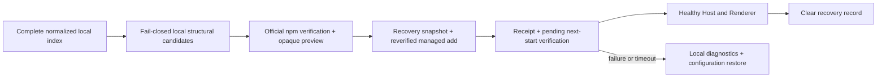

# Install and uninstall

[中文](install-and-uninstall.zh.md)

Status: delivered and built into DSH Desktop; this does not constitute a plugin security review

This guide explains what users see and the boundary developers must preserve. The current Market installs only a narrow class of exact npm packages into the active DSH Desktop profile. It does not install from GitHub or run a command supplied by a catalog. For plugins installed elsewhere, it can only persist a Desktop-owned enabled/disabled loading choice; it never claims uninstall ownership.

## The four views

| View | What it shows | What it does not mean |
| --- | --- | --- |
| **Discover** | Every normalized item in the selected source's complete local index, shown 50 at a time | A listing is not install approval, compatibility evidence, or endorsement |
| **Installable** | A fail-closed structural subset of the selected catalog requiring reviewed provider verification with `repository_backlink`, an exact stable npm target, and a canonical repository, while excluding product-blocked packages | Local install, receipt, uninstall, and enabled/disabled state do not remove a listing; presence is not permission to install, npm verification, compatibility proof, code review, or endorsement |
| **Installed** | Host-reconciled direct bundles for the active profile | A valid matching Market receipt grants uninstall; disabled mutable bundles can be enabled, while external active bundles grant disable but never uninstall |
| **Sources** | Saved source records and the one currently selected source | Changing source does not change the active profile or remove receipts |

Exactly one catalog source is browsed at a time. The Host completes and caches one full index for that source and locale; search, multi-category OR filtering, complete category choices, and 50-item pagination are local views over that index. Switching source resets the index view, search, categories, and cursor. The **Installed** view instead follows the active profile's direct-bundle inventory and locally verified receipts.

Optional catalog metadata reports `scannedAt`, cache `expiresAt`, optional `providerRevision`, and whether `cacheStatus` is `fresh` or `cached`. Explicit refresh replaces the complete index and bypasses the catalog HTTP cache before rescanning; it does not merely reload the visible page.

## Install a plugin

1. Select a catalog source and choose a card in **Discover** or **Installable**. The shared action dialog opens immediately.
2. The Host checks whether that exact normalized source/item is eligible for managed installation. Presence in **Installable** means only that it passed local, fail-closed structural candidate rules; the Host has not yet queried npm for that package. The catalog's version or command is never execution authority.
3. Managed preview verifies this one candidate against the official npm registry, including package/repository identity, deprecation, lifecycle scripts, runtime, integrity, tarball, DSH bundle evidence, and current-profile availability. Only success turns the same dialog into a confirmation with the catalog display name, verified exact `packageName@version`, active profile, and expiry.
4. Read the local-code warning and confirm. The confirmation is one-shot and short-lived. If the active profile or Host candidate changes, or the confirmation expires or is reused, a new preview is required.
5. Before the package operation starts, Desktop privately snapshots the active profile's `package.json`, `pnpm-lock.yaml`, and `pnpm-workspace.yaml`. It then runs the managed add, seals the resulting configuration image, verifies the installed DSH bundle, and saves a receipt. If the command fails after a recognized partial change, Desktop seals that partial image before restoring the snapshot.
6. Choose **Restart now** or **Restart later**. A successful install changes the profile on disk, but the running process does not load the new plugin automatically. The immediate action consumes a short-lived one-shot restart grant and never restarts silently. Until the next Desktop generation verifies a healthy startup, another protected plugin add is refused.
7. On the next launch, Desktop claims the pending recovery record before preparing the profile. The install is committed only after the Host starts successfully and the Renderer reports healthy within its 30-second deadline. If startup fails or remains unconfirmed, Desktop first saves a local diagnostics archive, restores a recognized before/after configuration image, and relaunches at most once.

If managed preview is unavailable, the dialog remains a details view. For an exact stable npm identity, the Host may show a bounded display-only command reconstructed from normalized identity. It may differ from the command described in the repository, is not the provider's original command, and has not passed the managed installer's complete verification. **Open DSH Terminal** sends no command, path, or profile: it only opens Desktop's built-in terminal so the user can inspect the source and decide whether to copy and run the text. A `dsh plugin add` launched through that built-in terminal uses the same configuration-recovery record as a Market install. Direct `pnpm` or `npm` commands typed there, and commands run from an external system terminal, are outside this recovery boundary. A manual install creates no Market receipt and therefore grants no Market uninstall authority.

The **Installable** label means only “this listing is a structural candidate from the selected catalog.” It does not mean npm has been contacted, the current profile permits installation, compatibility is proven, or the code is approved or safe. Installed, receipted, disabled, or subsequently uninstalled packages remain listed while the catalog still contains them. Preview may still reject a local operation, and a successful preview is not a promise that execution will succeed if registry, catalog, or profile state changes.

## What the Host accepts

The built-in managed installation boundary supports only an npm package when all of these checks succeed. The first structural check is local; the remaining authoritative package checks run during preview for the selected item and are repeated where mutable during execution:

- the catalog supplies a normalized npm package name, an exact stable SemVer version, and a canonical repository identity;
- npm returns the same package name and exact version;
- npm's repository identity matches the normalized catalog repository, including a subdirectory when present;
- the version is not marked deprecated;
- the target package manifest does not define `preinstall`, `install`, `postinstall`, or `prepare`;
- its declared DSH/Cordis dependencies are compatible with the Desktop runtime based on DSH `0.1.0-rc.8`, and its declared Node engine accepts the bundled Node.js runtime;
- npm supplies an official HTTPS tarball with a valid SHA-512 integrity value; and
- the package declares a safe DSH bundle patch, which is present and contained inside the installed package after the managed operation.

Building **Installable** does not perform per-package registry I/O. It excludes product-blocked packages, but does not read the active profile, Market receipts, or enabled/disabled state to decide catalog membership. Preview performs official-registry and active-profile verification for the selected candidate. Immediately before confirmed installation, execution repeats mutable checks; if integrity, tarball, bundle path, catalog candidate, or active profile changed, it refuses the operation. Only one Market package mutation runs at a time.

## Protected install recovery

The recovery boundary is deliberately configuration-level and applies only to `plugin add`. Before a Market-managed install or a `dsh plugin add` launched through Desktop's built-in DSH Terminal, Desktop stores private preimages for this fixed allowlist:

- `package.json`;
- `pnpm-lock.yaml`; and
- `pnpm-workspace.yaml`.

It does not back up or actively roll back `node_modules`, plugin payload files, environment variables, or separate credential stores. The three allowlisted profile files are copied as raw bytes, so users and integrations must not embed credentials in them. Uninstall and bundle enable/disable do not create this snapshot.

After a successful add, Desktop seals hashes for the resulting allowlisted files and keeps one write-ahead recovery record pending. A second protected plugin add is refused until the record is verified or reconciled. This gate covers Market installs and the built-in terminal's `dsh plugin add`; it is not a global filesystem lock and cannot protect raw package-manager commands or an external system terminal.

The next Desktop generation claims the record before profile preparation. Successful Host startup followed by a healthy Renderer report within its 30-second deadline verifies the install and clears the recovery data. A Host failure, main-frame load failure, Renderer failure, timeout, or an interrupted prior verification first triggers a local diagnostics export and then a conservative restore. Desktop writes a file only when its current hash is one of the recorded before/after images. Unknown third-party drift fails closed as `manual-recovery-required`, without a partial automatic overwrite. A successful automatic restore may relaunch Desktop once; it never enters an automatic restart loop.

When a Market receipt was already saved for an install that startup recovery rolls back, the Market removes that exact receipt before acknowledging and clearing the recovery record. If receipt persistence fails, the record remains pending and the cleanup is retried. The local diagnostics archive is not uploaded automatically and may contain logs, system information, and crash evidence; treat it as sensitive rather than assuming every artifact can be completely redacted.

The built-in managed installer rejects:

- GitHub URLs, Git repositories, release archives, commits, and other repository-based install targets;
- version ranges, tags such as `latest`, and prerelease versions;
- provider install commands, shell snippets, HTML, scripts, and executable adapter data;
- deprecated targets or a target package with one of the four lifecycle scripts listed above;
- packages incompatible with the current DSH rc.8, Cordis, or bundled Node.js runtime;
- packages without the required npm integrity and DSH bundle evidence; and
- the Desktop and Market product packages themselves.

A GitHub repository link may still appear as inert provenance and may be used to compare repository identity. It is never passed to the package manager as an install target.

## Uninstall a plugin

1. Open **Installed**. The list comes from valid receipts for the active profile, not from the selected catalog source.
2. Choose **Uninstall**. The Host checks that the receipt still exists and that the installed package, exact version, and bundle still match it.
3. Confirm the exact package and active profile. The UI sends only the receipt identifier; it cannot choose an arbitrary package name.
4. Desktop runs the managed remove operation. The Host verifies that the package has left the profile before removing the receipt.
5. Restart DSH Desktop so the running process no longer uses the removed plugin.

Uninstall does not need the provider to remain online and does not refetch the original listing. If a plugin has no Market receipt, belongs to another profile, or was changed after installation, the built-in Market refuses to remove it. That conservative behavior avoids claiming ownership of packages managed elsewhere.

## Disable or enable a plugin

An active mutable direct bundle without a valid matching Market receipt is externally owned. **Disable** sends only Desktop's generation-scoped opaque `bundleId`. Desktop mints a short-lived preview and revalidates the profile, exact bundle, mutability, and receipt boundary before persisting the disable. It does not uninstall the package or sandbox its code. Restart after success. If a broken bundle patch already prevents the current startup, this control cannot recover that failed startup.

A disabled mutable direct bundle exposes a new generation-scoped opaque `bundleId` for **Enable**. The Host accepts that capability only while the exact bundle is still disabled and mutable. It also revalidates receipt ownership: an externally owned bundle must remain external, while a Market-managed bundle must retain the same receipt. A disabled Market-managed plugin therefore keeps **Uninstall** and **Enable** as separate actions. Enabling changes only Desktop's private loading choice; after restart the plugin runs again as local code with the user's permissions.

Desktop stores this versioned, profile-scoped choice in `<Desktop user data>/plugin-management/state.json`. It does not edit the profile's `package.json`, lockfile, dependency tree, or `dsh.profile.bundles` list.

## What these checks do not prove

Registry identity, integrity, repository matching, compatibility metadata, and lifecycle-script policy reduce ambiguity around *what* Desktop installs. They do not determine whether the plugin's code or dependency tree is trustworthy, private, correct, or free from vulnerabilities. A plugin runs locally with the user's permissions after restart.

Before confirming, users should still review the publisher, repository, requested behavior, and whether they trust the code. Catalog inclusion, an **Installable** card, a successful npm check, and a saved receipt are not security endorsements by Anywhere Labs, DSH 1024Store, DeepSeek, or the catalog provider.

## Developer boundary

The installation path keeps catalog approval, package execution, and startup recovery separate:

Keep those states separate:

- A catalog adapter may map remote metadata into complete normalized snapshots, including `package`, `latestVersion`, repository, category, and display fields. Full-scan chunks contain at most 100 items, discard remote commands, and never load remote JavaScript.
- The Host owns fail-closed **Installable** structural filtering. The renderer displays only Host-returned candidate identities and must not infer candidacy from `latestVersion` or promote another listing. Listing does not query npm for every package.
- Install preview accepts only `sourceRecordId` and `itemId`. The Host selects its previously observed candidate, performs the full official-registry, runtime, lifecycle, integrity, repository, DSH bundle, and active-profile verification for that package, and returns an opaque `previewId` plus the exact confirmation summary only on success.
- Execute accepts only that `previewId`. The one-shot token binds the candidate, registry evidence, active profile, and expiry; the Host revalidates all mutable state. Desktop must publish the allowlisted preimages before starting the managed add and seal the known partial or successful postimage before reporting its outcome.
- Installed-state reads reconcile the active profile's direct-bundle inventory with verified receipts. Uninstall preview accepts only `receiptId`. Disable and enable preview accept only a generation-scoped opaque `bundleId`. Every execution accepts only its one-shot opaque `previewId`, and enable revalidates both disabled status and receipt ownership.
- The renderer never receives filesystem, process, environment, or package-manager authority. Package changes go through `desktopPnpm.runPlugin()` with fixed argument construction and the active profile's absolute directory. The only command-shaped value it may receive is a bounded display-only manual hint; the terminal action cannot receive or execute it.

The receipt records the profile, exact npm identity, integrity, DSH bundle patch, catalog provenance, display name, and installation time. It is local evidence that this Market completed and verified a managed install; it is not a provider credential and must not depend on the source remaining registered.

If Desktop package capabilities are unavailable, browsing still works while install, uninstall, disable, and enable return an unavailable state. The managed path never falls back to an ambient `pnpm`, shell, guessed executable, repository command, or inactive profile. Opening DSH Terminal is a separate explicit user action and never starts a package operation by itself. Only a later `dsh plugin add` through the built-in terminal receives the Desktop recovery handoff; other terminal commands do not.

## Failure and recovery

| Situation | Result |
| --- | --- |
| A listing fails local structural candidate rules | Item remains in Discover and is omitted from Installable; no registry request, profile change, or receipt |
| Official npm verification fails during preview | No confirmation is issued; the structural candidate may remain visible until its local inputs change |
| npm or profile state changes after a successful preview | Confirmed execution is refused; create a fresh preview before retrying |
| Preview expires, is reused, or profile/candidate changes | Operation is refused; create a fresh preview |
| Managed add fails after a recognized partial change | No receipt; the three allowlisted configuration files are restored after the partial image is sealed. `node_modules` is not actively rolled back |
| Receipt cannot be saved | The allowlisted configuration is restored; an unsafe or mismatched recovery state requires manual repair |
| A successful install is waiting for its first restart | Another protected plugin add is refused until startup health is verified or recovery is reconciled |
| Host startup fails, or the Renderer fails or does not report healthy within 30 seconds | A local diagnostics archive is saved, recognized configuration images are restored, and Desktop relaunches at most once |
| An allowlisted file has unknown third-party drift | Automatic restore stops without overwriting it; the recovery record requires manual repair |
| Startup recovery rolls back an install whose receipt was saved | The exact receipt is removed before the recovery record is acknowledged; a persistence failure leaves recovery pending for retry |
| Receipt or installed bundle changed before uninstall | Uninstall is refused without taking ownership of the changed package |
| Managed uninstall succeeds but receipt persistence fails | The package is removed, but the receipt store reports a persistence error |
| Bundle or receipt ownership changes after an enable/disable preview | Execution is refused; refresh Installed and create a new preview |

User-facing errors remain bounded and do not expose response bodies, local paths, environment variables, credentials, or commands. See [Security](../SECURITY.md) for the full trust model and [Market shell design](market-shell.md) for the surrounding catalog architecture.
