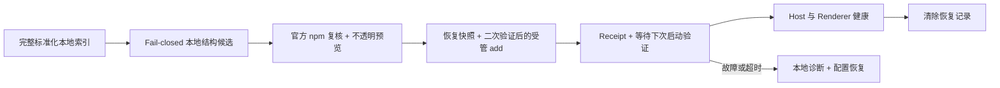

# 安装与卸载

[English](install-and-uninstall.md)

状态：已完成并内置于 DSH Desktop；不代表插件已经通过安全审核

本文同时说明用户会看到什么，以及开发者必须保持哪些边界。当前 Market 只会把一小类精确 npm package 安装到 DSH Desktop 的当前 profile；它不会从 GitHub 安装，也不会运行目录提供的命令。对于通过其他工具安装的插件，它只能保存 Desktop 自己拥有的启用/禁用加载选择，绝不会取得卸载所有权。

## 四个视图

| 视图 | 展示内容 | 不代表什么 |
| --- | --- | --- |
| **发现** | 当前已选来源完整本地索引中的全部标准化条目，每次展示 50 条 | 被收录不等于允许安装、兼容性证据或推荐 |
| **可安装** | 已选目录的 fail-closed 结构子集：要求经过审核的 provider 验证与 `repository_backlink`、精确稳定的 npm 目标和规范仓库，同时排除产品 blocklist 中的 package | 本地安装、receipt、卸载和启用/禁用状态不会移除条目；出现在这里不等于允许安装、npm 已复核、兼容性证据、代码审核或推荐 |
| **已安装** | Host 核对后的当前 profile direct bundle | 有效且匹配的 Market receipt 授予卸载；已禁用的可变 bundle 可以启用，外部 active bundle 只授予禁用、绝不授予卸载 |
| **来源** | 已保存的来源记录，以及当前唯一选中的来源 | 切换来源不会切换当前 profile，也不会删除 receipt |

同一时间只浏览一个目录来源。Host 会针对该来源和 locale 完成并 cache 一份完整索引；搜索、多分类 OR 筛选、完整分类选项和每页 50 条分页都是该索引上的本地视图。切换来源会重置索引视图、搜索、分类和 cursor。**已安装**视图则依据当前 profile 的 direct bundle 清单和本地复核后的 receipt。

可选目录 metadata 会报告 `scannedAt`、cache `expiresAt`、可选 `providerRevision`，以及 `cacheStatus` 是 `fresh` 还是 `cached`。明确刷新会替换完整索引，并绕过目录 HTTP cache 后重新扫描，而不只是重新加载可见页面。

## 安装插件

1. 选择一个目录来源，再点击**发现**或**可安装**中的卡片；统一操作弹窗会立即打开。
2. Host 会判断这个精确的标准化来源/条目能否使用受管安装。出现在**可安装**中，只表示它通过了本地、fail-closed 的结构候选规则；此时 Host 尚未针对该 package 请求 npm。目录给出的版本或命令始终没有执行授权。
3. 受管 preview 此时才针对这一个候选访问官方 npm registry，检查 package/仓库身份、deprecated 状态、lifecycle script、runtime、integrity、tarball、DSH bundle 证据和当前 profile 可安装性。只有成功后，同一个弹窗才会切换成确认框，并展示目录显示名、验证过的精确 `packageName@version`、当前 profile 和过期时间。
4. 阅读“本地代码”提示并确认。确认是一次性且短时有效的；如果当前 profile 或 Host 候选发生变化，或者确认过期、已被使用，就需要重新预览。
5. Package 操作开始前，Desktop 会私下为当前 profile 的 `package.json`、`pnpm-lock.yaml` 和 `pnpm-workspace.yaml` 创建快照，再执行受管 add、封存产生的配置状态、验证安装后的 DSH bundle 并保存 receipt。如果命令在产生可识别的部分修改后失败，Desktop 会先封存该部分状态，再恢复快照。
6. 选择**立即重启**或**稍后重启**。安装成功会修改磁盘上的 profile，但当前运行的进程不会自动加载新插件。立即重启会消费一份短时、一次性重启许可，系统不会静默重启。下一次 Desktop generation 完成健康启动验证前，会拒绝另一次受保护的插件添加。
7. 下一次启动时，Desktop 会在准备 profile 前认领待验证的恢复记录。只有 Host 成功启动，并且 Renderer 在 30 秒期限内报告健康，安装才会正式提交。如果启动失败或一直未确认，Desktop 会先在本地保存诊断归档，再恢复一份已识别的前后配置状态，并且最多自动重启一次。

如果受管 preview 不可用，弹窗会保留为详情。对于精确稳定的 npm 身份，Host 可以展示一条根据规范化身份重建的、有界且只用于展示的命令。它可能与仓库中描述的命令不同，不是 provider 返回的原始命令，也没有通过受管安装器的全部验证。**打开 DSH 终端**不会提交命令、路径或 profile，只负责打开 Desktop 内置终端；用户需要先检查源码，再自行决定是否复制并运行文本。通过该内置终端运行的 `dsh plugin add` 会使用与 Market 安装相同的配置恢复记录；在其中直接执行 `pnpm`、`npm`，或在外部系统终端中运行命令，都不在这个恢复边界内。手动安装不会生成 Market receipt，因此也不会授予 Market 卸载权限。

**可安装**只表示“这个条目是已选目录中的结构候选”。它不表示已经联系 npm、当前 profile 允许安装、兼容性已经证明，或代码已经获批、安全。只要目录仍然包含该条目，已经安装、已有 receipt、处于禁用状态或后来已卸载的 package 都会继续显示。Preview 仍可能拒绝本地操作；即使 preview 成功，如果 registry、目录或 profile 状态发生变化，也不承诺执行一定成功。

## Host 接受什么

内置受管安装边界只在以下检查全部通过时支持 npm package。第一项结构检查在本地完成；其余权威 package 检查在用户选择条目后的 preview 阶段执行，并在执行阶段按可变性再次检查：

- 目录给出标准化 npm package 名、精确稳定的 SemVer 版本和规范仓库身份；
- npm 返回相同的 package 名和精确版本；
- npm 的仓库身份与目录中的标准化仓库一致，存在 subdirectory 时也必须一致；
- 该版本没有 deprecated 标记；
- 目标 package manifest 没有定义 `preinstall`、`install`、`postinstall` 或 `prepare`；
- 它声明的 DSH/Cordis dependency 与基于 DSH `0.1.0-rc.8` 的 Desktop runtime 兼容，并且声明的 Node engine 接受 Desktop 内置的 Node.js runtime；
- npm 提供官方 HTTPS tarball 和合法 SHA-512 integrity；以及
- package 声明安全的 DSH bundle patch，受管操作结束后，该文件确实存在于安装 package 内且没有越出 package 目录。

生成**可安装**列表时不会逐包访问 registry。它会排除产品 blocklist 中的 package，但不会读取当前 profile、Market receipt 或启用/禁用状态来决定目录成员资格。Preview 针对用户选中的候选完成官方 registry 与当前 profile 复核。用户确认后、真正安装前，执行阶段会立即重复可变检查；如果 integrity、tarball、bundle 路径、目录候选或当前 profile 发生变化，就会拒绝执行。同一时间只允许一个 Market package 修改操作。

## 受保护安装恢复

恢复边界刻意只做到配置层，并且只适用于 `plugin add`。Market 受管安装，或通过 Desktop 内置 DSH 终端运行 `dsh plugin add` 之前，Desktop 会为以下固定白名单保存私有前镜像：

- `package.json`；
- `pnpm-lock.yaml`；以及
- `pnpm-workspace.yaml`。

它不会备份或主动回滚 `node_modules`、插件 payload 文件、环境变量或独立凭据存储。这三个白名单 profile 文件会按原始字节复制，因此用户和集成都不应把凭据写入其中。卸载以及启用/禁用 bundle 不会创建这份快照。

Add 成功后，Desktop 会封存白名单文件的结果 hash，并保留一条待验证的 write-ahead 恢复记录。该记录完成验证或 reconcile 前，会拒绝第二次受保护的插件添加。这个 gate 覆盖 Market 安装和内置终端中的 `dsh plugin add`；它不是全局文件系统锁，也无法保护直接执行的 package-manager 命令或外部系统终端。

下一次 Desktop generation 会在准备 profile 前认领该记录。Host 成功启动，并且 Renderer 在 30 秒期限内报告健康后，安装才会通过验证并清除恢复数据。如果发生 Host 故障、主 frame 加载失败、Renderer 故障、超时，或上一次验证被中断，Desktop 会先导出本地诊断，再进行保守恢复。只有当前 hash 属于记录中的前镜像或后镜像时，Desktop 才会写回文件。未知第三方漂移会 fail closed 为 `manual-recovery-required`，不会进行部分自动覆盖。自动恢复成功后最多重新启动 Desktop 一次，绝不会进入自动重启循环。

如果 Market receipt 已经保存，但该安装随后被启动恢复回滚，Market 会先移除这条精确 receipt，再确认并清除恢复记录。Receipt 持久化失败时，记录会继续保持 pending，之后重试清理。本地诊断归档不会自动上传，其中可能包含日志、系统信息和 crash 证据；应把它当作敏感数据处理，不能假设每一类 artifact 都能彻底脱敏。

内置受管安装器会拒绝：

- GitHub URL、Git repository、release archive、commit，以及其他基于仓库的安装目标；
- 版本范围、`latest` 等 tag 和 prerelease 版本；
- provider 安装命令、shell 片段、HTML、脚本和任何可执行 adapter 数据；
- deprecated 目标，或包含上述四种 lifecycle script 之一的目标 package；
- 与当前 DSH rc.8、Cordis 或内置 Node.js runtime 不兼容的 package；
- 缺少必要 npm integrity 或 DSH bundle 证据的 package；以及
- Desktop 与 Market 产品 package 本身。

GitHub 仓库链接仍可作为不可执行的来源信息显示，也可以用于比较仓库身份；它绝不会作为安装目标传给 package manager。

## 卸载插件

1. 打开**已安装**。列表来自当前 profile 的合法 receipt，不依赖已选目录来源。
2. 点击**卸载**。Host 会确认 receipt 仍然存在，而且已安装 package、精确版本和 bundle 仍与 receipt 一致。
3. 确认精确 package 和当前 profile。UI 只提交 receipt 标识，不能自行选择任意 package 名。
4. Desktop 执行受管 remove 操作。Host 确认 package 已离开 profile 后，才移除 receipt。
5. 重启 DSH Desktop，让当前运行的进程不再使用已移除插件。

卸载不需要 provider 保持在线，也不会重新请求原目录条目。没有 Market receipt、属于其他 profile，或安装后已被修改的插件，内置 Market 都会拒绝移除。这种保守行为可以避免 Market 错误接管由其他工具维护的 package。

## 禁用或启用插件

没有合法匹配 Market receipt 的 active、可变 direct bundle 属于外部所有。点击**禁用**时，UI 只提交 Desktop 清单中的 generation-scoped 不透明 `bundleId`。Desktop 会签发短期 preview，并在持久化前再次核对 profile、精确 bundle、可变性和 receipt 边界。这个操作不会卸载 package，也不是安全沙箱；成功后需要重启。如果损坏的 bundle patch 已经导致当前启动失败，此功能无法救援这次失败的启动。

已禁用的可变 direct bundle 会得到一份新的、generation-scoped 不透明 `bundleId`，用于**启用**。只有精确 bundle 仍然处于禁用且可变状态时，Host 才接受该能力；同时还会重验 receipt 所有权：外部 bundle 必须仍然属于外部，Market 受管 bundle 必须仍然保留同一 receipt。因此，已禁用的 Market 受管插件会同时保留**卸载**和**启用**两个独立操作。启用只修改 Desktop 私有加载选择；重启后，插件会再次以用户权限作为本地代码运行。

Desktop 会把这个带版本、按 profile 隔离的选择保存在 `<Desktop user data>/plugin-management/state.json`，不会修改 profile 的 `package.json`、lockfile、依赖树或 `dsh.profile.bundles` 清单。

## 这些检查不能证明什么

Registry 身份、integrity、仓库匹配、兼容 metadata 和 lifecycle script 策略，只能减少 Desktop “到底安装了什么”的歧义；它们不能判断插件代码或依赖树是否可信、是否保护隐私、是否正确，或是否没有漏洞。重启后，插件会以用户权限作为本地代码运行。

确认前，用户仍应检查 publisher、源码仓库、插件行为，以及自己是否信任这些代码。目录收录、**可安装**卡片、npm 复核成功和本地 receipt，都不代表 Anywhere Labs、DSH 1024Store、DeepSeek 或目录 provider 作出安全背书。

## 开发边界

安装路径会把目录许可、package 执行和启动恢复保持为独立状态：

必须保持这些状态互相分离：

- 目录 adapter 可以把远程 metadata 映射成完整标准化 snapshots，包括 `package`、`latestVersion`、repository、category 和展示字段。全量扫描分块每块最多 100 条，必须丢弃远程命令，绝不能加载远程 JavaScript。
- **可安装**的 fail-closed 结构筛选由 Host 负责。Renderer 只能展示 Host 返回的候选标识，不能根据 `latestVersion` 自行推断，也不能把其他条目提升为可安装。生成列表时不会逐包请求 npm。
- 安装 preview 只接受 `sourceRecordId` 和 `itemId`。Host 从自己此前观察到的候选中选择目标，针对该 package 完整执行官方 registry、runtime、lifecycle、integrity、仓库、DSH bundle 和当前 profile 复核，只有成功后才返回不透明 `previewId` 与精确确认摘要。
- 执行阶段只接受该 `previewId`。一次性 token 会绑定候选、registry 证据、当前 profile 和过期时间；Host 需要重新校验所有可变状态。Desktop 必须在受管 add 开始前发布白名单文件的前镜像，并在报告操作结果前封存已知的部分或成功后镜像。
- 已安装状态读取会核对当前 profile 的 direct-bundle 清单与合法 receipt。卸载 preview 只接受 `receiptId`；禁用和启用 preview 只接受 generation-scoped 不透明 `bundleId`。每次执行都只接受各自的一次性不透明 `previewId`，启用时还会重验禁用状态和 receipt 所有权。
- renderer 不会获得文件系统、进程、环境变量或 package manager 权限。package 修改通过 `desktopPnpm.runPlugin()` 完成，参数由 Host 固定构造，并使用当前 profile 的绝对目录。它唯一可以收到的命令形文本是有界、只展示的手动提示；终端操作不能接收或执行该文本。

Receipt 会记录 profile、精确 npm 身份、integrity、DSH bundle patch、目录 provenance、展示名称和安装时间。它只是“本 Market 已完成并验证一次受管安装”的本地证据，不是 provider 凭据，也不能依赖来源继续存在。

如果 Desktop package 能力不可用，目录浏览仍然可以工作，而安装、卸载、禁用和启用会返回不可用状态。受管路径不会退回 ambient `pnpm`、shell、猜测的 executable、repository 命令或未激活 profile。打开 DSH 终端是另一项明确的用户操作，本身绝不会启动 package 操作；只有之后通过内置终端运行的 `dsh plugin add` 会获得 Desktop 恢复 handoff，其他终端命令不会。

## 失败与恢复

| 情况 | 结果 |
| --- | --- |
| 条目不满足本地结构候选规则 | 条目留在发现页，不出现在可安装页；不请求 registry、不修改 profile，也不写入 receipt |
| Preview 阶段官方 npm 复核失败 | 不生成确认；在本地输入变化前，该结构候选仍可能可见 |
| Preview 成功后 npm 或 profile 状态发生变化 | 拒绝已确认的执行；重新生成 preview 后再试 |
| 预览过期、重复使用，或 profile/候选变化 | 拒绝操作；必须生成新的预览 |
| 受管 add 在产生可识别的部分修改后失败 | 不写入 receipt；封存部分镜像后恢复三个白名单配置文件。不会主动回滚 `node_modules` |
| Receipt 无法保存 | 恢复白名单配置；恢复状态不安全或不匹配时要求手动修复 |
| 安装成功，正在等待第一次重启 | 启动健康得到验证或恢复完成 reconcile 前，拒绝另一次受保护的插件添加 |
| Host 启动失败，或 Renderer 失败、未在 30 秒内报告健康 | 保存本地诊断归档，恢复已识别配置状态，并且最多自动重启 Desktop 一次 |
| 白名单文件出现未知第三方漂移 | 自动恢复停止，不覆盖该文件；恢复记录要求手动修复 |
| 启动恢复回滚的安装已经保存 receipt | 确认恢复记录前先移除精确 receipt；持久化失败时保持 pending 并等待重试 |
| 卸载前 receipt 或已安装 bundle 发生变化 | 拒绝卸载，不接管已变化的 package |
| 受管卸载成功但 receipt 持久化失败 | package 已移除，但 receipt store 会报告持久化错误 |
| 启用/禁用 preview 后 bundle 或 receipt 所有权变化 | 拒绝执行；刷新“已安装”并生成新的 preview |

用户可见错误必须保持有界，不能暴露响应 body、本地路径、环境变量、凭据或命令。完整信任模型见[安全说明](../SECURITY.zh.md)，目录整体架构见[市场壳设计](market-shell.zh.md)。
