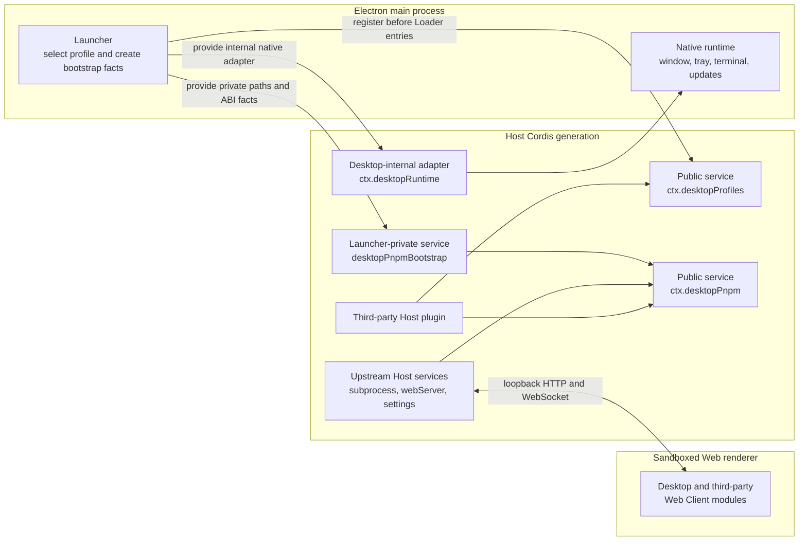

# DSH Desktop plugin services

English | [中文](plugin-services.zh.md)

This document is the supported Host-side integration contract for plugin authors. It covers the public `desktopProfiles` and `desktopPnpm` Cordis services exported by DSH Desktop 2.x in both compatibility and advanced presentation modes. It does not grant third-party access to raw Electron APIs, the renderer, or launcher bootstrap state.

## Layers and data flow



The launcher resolves one profile before the Loader tree mounts. `desktopProfiles.current` remains fixed until that whole Cordis generation is disposed. The `desktop-pnpm` Host row builds `desktopPnpm` from launcher-private facts and the upstream subprocess service. A profile or mode switch disposes the current generation and starts a new one; service references must not cross that boundary.

The renderer receives ordinary Web Client modules over the existing loopback carrier. It cannot read these Host services directly, and DSH Desktop adds no preload or Electron IPC bridge for them. A plugin with browser UI continues to use normal DSH Host routes, RPC, client metadata, services, and slots.

## Public Cordis services

Use type-only imports from the supported contract paths:

```ts
import type {
  DesktopCurrentProfile,
  DesktopProfiles,
} from 'dsh-plugin-desktop/profile-service'
import type {
  DesktopPnpm,
  DesktopPnpmHandle,
  DesktopPnpmOutcome,
} from 'dsh-plugin-desktop/pnpm'
```

`dsh-plugin-desktop/profiles` is the Desktop-owned tray consumer, not the profile service contract. Do not import it for service types.

### `desktopProfiles`

```ts
interface DesktopProfiles {
  readonly current: {
    readonly name: string
    readonly dir: string
  }
  list(): readonly DesktopProfileSummary[]
  select(name: string): Promise<void>
}
```

- `current` is immutable for one generation. `name` is the launcher-selected profile name and `dir` is its absolute manifest directory. Do not infer either value from argv, `ctx.baseUrl`, settings, Loader rows, or `$DSH_HOME`.
- `list()` re-reads profile manifests without changing their patches, dependencies, or bundle order. Entries can describe profiles that are visible but not selectable.
- `select(name)` is a restart operation, not an in-place mutation. It persists an accepted target before requesting orderly Cordis teardown and Electron relaunch.
- Concurrent calls for the same target share one operation. After a target has been committed as pending, a different target is rejected until restart. A persistence failure releases the selection slot; a restart failure retains the committed target so the same restart can be retried without overwriting state.
- Calls through a retained reference fail after service disposal. Read `current` again from the next generation instead of caching the old service globally.

### `desktopPnpm`

```ts
interface DesktopPnpm {
  run(args: readonly string[], signal?: AbortSignal): DesktopPnpmHandle
  runPlugin(
    args: readonly string[],
    invokingDir: string,
    signal?: AbortSignal,
  ): DesktopPnpmHandle
  /** @deprecated Use installPlugin(). */
  runPluginInstall(
    args: readonly string[],
    invokingDir: string,
    recovery: {
      readonly packageName: string
      readonly packageVersion: string
      readonly receiptId: string
    },
    signal?: AbortSignal,
  ): Promise<DesktopPnpmHandle>
  installPlugin(request: {
    readonly pnpmOptions?: readonly string[]
    readonly invokingDir: string
    readonly recovery: {
      readonly packageName: string
      readonly packageVersion: string
      readonly receiptId: string
    }
    readonly signal?: AbortSignal
  }): Promise<DesktopPnpmHandle>
  recoveredInstallReceiptIds(): Promise<readonly string[]>
  acknowledgeRecoveredInstall(receiptId: string): Promise<void>
  rollbackPluginInstall(receiptId: string): Promise<boolean>
}

interface DesktopPnpmHandle {
  readonly stdout: NodeJS.ReadableStream
  readonly stderr: NodeJS.ReadableStream
  readonly done: Promise<{
    readonly exitCode: number | null
    readonly signal: NodeJS.Signals | null
  }>
  cancel(): void
}
```

The actual stream type is Node's `Readable`. Command methods validate non-empty, NUL-free argv. Plugin operations additionally require an absolute, NUL-free `invokingDir`.

| Method | Process and working directory | Supported purpose |
| --- | --- | --- |
| `run(args, signal?)` | Runs the packaged pnpm JavaScript entry directly, with the active profile directory as `cwd`. | Low-level pnpm work whose caller deliberately does not need DSH plugin reconciliation. |
| `runPlugin(args, invokingDir, signal?)` | Runs packaged `dsh plugin --profile <active> ...` with the absolute caller directory as CLI `cwd`; upstream DSH changes into the profile for pnpm. | Plugin remove, update, collection repair, or dependency repair. It rejects `add`. |
| `runPluginInstall(args, invokingDir, recovery, signal?)` | Accepts the v2.0.1 `add` shape only when its single exact target equals the recovery receipt, then delegates to `installPlugin()`. | Deprecated compatibility for released plugin managers; do not use in new integrations. |
| `installPlugin(request)` | Snapshots the profile, generates the exact `name@version` target, then runs the enforced `dsh plugin ... add` operation and seals or restores the snapshot before `done` settles. | The only supported Desktop plugin-install path. |

`run()` is not a shorter spelling of `runPlugin()`. Direct pnpm does not promise first-use profile initialization, caller-relative `file:` or `link:` source anchoring, or successful `dsh.profile.bundles` reconciliation. A package can appear in dependencies yet fail to join the Loader layer stack if a plugin manager uses the wrong method.

`runPlugin()` preserves the ordinary DSH CLI as the authority for non-install mutations. Its `args` are forwarded after `dsh plugin --profile <active>`, for example:

```ts
['remove', 'example-plugin']
['update']
['install', '--no-frozen-lockfile']
```

`installPlugin()` owns the recoverable `add` lifecycle. The caller supplies pnpm flags, an absolute invoking directory, and a durable receipt identity. Desktop generates the exact `${packageName}@${packageVersion}` target, snapshots the profile manifest and lockfiles before spawning, restores them after a failed command, and seals the post-install image after success. `receiptId` links the caller's durable receipt ledger to the Desktop WAL. After startup rollback, remove that exact receipt first and only then call `acknowledgeRecoveredInstall(receiptId)`; acknowledgment is idempotent. `rollbackPluginInstall(receiptId)` is limited to the current generation's matching transaction.

`runPluginInstall()` remains available only to avoid breaking v2.0.1 plugin managers. It accepts `['add', ...flags, exactTarget]` only when `exactTarget` is precisely `${recovery.packageName}@${recovery.packageVersion}` and every intermediate argument is a flag. A different command, target, extra positional package, or malformed argument is rejected before any process starts.

The service starts at most one package operation per generation. A second call while one is active throws synchronously. It exposes output instead of choosing a progress UI, and it has no built-in timeout. The consumer owns deadlines, reads both streams, reports progress, calls `cancel()` or aborts its signal when needed, awaits `done`, and checks both `exitCode` and `signal`.

Invalid argv, an invalid `invokingDir`, a closed or busy generation, and a signal that was already aborted all throw synchronously before a handle is returned. After a handle exists, cancellation and generation teardown target the complete subprocess tree. `done` does not settle merely because the direct wrapper exits; the operation gate remains held until descendants are gone. An asynchronous spawn-level failure rejects `done`, while a normal command failure resolves it with a nonzero exit code. On Windows the provider launches exact packaged entries with argv and delegates tree ownership to the subprocess service, so plugin authors do not need to discover `.cmd` shims or concatenate shell text.

## Internal and launcher-private capabilities

| Name | Boundary | Plugin-author status |
| --- | --- | --- |
| `desktopProfiles` | Generation-scoped Host service. | Public and supported through `dsh-plugin-desktop/profile-service`. |
| `desktopPnpm` | Generation-scoped Host service. | Public and supported through `dsh-plugin-desktop/pnpm`. |
| `desktopRuntime` | Launcher-provided native adapter used by Desktop-owned shell, tray, terminal, profile, and update rows. | Desktop-internal. Third-party plugins must not inject it or rely on its window/tray methods. |
| `desktopPnpmBootstrap` | Absolute packaged paths, selected profile facts, Electron ABI values, and private Node helpers supplied to the `desktop-pnpm` provider. | Launcher-private. Never read, provide, intercept, or declare it as a dependency. |
| `DesktopProfileServiceBootstrap` | Constructor input used while the launcher registers `desktopProfiles`; it is not a Cordis service. | Launcher-private implementation detail. |

The fact that a private type is present in emitted declarations does not make its runtime service a supported third-party capability. The two public service names and their contract modules are the compatibility boundary.

## Injection patterns

### Desktop-only plugin: required injection

A plugin that only makes sense inside DSH Desktop can declare both services as required dependencies. Cordis keeps the plugin pending until both providers are available and unloads its effects if a required service disappears.

```ts
import type { Context } from '@deepseek-ai/cordis'
import { randomUUID } from 'node:crypto'
import type {} from 'dsh-plugin-desktop/profile-service'
import type { DesktopPnpmHandle } from 'dsh-plugin-desktop/pnpm'

export const name = 'example-desktop-plugin-manager'
export const inject = ['desktopProfiles', 'desktopPnpm']

declare function registerInstallAction(
  callback: (target: string) => Promise<void>,
): () => void
declare function persistPendingReceipt(recovery: {
  readonly packageName: string
  readonly packageVersion: string
  readonly receiptId: string
}): Promise<void>

export function apply(ctx: Context): void {
  ctx.logger.info(`active Desktop profile: ${ctx.desktopProfiles.current.name}`)
  ctx.effect(() => {
    let active: DesktopPnpmHandle | undefined
    const disposeAction = registerInstallAction(async (target) => {
      // Validate target first. This callback represents an explicit user action.
      const signal = AbortSignal.timeout(5 * 60_000)
      const recovery = {
        packageName: target,
        packageVersion: '1.0.0',
        receiptId: randomUUID(),
      }
      await persistPendingReceipt(recovery)
      const operation = await ctx.desktopPnpm.installPlugin({
        invokingDir: process.cwd(),
        recovery,
        signal,
      })
      active = operation
      operation.stdout.setEncoding('utf8')
      operation.stderr.setEncoding('utf8')
      operation.stdout.on('data', chunk => ctx.logger.info(String(chunk).trimEnd()))
      operation.stderr.on('data', chunk => ctx.logger.warn(String(chunk).trimEnd()))
      try {
        const outcome = await operation.done
        if (outcome.exitCode !== 0) {
          throw new Error(`plugin install failed: exit=${String(outcome.exitCode)} signal=${String(outcome.signal)}`)
        }
      } finally {
        if (active === operation) active = undefined
      }
    })
    return async () => {
      disposeAction()
      const operation = active
      operation?.cancel()
      await operation?.done.catch(() => {})
    }
  }, 'example: package-manager user action')
}
```

In production, validate `target` against the plugin's trust policy before invoking a package manager. A process exit code of zero does not replace domain-specific post-install validation.

### Cross-environment plugin: optional Desktop adapter and ordinary DSH fallback

Do not put Desktop services in the top-level required `inject` list when the same package must activate under ordinary DSH. The launcher registers `desktopProfiles` before Loader entries mount, so its presence is the Desktop environment discriminator. If present, create a nested `ctx.inject()` callback that waits for `desktopPnpm`; if absent, mount the existing ordinary DSH implementation.

```ts
import type { Context } from '@deepseek-ai/cordis'
import type {} from 'dsh-plugin-desktop/profile-service'
import type {} from 'dsh-plugin-desktop/pnpm'

export const name = 'cross-environment-plugin-manager'
export const inject = ['webServer', 'loader']

interface ManagerAdapter {
  readonly profile: string
  readonly profileDir?: string
  runPlugin(
    args: readonly string[],
    invokingDir: string,
    signal?: AbortSignal,
  ): unknown
}

declare function mountManager(ctx: Context, adapter: ManagerAdapter): () => void
declare function ordinaryDshAdapter(profile: string): ManagerAdapter

export function apply(ctx: Context, config: { profile?: string }): void {
  const profiles = ctx.get('desktopProfiles')
  if (profiles === undefined) {
    // Existing non-Desktop behavior remains authoritative here.
    const profile = config.profile ?? 'web'
    ctx.effect(
      () => mountManager(ctx, ordinaryDshAdapter(profile)),
      'example: ordinary DSH plugin manager',
    )
    return
  }

  // ctx.inject() still treats desktopPnpm as required for this nested
  // callback. The parent plugin remains loadable in ordinary DSH because the
  // Desktop-only dependency is not in its top-level inject list.
  ctx.inject(['desktopPnpm'], (desktopCtx) => {
    desktopCtx.effect(() => mountManager(desktopCtx, {
      profile: profiles.current.name,
      profileDir: profiles.current.dir,
      runPlugin: (args, invokingDir, signal) =>
        desktopCtx.desktopPnpm.runPlugin(args, invokingDir, signal),
    }), 'example: Desktop plugin manager')
  })
}
```

`ctx.inject()` is not an optional-dependency declaration: every name passed to that callback is required for the callback. It is useful here because only the nested Desktop adapter waits for `desktopPnpm`; the outer plugin still owns the ordinary fallback. For a purely additive Desktop feature, the same nested pattern can simply contribute effects while the services exist and do nothing elsewhere.

Never fall back to a guessed `web` profile after `desktopProfiles` is present. A partial or failed Desktop provider set is a Desktop generation failure, not permission to mutate another profile through an ambient CLI. Also do not use `ctx.baseUrl`, settings, Loader inventory, or the launcher's inner `cmdlineArgs` as a substitute for `desktopProfiles.current`.

Type-only imports are erased from JavaScript. A cross-environment package can keep `dsh-plugin-desktop` as a development dependency for compilation, or as an optional peer if it publishes declarations that expose these types; it does not need a runtime import merely to probe the services.

## Minimal runnable test plugin

The repository includes a two-file profile-local fixture at [`tests/fixtures/desktop-host-services-smoke-plugin`](../tests/fixtures/desktop-host-services-smoke-plugin/). Its entry declares `inject = ['desktopProfiles', 'desktopPnpm']`, reads `desktopProfiles.current`, and confirms that the command and recoverable-install lifecycle methods are available. It only publishes the result as a test probe; it never executes pnpm or changes a profile.

The complete Profile Loader smoke copies that package into a temporary profile's `node_modules`, loads it as a normal bare-package Loader entry, and fails unless the probe reports the active profile and both package-manager methods. Run it with:

```sh
yarn workspace dsh-plugin-desktop build
yarn workspace dsh-plugin-desktop verify:profile
```

This fixture is under `tests/`, is absent from the npm `files` list and Electron build files, and never enters a production archive.

## Failure and teardown checklist

1. Start package mutations only from an explicit user or administrator action.
2. Use `desktopProfiles.current` as one snapshot; do not retain the service across restart.
3. Use `installPlugin()` for `add`; use `runPlugin()` for remove, update, and dependency repair.
4. Pass an absolute caller directory so relative package specifications preserve user intent.
5. Supply an `AbortSignal` for the user-facing deadline and retain the handle for explicit cancellation.
6. Drain stdout and stderr, but bound any in-memory history used by a status endpoint.
7. Await `done`; handle rejection, nonzero `exitCode`, and terminating `signal` separately.
8. Surface the generation-wide busy error instead of starting concurrent profile mutations.
9. Cancel active work from the owning Cordis effect disposer and wait for its completion when coordinating teardown.
10. Treat `desktopProfiles.select()` as a restart boundary. Do not continue assuming the selected target is live in the old generation.

## Current dshmarket boundary

`dshmarket@1.2.3` predates this contract. It chooses `config.profile`, then launcher argv, then `web`; it privately imports `node:child_process`, discovers a bare `dsh` command, and runs `dsh plugin --profile ...` itself. Its public package exports expose no route or runner injection seam. An external config patch can correct the profile name and a PATH shim can make its legacy command discoverable, but neither adaptation makes version `1.2.3` consume `desktopProfiles` or `desktopPnpm`.

DSH Desktop therefore does not preinstall or depend on that version. A compatible future release must:

- use `desktopProfiles.current` as the authoritative Desktop identity;
- use `desktopPnpm.installPlugin()` for add and `runPlugin()` for remove, update, collection cleanup, and dependency repair;
- derive progress from the returned streams and own its timeout through `AbortSignal`;
- keep its current config/argv/CLI path when Desktop services are absent under ordinary DSH; and
- avoid treating Desktop services as required top-level injections for the cross-environment package.

There is a separate redistribution gate. The `1.2.3` manifest and README say MIT, but its source repository and npm tarball contain no complete MIT license text or copyright notice. Until a newly audited release includes the required notice, user-directed installation remains distinct from Desktop embedding the package in its application archive or installer.

## Stability boundary

The supported plugin-author surface is the `desktopProfiles` and `desktopPnpm` service contract described here and exported by `dsh-plugin-desktop/profile-service` and `dsh-plugin-desktop/pnpm`. Launcher bootstrap values, native adapters, generated shims, state-file formats, Loader row ordering, and Electron implementation details may change without becoming third-party APIs. Keep fallbacks explicit, lifecycle-scoped, and headless-safe.
